# Outline


#Principles & methods

## Backtracking

* Principle
    * Search:  <u>list al</u>l candidates and <u>examine each</u>
    * Pruning: <u>eliminate</u> the explicit examination of <u>a large subset of</u> the candidates

* Basic idea:  is that suppose we have a partial solution ( x1, ... , xi ) where each xk ∈ Sk for  1 ≤ k ≤ i < n.   First we <u>add  xi+1 ∈ Si+1 and check if ( x1, ... , xi, xi+1 ) satisfies</u> the constrains.  If the answer is “yes” we continue to add the next x, else we delete xi and backtrack to the **<u>previous partial solution ( x1, ... , xi-1 )</u>**.

    当xi往下走不通时，回溯到xi-1

* template

    ```pseudocode
    bool Backtracking ( int i )
    {   Found = false;
        if ( i > N )
            return true; /* solved with (x1, …, xN) */
        for ( each xi ∈ Si ) { 
            /* check if satisfies the restriction R */
            OK = Check((x1, …, xi) , R ); /* pruning */
            if ( OK ) {
                Count xi in;
                Found = Backtracking( i+1 );
                if ( !Found )
                    Undo( i ); /* recover to (x1, …, xi-1) */
            }
            if ( Found ) break; 
        }
        return Found;
    }
    ```

* 复杂度分析

    * 回溯的效率跟**<u>S的规模、约束函数的复杂性、满足约束条件的结点数</u>**相关
    * 约束函数决定了剪枝的效率，但是如果函数本身太复杂也未必合算
    * 满足约束条件的结点数最难估计，使得**<u>复杂度分析很难完成</u>**

## Divide & Conquer

* Principle : Recursively
    * **Divide** **the problem into a number of sub-problems**
    * **Conquer** **the sub-problems by solving them recursively**
    * **Combine** **the solutions to the sub-problems into the solution for the original problem**
    * **General recurrence:**  $T(N) = aT(N/b) + f(N)$

* classic cases
    * **The maximum subsequence sum – the O(** **N** **log** **N** **) solution**
    * **Tree traversals – O(** **N** **)**
    * **Mergesort** **and quicksort – O(** **N** **log** **N** **)** 

* 复杂度分析： $T(N) = aT(N/b) + f(N)$
    * **Substitution method** —— 猜，然后归纳证明
        * Example： $T( N ) = 2 T(\lfloor N / 2 \rfloor) + N$

* **Guess:** **T**( **N** **) = O(** **N** **log** **N** **)**

* Proof: 

    

    * 注意在归纳中常数c不能根据递归改变

    * 例如此处每次二分，c会变成c+1，+N应该为+logN个N

    * **Recursion-tree method**
        * Example

            

        * 子树数目为a

        * 树高：$log_bN$

        * 叶子节点数：$a^{log_bN}$

        * T(N) 需根据f(N)决定

    * **Master method**
        * f(N)为多项式形式
            * 形式1：
              * 比多项式形式小：If  $f(N) = O(N^{log_ba-\varepsilon})$ for some constant $\varepsilon < 0$, then  $T(N)= \Theta(N^{log_ba})$
                * If $f(N) = \Theta(N^{log_ba})$ , then  $T(N)= \Theta(N^{log_ba}*log_bN)$
                * 比多项式形式大：If $f(N) = \Omega(N^{log_ba+\varepsilon})$ for some constant $\varepsilon > 0$, and if $ af(N/b) < cf(N)$for some constant c < 1 and all sufficiently large N,  then $T(N)= \Theta(f(N)*log_bN)$
            * 形式2：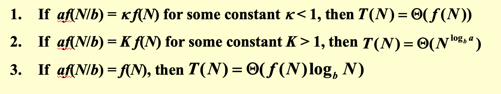

    * ==f(N)为多项式×对数形式== $ T(N)=aT(N/b) + \Theta(N^klog^pN)$

        

        * Example
            *  $a = b = 2,  f (N) = NlogN $
            * $k = 1, p = 1, a = b^k$
            * $T(N)= O(Nlog^2N)$

## Dynamic Programming 

* Principle : **Solve sub-problems just once and save answers in a** **table**
    * 优化子结构
    * 重复子问题
* template
    * **Characterize an optimal solution**：发现最优结果需要子问题最优解
    * **Recursively define the optimal values**：寻找递推式
    * **Compute the values in some order**：按从下至上的顺序计算
    * **Reconstruct the solving strategy**：重构路径
* 不适用情况
    * 找不出子问题
    * 子问题状态互相有影响
    * 没有形成先后顺序

## Greedy 

* Principle
    * 针对优化问题——找可行解中的最优解

        * Given a set of **constraints** and an **optimization function**.  Solutions that satisfy the constraints are called **feasible solutions**.  A feasible solution for which the optimization function has the best possible value is called an **optimal solution**.

    * Make the best decision at each stage, under some greedy criterion.  A decision made in one stage is ==not changed== in a later stage, so each decision should assure feasibility.

        找每一步的最优解，并确保可行性

* 适用条件

    * **<u>局部最优等于全局最优</u>**
    * **<u>贪心算法不一定保证最优解，而逼近最优解（在最优解需要花大量时间时）</u>**

* Elements

    * 总会存在最优解包含**<u>贪心选择</u>**，贪心选择是安全的
    * 通过**<u>优化子结构</u>**证明，通过将贪心选择和子问题最优解结合能得到全局最优解

## Approximation 

* Principle

    * 针对HARD问题——在NPC问题中

        * N小，$2^N$的算法是可接受的

        * 特殊情况可以用多项式时间复杂度解决

        * 在多项式复杂度夏找到接近最优解的近似算法

            **<u>注意！近似算法要考虑与最优解的接近程度，而贪心算法不需要，这就是两者的区别</u>**

    * **Approximation Ratio**：近似比率

        * An algorithm has an approximation ratio of  $\rho(n)$ if, for any input of size n, the cost C of the solution produced by the algorithm is within a factor of $\rho(n)$  of the cost C* of an optimal solution:

            

        * If an algorithm achieves an approximation ratio of $\rho(n)$, we call it a  $\rho(n)$-approximation algorithm

    * **Approximation scheme**

        * An approximation scheme for an optimization problem is an approximation algorithm that takes as input not only an instance of the problem, but also **a value** $\varepsilon$ > 0 such that for any fixed $\varepsilon$, the scheme is a (1+ $\varepsilon$)-approximation algorithm.

        * We say that an approximation scheme is a polynomial-time approximation scheme **<u>(PTAS)</u>** if for any fixed  $\varepsilon$ > 0, the scheme runs in time **polynomial in the size n** **of its input instance.*

            

        * 随着$\varepsilon$的减小，PTAS的运行时间可能会迅速增长

        * **fully** **polynomial-time** **approximation scheme(FPTAS)** :   **其运行时间表达式既为$1/\varepsilon$的多项式，又为n的多项式**

            

* Aspects

    * **A :Optimality** —— 解的质量
    * **B : Efficiency** —— 计算效率
    * **C :All instances** —— 是否覆盖所有情况
    * 近似算法属于：B+C
    * **<u>除非P = NP，我们无法兼顾ABC</u>**

## Local search 

* Principle：**aims at a** <u>**local**</u> **optimum** approximately
    * Local
        * 定义一个可行集里的**<u>邻域</u>**（neighborhoods)
        * 在邻域中，**<u>局部最优是最佳解</u>**
    * Search
        * 从一个可行解开始，在邻域中搜索更优解
        * 当不能再提升时，得到邻域中的局部最优

* Neighbor Relation
    * S ~S' : S'是一个可以通过S微小改动得来的 *neighboring solution*
    * N(S) : ***neighborhood*** **of S –** **the set {** **S':** **S** **~** **S'** **}**.

* Implementation: 

    * 如何定义邻域 —— 邻域不能过大，否则在搜索时类似于暴搜；但邻域要足够丰富，让我们不易陷入局部最优但远离全局最优

    * 如何搜索邻域中的最优解

        * Gradient_descent 梯度下降法 

            ```pseudocode
            SolutionType Gradient_descent()
            {   Start from a feasible solution S ∈ FS ;
                MinCost = cost(S);
                while (1) {
                    S’ = Search( N(S) ); /* find the best S’ in N(S) */
                    CurrentCost = cost(S’);
                    if ( CurrentCost < MinCost ) {
                        MinCost = CurrentCost;    S = S’;
                    }
                    else  break;
                }
                return S;
            }
            ```

        * The Metropolis Algorithm 大都市算法

            * 设置温度：Simulated Annealing 
            * **The material is cooled** **very gradually** **from a high temperature, allowing it enough time to reach equilibrium at a succession of intermediate lower temperatures.**
            * **Cooling schedule:** T = {T1, T2, ...}

## Randomized 

* Principle —— 用于handle最坏情况输入，让输入不影响算法表现；**<u>对于随机化算法没有坏的输入，只有坏的随机数</u>**
    * **确定型算法**的输入是随机的但算法表现是确定的，因此可以使用**平均分析**
    * **随机算法**会**表现随机**，当输入是最坏情况时
* 使用原因
    * 高效且保证正确性的确定性算法是——的特例
        * **高效，只在极高概率下保证正确的随机算法**
        * **保证正确，在<u>期望</u>层面上高效的随机算法**
* 数学基础——概率论
    * Pr[ A ] := the probability of the event A

    * $\overline{A}$:= the complementary of the event A (A did not occur )

         

    * E[ X ] := the **<u>expectation</u>** (the “average value”) of the 
                random variable X

            

* Implementation

    * Target: 打乱数组A[ ]，产生一字随机分布

    * Method: **给每个元素A[i] 一个随机值 P[i]，然后根据P排序**

        * 此处对$N^3$正是为了**<u>使出现两个相同数的概率变小，同时减小可能出现太大数的概率</u>**

        ```c
        void PermuteBySorting ( ElemType A[ ], int N )
        {
            for ( i=1; i<=N; i++ )
                A[i].P = 1 + rand()%(N^3); 
                /* makes it more likely that all priorities are unique */
            Sort A, using P as the sort keys;
        }
        ```

    * 定理：**PermuteBySorting** **produces a** **uniform random permutation** **of the input, assuming <u>all priorities are distinct</u>.**

## Parallel 

* Principle
    * 有效的并行是软硬件同时进行的
    * 硬件
        * •**Processor parallelism**
        * • **Pipelining**
        * • **Very-Long Instruction Word (VLIW)**
    * 软件：并行算法
* Description
    * Parallel Random Access Machine (PRAM) —— 多个处理器共享内存
        * 解决内存冲突
            * Exclusive-Read Exclusive-Write (EREW) 读写均不可并行，排队等待
            * Concurrent-Read Exclusive-Write (CREW) 读可并行，写不可
            * Concurrent-Read Concurrent-Write (CRCW) 读写均可并行
                 * Arbitrary rule 不管
                *  Priority rule (P with the smallest number) **<u>优先级</u>**最高的处理器写成功
                * Common rule (if all the processors are trying to write the same value) 如果所有处理器**<u>写同样的值</u>**才能写成功（用于需要精密处理的数据）
    * **<u>Work-Depth (WD) 深度学习</u>**
        * **<u>Work load - total number of operations: W(n)</u>**
        * Worst-case running time: T(n)
* 性能分析
    * W(n)
    * T(n) —— 与处理器数目的关系
        * W(n) operations and T(n) time
        * P(n) ≥ W(n)/T(n) processors and T(n) time (on a PRAM)
        * W(n)/p time using any number of p ≤ W(n)/T(n) processors (on a PRAM)(占主导)
        * **<u>W(n)/p + T(n) time using any number of p processors (on a PRAM)</u>**
    * Example
        * n个CPU ： W(n) = O(n) , T(n) = O(log n)
        * n/2个CPU：W(n) = O(n) , T(n) = O(log n)(常数变化)
        * p< O(n/log n) : 此时，T> O(log n)

## External sorting

* Principle —— 因disk上快速排序困难，使用**<u>归并排序</u>**
    * **Store data on tapes** **(can only be accessed sequentially)**
    * **Can use at least** **3** **tape drives**
    * **Computer can carry out I\O and CPU processing in** **parallel**  输入输出操作和CPU计算是并行的

* Concerns

    * **Seek** **time** —— **O( number of passes )**  ==BOTTLE NECK== 
        * pass：访问磁带上所有数据
        * 访问磁带是开销的主要来源
    * **Time to** **read or write** **one** **block** **of records** 
    * **Time to** **internally sort** **M** **records**（小） <u>**T = O(M)或O(log M)**</u>
    * **Time to** **merge** **N** **records from input buffers to the output buffer**

* Target 

    * 减少pass数目—— 使用**<u>多路归并</u>**

        * **Number of passes** **=**

            M为内存中可存records数目，N/M为初始run数，+1为最初始的internal sort所用

            Run：指已经排序的小部分

        * 在merge过程中，使用**小顶堆**有效比较大小（T = O(log M) )

        * 需要2k tapes —— 如何减少tapes数目？

            * Split unevenly

                * 2路归并只需3个tapes：if the number of runs is a Fibonacci number FN, then the best way to **<u>distribute them is to split them into FN–1 and FN–2</u>** .

                * k路归并只需k+1个tapes：where 

                    polyphase Merge—— 例子：4-斐波那契数

                * Pass数目计算

                    从1开始反向构建

                    ==$_nL_1 = _{n-1}L_4$==

                    ==$_{n-1}L_{i-1} = _{n}L_i - _nL_1$==


    * 在并行操作中对Buffer的控制 —— <u>使I/O操作跟上CPU的速度</u>

        * Example:Sort a file containing 3250 records, using a computer with an internal memory capable of sorting at most 750 records（3块）. The input file has a block length of 250 records. 

            2块作为输入缓存，1块作为输出缓存

        * 对于k路归并，我们需要**<u>2k块作为输入缓存，2块作为输出缓存</u>**，才不会使CPU空等I/O

        * 但是，当k增加时，input buffer数目增加，memory容量不变情况下，buffer size减小，disk上Block的大小也需要减小，block数目增加，seek time增加

            ==因此K并不是越大越好的，当超过某一k值时，I/O时间因寻道时间增加而增加（尽管passes数目变少）==

    * generate a longer run —— run的长度不一定等于内存大小

        * Replacement selection( 相当于使内存扩充一倍)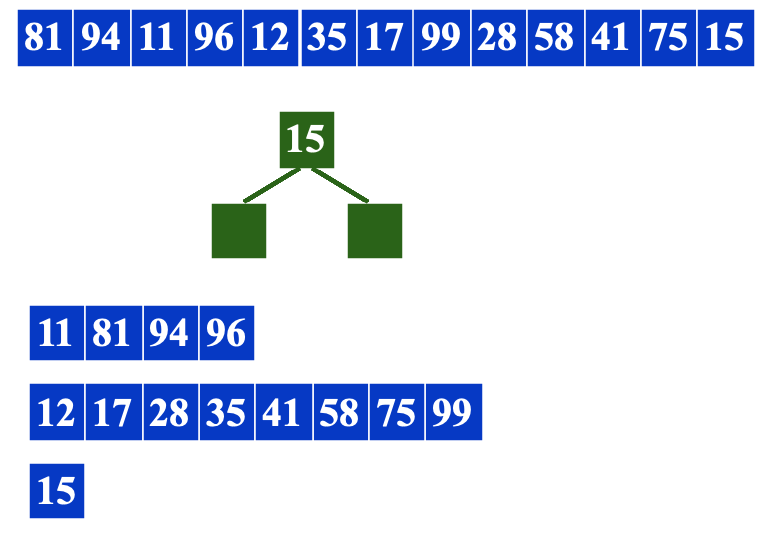
            * 使用堆结构出列一个读入一个
            * 如果读入的已经比已写元素小，则为死空间
            * 若全部节点都死掉，则开启新run，写下一段tape
        * run的平均长度：$L_{avg} = 2M$
        * 当输入接近有序的时候非常有效，能形成很长的run

    * 针对run长度不一情况下，减少归并时间

        * 利用Huffman Tree 

        * **Total merge time = O (** **the weighted external path length** **)**

        * Example: Suppose we have 4 runs of length 2, 4, 5, and 15, respectively.    How can we arrange the merging to obtain minimum merge times?

            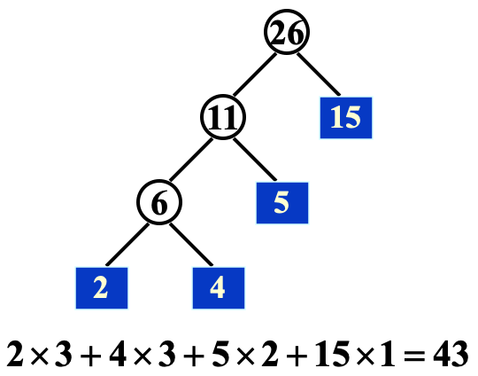


#Cases 

## Backtracking

### Eight queens

* Problems
    * Find a placement of  8 queens on an 8 x 8 chessboard such that no two queens attack.
    * Two queens are said to attack iff they are in the same row, column, diagonal, or antidiagonal of the chessboard.
* Symbol
    * $Q_i $::= queen in the i-th **row**
    * $x_i $::= the **column index** in which $Q_i $ is
* Constrains
    * $S_i$ = { 1,2,3,4,5,6,7,8 } for 1 ≤ i ≤ 8 —— $8^8$种解
    * 不在同一列：xi ≠ xj  if  i ≠ j —— 8！种解
    * 不在同一对角线：**<u>( xi - xj ) / (i - j ) ≠ ± 1</u>**
* Method
    * 建**<u>博弈树</u>**（一个抽象概念，并没有真正建立一棵树）—— **n! 个叶子节点**，每个从根到叶的路径对应解空间的一个元素
    * DFS搜索每条路径**<u>（post-order traversal）</u>**

### Turnpike Reconstruction Problem

* Problems
    * Given N points on the x-axis with coordinates x1<x2<..<xN. Assume that x1 = 0. There are  $N ( N – 1 ) / 2$  distances between every pair of points.
    * Given $ N ( N – 1 ) / 2$  distances.  Reconstruct a point set from the distances.

* Method
    * 通过 $ N ( N – 1 ) / 2$ 计算N的值
    * X1 = 0, xN = 给定集合中最大的值（最远的点）
    * 找下一大的值，新增节点，检查新增节点与已有节点间距是否在数据集中；若无则回溯
    * **<u>注意！回溯时要恢复数据集</u>**

* Example
    * **Given** **D** **= { 1, 2, 2, 2, 3, 3, 3, 4, 5, 5, 5, 6, 7, 8, 10 }**
    * **Step 1:** **N** **(** **N** **– 1 ) / 2 = 15 implies** **N** **= 6**
    * **Step 2:** **x1** **= 0 and ** **x6** **= 10**
    * ( 0, 3, 5, 6, 8, 10 )  **<u>对称情况不再计算</u>**

        

* Code

    ```c
    bool Reconstruct ( DistType X[ ], DistSet D, int N, int left, int right ) //left、right为递归边界
    { /* X[1]...X[left-1] and X[right+1]...X[N] are solved */
        bool Found = false;
        if ( Is_Empty( D ) )
            return true; /* solved */
        D_max = Find_Max( D );
        /* option 1：X[right] = D_max */
        /* check if |D_max-X[i]| ∈ D is true for all X[i]’s that have been solved */
        OK = Check( D_max, N, left, right ); /* pruning */
        if ( OK ) { /* add X[right] and update D */
            X[right] = D_max;
            for ( i=1; i<left; i++ )  Delete( |X[right]-X[i]|, D);
            for ( i=right+1; i<=N; i++ )  Delete( |X[right]-X[i]|, D);
            Found = Reconstruct ( X, D, N, left, right-1 );
            if ( !Found ) { /* if does not work, undo */
                for ( i=1; i<left; i++ )  Insert( |X[right]-X[i]|, D);
                for ( i=right+1; i<=N; i++ )  Insert( |X[right]-X[i]|, D);
            }
        }
        /* finish checking option 1 */
        if ( !Found ) { /* if option 1 does not work */
            /* option 2: X[left] = X[N]-D_max */
            OK = Check( X[N]-D_max, N, left, right );
            if ( OK ) {
                X[left] = X[N] – D_max;
                for ( i=1; i<left; i++ )  Delete( |X[left]-X[i]|, D);
                for ( i=right+1; i<=N; i++ )  Delete( |X[left]-X[i]|, D);
                Found = Reconstruct (X, D, N, left+1, right );
                if ( !Found ) {
                    for ( i=1; i<left; i++ ) Insert( |X[left]-X[i]|, D);
                    for ( i=right+1; i<=N; i++ ) Insert( |X[left]-X[i]|, D);
                }
            }
            /* finish checking option 2 */
        } /* finish checking all the options */

        return Found;
    }

    ```

### Tic-tac-toe & α-β pruning

* Problem

    * **The player who succeeds in placing three of their marks in a horizontal, vertical, or diagonal row wins the game.**

    

* Method : **Minimax Strategy**

    * 用好处函数来判断一个位置的”goodness“

        ==$f(P) = W_{computer} - W_{human}$== 

        W为P位置可能赢的局数

        

        Here X is computer and O is the human

    * The human is trying to **minimize** the value of the position P, while the computer is trying to **maximize** it

        

* α pruning —— 取max时，44>=40，再min只能比40小，取不到40

    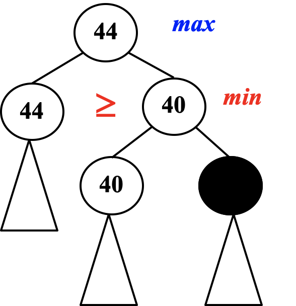

* β pruning —— 取min时，44 <=68，再max只能比68大，取不到68

    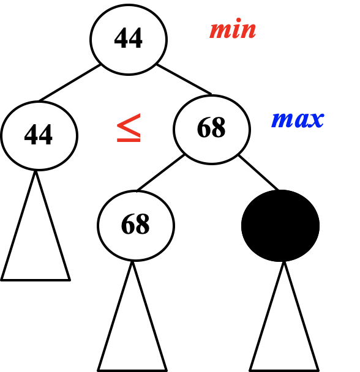

* α-β pruning 效率：it limits the searching to **only $O(\sqrt{N})$**
**nodes, where N is the size of the full game tree**

## Divide & Conquer

### Closest points problem

* Problem

    *    Given N points in a plane.  Find the closest pair of points.  (If two points have the same position, then that pair is the closest with distance 0.)

* Method

    * 暴搜：检查**N** **(** **N** **– 1 ) / 2** 对点，$T = O(N^2)$

    * 分治

        *    按照x轴顺序排序
        *    分：以中线分开
        *    治：左、右、跨线合并

    * 复杂度分析

        * **O(** **N** **log** **N** **)** 
        * **f(N)** ：确保在找cross distance时为**<u>线性复杂度</u>**

    * δ - strip ：δ是左、右区域中的最小距离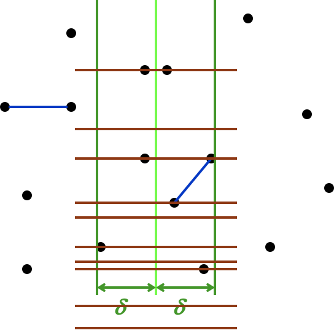

        * 如果**NumPointInStrip** **= $O(\sqrt{N})$**，暴搜可以得到线性复杂度

            ```c
            for ( i=0; i<NumPointsInStrip; i++ )
                for ( j=i+1; j<NumPointsInStrip; j++ ) 
                    if ( Dist( Pi , Pj ) < δ )
            	 δ = Dist( Pi , Pj );

            ```

        * **The worst case:** **NumPointInStrip** **=** **N**（所有点都在strip里）——  **<u>利用y轴的δ - strip</u>** 

            ```c
            /* points are all in the strip */
            /* and sorted by y coordinates */
            for ( i = 0; i < NumPointsInStrip; i++ )
                for ( j = i + 1; j < NumPointsInStrip; j++ ) 
                    if ( Dist_y( Pi , Pj ) > δ )
            	break;
                    else  if ( Dist( Pi , Pj ) < δ )
            	 δ = Dist( Pi , Pj );
            ```

            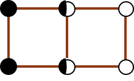

            对于每个点Pi，至多有7个点在考虑中，因此**每个点的搜索代价为常数 —— $f(N) = O(N)$**


## Dynamic Programming

### Ordering Matrix Multiplications

* Problem
    * 在连续矩阵乘法中只满足结合律不满足交换律，因此结合形式不同计算次数也不同
    * **In which** **order** **can we compute the product of n matrices with** **minimal computing time**

* Symbol
    *  $b_n$ = number of different ways to compute  M1 * M2 *  .. * Mn
    * $Mij = Mi * ... * Mj$ , 则$ M_{1n} = M1 * ... * Mn = M_{1i} * M_{i+1n}$ 将矩阵相乘作为二元运算
    * $M_i$ 是一个 $r_{i-1} * r_i$矩阵，即用r数组来代表矩阵维度
    * Let $mij$ be the cost of the optimal way to compute $ Mi * ... * Mj$

* Method

    * 暴搜：

        $b_n = O(4^n/n \sqrt{n})$ —— catalan number

    * DP：每个子问题都最优，==$r_{i-1}r_lr_j$为合并$M_{il}$ $M_{lj}$的代价==

        

    * 复杂度分析

        * $T(N) = O(N^3)$

* Code

    ```c
    /* r contains number of columns for each of the N matrices */ //r为矩阵维度
    /* r[ 0 ] is the number of rows in matrix 1 */ 
    /* Minimum number of multiplications is left in M[ 1 ][ N ] */ 
    void OptMatrix( const long r[ ], int N, TwoDimArray M ) 
    {   int  i, j, k, L; 
        long  ThisM; 
        for( i = 1; i <= N; i++ )   M[ i ][ i ] = 0; 
        for( k = 1; k < N; k++ ) /* k = j - i */ //k代表矩阵序列长度
            for( i = 1; i <= N - k; i++ ) { /* For each position */ 
    	j = i + k;    M[ i ][ j ] = Infinity; 
    	for( L = i; L < j; L++ ) { 
    	    ThisM = M[ i ][ L ] + M[ L + 1 ][ j ] 
    		    + r[ i - 1 ] * r[ L ] * r[ j ]; 
    	    if ( ThisM < M[ i ][ j ] )  /* Update min */ 
    		M[ i ][ j ] = ThisM; 
    	}  /* end for-L */
            }  /* end for-Left */
    }

    ```

### Optimal Binary Search Tree

* Problem
    * Given  N  words  w1 < w2 < …… < wN, and the probability of searching for each  wi  is  pi .  Arrange these words in a binary search tree in a way that minimize the expected 
total access time
    * $  d_i$—— 深度 
    * 这是静态搜索（没有插入删除）的最优结构
    * 

* Symbol
  * $Ti j $::= OBST for  wi , ……, wj  ( i < j )
  * $cij$ ::= cost of Ti j  ( ci i = 0 )
  * $ri j$ ::= root of Ti j
  * $wij$ ::= weight of $Tij = \Sigma_{k=i}^j p_k$  ( wii = pi )

* Method

  * ==$cij = p_k + cost(L) +cost(R)+ weight(L)+weight(R) $==

      ==$= p_k + c_{i,k-1} + c_{k+1,j}+ w_{i,k-1}+w_{k+1,j}$==

      ==$= w_{ij} + c_{i,k-1} + c_{k+1,k}$==

      注意加weight是因为L、R作为子树是**<u>每个节点的深度都加1，相当于增加一遍所有的p</u>**

      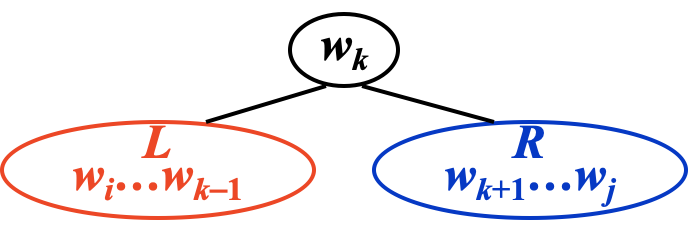

  * 复杂度分析

      * $T(N) = O(N^3)$

* Example

    **<u>标红的key为root,取cij = min {wij + ci,l-1 + cl+1,j}</u>**

    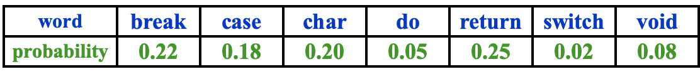

    

### All-Pairs Shortest Path

* Problem

    * For all pairs of vi and vj ( i ≠ j ), find the shortest path between

* Method
    * **Use** **single-source algorithm** **for |V| times.**

        **$T= O( |V| ^3)$ – works fast on sparse graph.(稀疏图适用）**

    * Define  
      $D^{k}[ i ] [ j ] $= min{ length of path i -> { l ≤ k } -> j }  
      and  $D^{-1}[ i ] [ j ] $= Cost [ i ] [ j ].   Then the length of the shortest path from i to j  is $D^{N-1}[ i ] [ j ] $

      从$D^{-1}$开始迭代计算$D^{0}$,$D^{1}$,...,$D^{N-1}$

      

    * **<u>可用于有负边的图，但不能有负环</u>**

* Code

    ```c
    /* A[ ] contains the adjacency matrix with A[ i ][ i ] = 0 */ 
    /* D[ ] contains the values of the shortest path */ 
    /* N is the number of vertices */ 
    /* A negative cycle exists iff D[ i ][ i ] < 0 */ 
    void AllPairs( TwoDimArray A, TwoDimArray D, int N ) 
    {   int  i, j, k; 
        for ( i = 0; i < N; i++ )  /* Initialize D */ 
             for( j = 0; j < N; j++ )
    	 D[ i ][ j ] = A[ i ][ j ]; 
        for( k = 0; k < N; k++ )  /* add one vertex k into the path */
             for( i = 0; i < N; i++ ) 
    	 for( j = 0; j < N; j++ ) 
    	    if( D[ i ][ k ] + D[ k ][ j ] < D[ i ][ j ] ) 
    		/* Update shortest path */ 
    		 D[ i ][ j ] = D[ i ][ k ] + D[ k ][ j ]; 
    }
    ```

* 复杂度分析

    * $T(N) = O(N^3)$，但在稠密图效率很高

### Product Assembly

* Problem

    * •**Two assembly lines for the same car**

        •**Different technology (time) for each stage**

        •**One can change lines between stages**

        •**Minimize the total assembly time**

        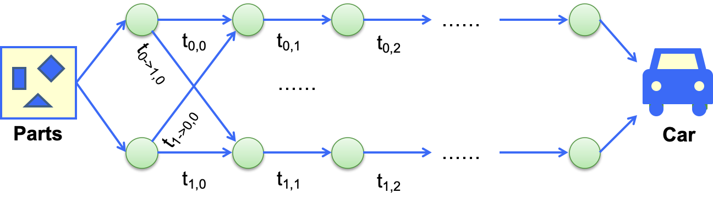

* Method

    * 暴搜：$O(2^N)$ time +$O(N)$space
    * DP

* Code

    ```c
    f[0][0]=0; L[0][0]=0; //f[line][stage]记录进行到第stage步所用时间
    f[1][0]=0; L[1][0]=0;//L记录每个步骤选用的产品线号码
    for(stage=1; stage<=n; stage++){
      for(line=0; line<=1; line++){
        f_stay = f[  line][stage-1] + t_process[  line][stage-1];
        f_move = f[1-line][stage-1] + t_transit[1-line][stage-1];
        if (f_stay<f_move){
          f[line][stage] = f_stay;
          L[line][stage] = line;
        }
        else {
          f[line][stage] = f_move;
          L[line][stage] = 1-line;
        }
      }
    }
    ```

## Greedy

### Activity Selection Problem 

* Problem
    * Given a set of activities S = { a1, a2, …, an } that wish to use a resource (e.g. a classroom).  Each ai takes place during a time interval [si, fi).
Activities ai and aj are compatible if si ≥ fj or sj ≥ fi (i.e. <u>their time intervals do not overlap</u>).
    * **Select a maximum-size subset of mutually compatible activities.**

* Method

  * DP: $c_{ij} = c_{ik }+ c_{kj} + 1 (a_k ∈ S_{ij})$

    * 复杂度分析：$T(N)=O(N^2)$

  * Greedy

    * Greedy 1：选最先开始 —— 非最优
    * Greedy 2：选最短时间 —— 非最优
    * Greedy 3： 选冲突最少 —— 非最优
    * Greedy 4：选最早结束 —— 资源尽快释放
    * 复杂度分析：$T(N)=O(NlogN)$

  * Another DP

    

    如果每个事务有权重，**<u>那么只能使用DP，之前的Greedy算法不再适用</u>**

    

### Huffman Codes 

* Problem

    * Suppose our text is a string of length 1000 that comprises the characters  a, u, x, and z.  Then it will take  8000  bits to store the string as 1000 one-byte characters.
    * We may encode the symbols as a = 00, u = 01, x = 10, z  = 11.   For example, aaaxuaxz is encoded as 0000001001001011.  Then the space taken by the string with length 1000 will be  2000 bits + space for code table.  /*$ \lceil log C \rceil$ bits are needed in a standard encoding where C is the size of the character set */
    * **<u>如果使用不定长编码，如何确保没有二义性</u>**==（如果每个字母出现频率相同，没有必要使用不定长编码）==

* Symbol

  * **frequency ::=** **number of occurrences of a symbol**

      In string  aaaxuaxz ,   f(a) = 4,  f(u) = 1,  f(x) = 2,  f(z) = 1

  * **Depth di ::= 深度**
  * **WPL ::= 带权路径长度**，每个叶节点带有权值wk(频率)，到从根节点到叶节点长度lk，则$WPL= \Sigma_{k=1}^n w_kl_k$

* Method

    * **只要没有一个code是另一个的前缀码，可确保没有二义性，使字符都在叶节点上即可**
    * 找到WPL最小的最优二叉树

* Code

    ```c
    void Huffman ( PriorityQueue  heap[ ],  int  C )
    {   consider the C characters as C single node binary trees,
         and initialize them into a min heap;
         for ( i = 1; i < C; i++ ) { 
            create a new node;
            /* be greedy here */
            delete root from min heap and attach it to left_child of node;
            delete root from min heap and attach it to right_child of node;
            weight of node = sum of weights of its children;
            /* weight of a tree = sum of the frequencies of its leaves */
            insert node into min heap;
       }
    }
    ```

* 复杂度分析： $T = O(C \log C)$ **与高度相关**

* Huffman Tree的特性

    * 没有度为1的节点
    * **<u>n个叶节点的哈夫曼树共2n-1个节点</u>**
    * 任意非叶节点左右子树交换后仍然为哈夫曼树
    * 对同一组权值存在不同构的哈夫曼树

## Approximation

### Approximate Bin Packing

* Problem
    *         Given N items of sizes  S1 , S2 , …, SN , such that 0 < Si ≤ 1 for all 
1 ≤ i ≤ N .  Pack these items in the fewest number of bins, each of which has unit capacity

* Method

  * **On-line Algorithm**: 不能改变决定，**只要是在线算法就不可能得到最优解**

    * **Next Fit**
    ```pseudocode
    void NextFit ( )
    {   read item1;
        while ( read item2 ) {
            if ( item2 can be packed in the same bin as item1 )
    	place item2 in the bin;
            else
    	create a new bin for item2;
            item1 = item2;
        } /* end-while */
    }
    ```

    * 近似率分析
      * Let M be the optimal number of bins required to pack a list I of items.  Then next fit never uses more than 2M – 1 bins.  There exist sequences such that next fit uses 2M  – 1 bins
        * ==**<u>近似率为2</u>**==

    * **First Fit**

    ```pseudocode
    void FirstFit ( )
    {   while ( read item ) {
            scan for the first bin that is large enough for item;
            if ( found )
    	place item in that bin;
            else
    	create a new bin for item;
        } /* end-while */
    }
    ```

    * 复杂度分析：$T = O(N \log N)$
    * 近似率分析
        * Let M be the optimal number of bins required to pack a list I of items.  Then first fit never uses more than 17M / 10 bins.  There exist sequences such that first fit uses 17(M – 1) / 10 bins.
        * ==**<u>近似率为1.7</u>**==

    * **Best Fit**
    * **Place a new item in the** **tightest** **spot among all bins.**
        * 复杂度与近似率同First Fit
    * ==**<u>在线算法近似比率不会好于5/3</u>**==

  * **Off-line Algorithm**：在开始计算答案之前先view全局

    * 问题出在**大**的物件
    * 对其进行**降序**排列后使用**first fit/ best fit decreasing**
    * 近似率分析
        * Let M be the optimal number of bins required to pack a list I of items.  Then first fit decreasing never uses more than 11M / 9 + 6/9 bins.  There exist sequences such that first fit decreasing uses ==**11M / 9 + 6/9**== bins

  * **简单的贪心算法即可得到较优解**  

### The Knapsack Problem

* Problem 1 : 分数
    * A knapsack with a capacity  M  is to be packed.  Given N items.  Each item  i  has a weight  wi  and a profit  pi .  If  xi is the percentage of the item i  being packed,  then the packed profit will be  $pi*xi$ .
    * An optimal packing is a feasible one with maximum profit.  That is, 
we are supposed to find the values of xi  such that $\Sigma_{i=1}^n p_ix_i$ obtains its maximum under the constrains
* Method
  * Greedy criterion
    * maximum profit density $p_i/w_i$

* Problem 2 : 0-1  —— 整数

    * $x_i$ 为0或1
* Method
    * Greedy on taking the maximum profit or profir density

        * ==**<u>approximation ratio is 2</u>**==
    * DP
    * $W_{i, p} $= the minimum weight of a collection from {1, …, i } with total profit being  exactly p

        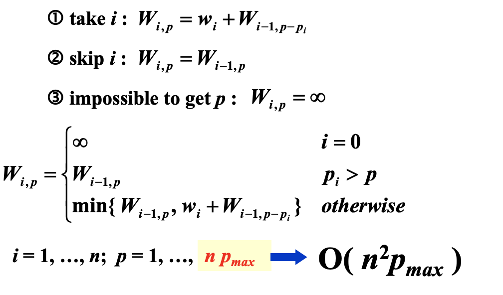

        * 复杂度分析：注意Pmax的二进制编码长度为d，所以==$P_{max} = O(2^d)$，是指数级的复杂度==

            * 这就要求当Pmax很大时，对Profit进行归约到更小的范围

                ==$(1+\varepsilon) P_{alg}\leq P $   for any feasible solution P==

### The K-center Problem

* Problem
    * 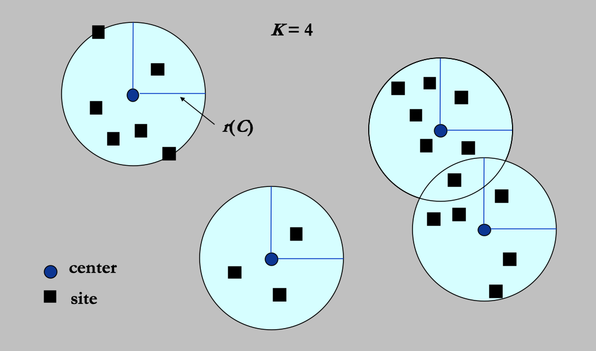
    * Input:  Set of n sites s1, …, sn
    * **Center selection problem:** **Select** **K** **centers** **C** **so that the maximum distance from a site to the nearest center is minimized**
* Properties
    * distance
        * 满足同一性、对称性、三角不等式
* Symbol
    * $dist(s_i , C) = min_{c∈C} dist(s_i, c)$  
                 = distance from si to the closest center
    * 覆盖半径（覆盖所有si）$r(C) = max_i dist(s_i, C)$ = smallest covering radius
* Target

    * Find a set of centers C that **<u>minimizes r(C)</u>**, subject to **<u>|C| = K.</u>**
* Method

    * Greedy 1：Find a set of centers C that minimizes r(C), subject to |C| = K.

        * 此时当N=2且K=2时，其实最优解是把连个sites选为centers

        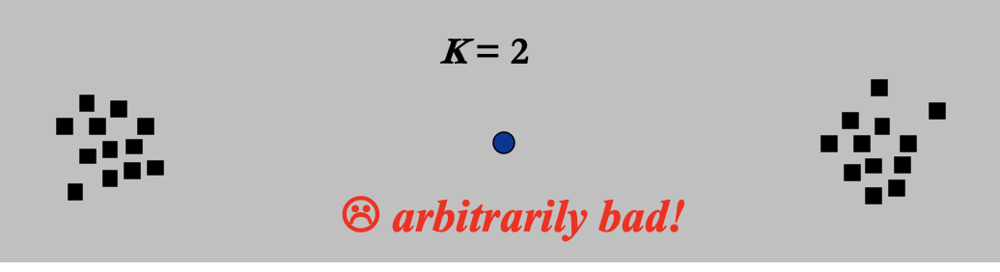

    * Greedy 2：we know that $r(C^*) \leq r $ where **C* is the optimal solution set** **<u>如果我们已知优化覆盖半径</u>**

        * 如果s作为中心，那么**<u>r = 2r(C*)</u>**即可确保覆盖所有被C *覆盖的点

            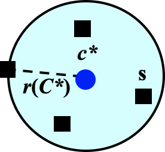

        ```pseudocode
        Centers  Greedy-2r ( Sites S[ ], int n, int K, double r ) /* r 为优化覆盖半径*/
        {   Sites  S’[ ] = S[ ]; /* S’ is the set of the remaining sites */
            Centers  C[ ] = ∅;
            while ( S’[ ] != 空集 ) {
                Select any s from S’ and add it to C;
                Delete all s’ from S’ that are at dist(s’, s) ≤ 2r;
            } /* end-while */
            if ( |C| ≤ K ) return C;/* 判断条件是否满足 */
            else ERROR(No set of K centers with covering radius at most r);
        }
        ```

        * **<u>定理：如果该算法选出了大于K个中心，那么对于任意至多包含K个点可行解集C* ，覆盖半径 r(C*) > r.</u>**

        * 但我们实际并不知道优化覆盖半径——**<u>对r进行二分查找</u>**

            * 对于r有K个中心找到——向r更小二分
            * 对于r有超过K个 —— 向r更大二分

        * 复杂度分析：若r是个整数，$T = O(\log r)$ —— 多项式级别

        * 近似率分析：Solution radius = $2r_1$ —— ==**<u>2-approximation</u>**==

            定理：**<u>除非P = NP，没有ρ-approximation可以让中心选择问题的ρ<2</u>**

    * 进一步优化—— be far away

        * 不再随机选择点s，而是选择离已有中心点最远的s
        * 不再需要逐步逼近r(C*)的过程

        ```pseudocode
        Centers  Greedy-Kcenter ( Sites S[ ], int n, int K )
        {   Centers  C[ ] = ∅;
            Select any s from S and add it to C;
            while ( |C| < K ) {
                Select s from S with maximum dist(s, C);
                Add s it to C;
            } /* end-while */
            return C;
        }
        ```

        * 近似率分析：

            定理：The algorithm returns a set C of K centers such that ==$r(C) \leq 2r(C^*)$== where C* is an optimal set of K centers

            ==2-approximation==


## Local search

### Vertex Cover Problem 

* Problem

    * Given an undirected graph G = (V, E).  Find a minimum subset S of  V such that **<u>for each edge (u, v) in E, either u or v  is in S.</u>**

* Symbol

    * **Feasible solution set** **FS** **: all the vertex covers.**
    * **cost(S) = | S |** —— 用顶点数衡量解的代价
    * 邻域S~S': S' 可以通过S（加或）减一个点得到

* Method

    * 梯度下降：

        * 从S=V开始，**删掉一个节点**并检查S‘是否满足vertex cover

        * 缺点 —— **<u>搜索路径</u>**影响找到的最优解

            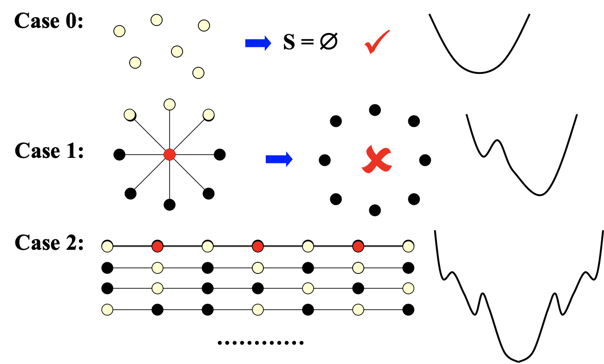

    * 大都市算法：

        * 如何**设置温度T**是关键—— 模拟退火
        * p = 

        ```pseudocode
        SolutionType Metropolis()
        {   Define constants k and T;
            Start from a feasible solution S ∈ FS ;
            MinCost = cost(S);
            while (1) {
                S’ = Randomly chosen from N(S); /* 可以进行添加 */
                CurrentCost = cost(S’);
                if ( CurrentCost < MinCost ) {
                    MinCost = CurrentCost;    S = S’;
                }
                else {
                    With a probability p , let S = S’;/* 在p概率下，用更差的解来代替当前解，使得Local search有概率越过“小坑”*/
                    else  break;
                }
            }
            return S;
        }
        ```

### Hopfield Neural Networks

* Problem
    * Graph G = (V, E) with integer <u>edge weights w (positive or negative)</u>.
    * If $w_e < 0$, where e = (u, v), then **u and v want to have the same state** ;if $w_e > 0$ then **u and v want different states**.
    * The absolute value $|w_e|$ indicates the strength of this requirement
    * Output: A configuration S of the network – 
              **an assignment of the state $s_u$ to each node u**
    * 可能找不到满足所有边的安排，但是要找到一个**足够好**的

* Definition
    * 好边和坏边：In a configuration S, edge e = (u, v) is good if $w_e s_u s_v < 0$ ($w_e < 0$ iff $s_u = s_v$ ); otherwise, it is bad. <u>可能不能让所有边都是好边</u>

    * 点是否被满足（satisfied）:**a node** **u** **is** **satisfied** **if the weight of incident good edges** **≥** **weight of incident bad edges.**

        

    * 安排稳定（stable）：所有点都被满足

* Method: State-flipping Algorithm

    * Problem : 最大化好边权重$\Phi$

    * FS : 配置

    * S~S' : S’通过S**翻转一个点的状态**得到

    * 定理：**<u>任何通过s-f算法最大化$\Phi$的配置，都是一个稳定的配置（所有节点被满足）</u>**

    * 证明算法不会死循环

        * 定理：算法会在最多进行$W =\Sigma_e|w_e|$ 次迭代后，停在一个稳定的配置

        * 证明：当$\Phi(S')> \Phi(S)$,那么至少增加1，增加不是无限的，最多W次

            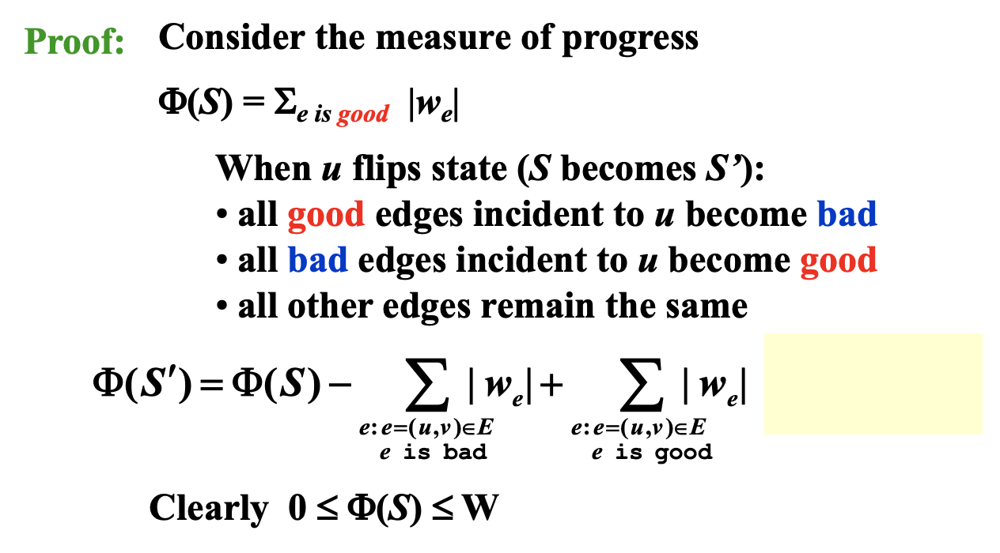

    * 复杂度分析：仍然未解

        * 希望找到一个对于**n单独多项式时间**或对于**n和logW多项式时间**的解法

    * Code

    ```pseudocode
    ConfigType State_flipping()
    {
        Start from an arbitrary configuration S;
        while ( ! IsStable(S) ) {
            u = GetUnsatisfied(S);
            su = - su;
        }
        return S;
    }
    ```

### Maximum Cut Problem

* Problem

    * Given an undirected graph G = (V, E) with positive integer edge weights $w_e$, find a node partition (A, B) such that the total weight of edges crossing the cut is maximized.

        

    * **<u>相当于Hopfield的边为正边，点状态不同的情况</u>**

* Method

    * Problem: 最大化好边权重$\Phi(S) = \Sigma_{e is good} |w_e|$

    * FS: （A,B)任意划分

    * S~S'：S‘可以通过S将一个点从A到B或从B到A的移动得到

    * 方法同上Hopfield

    * 复杂度分析：可能不能在多项式时间内完成

        * 解决办法：在没有“足够大”的提升时结束算法 —— **Big-improvement-flip**

            翻转一个点的要求是至少让cut value增加 

            ==定理：在结束时，$(2 + \varepsilon) w(A, B) \geq  w(A^*, B^*)$==

            ==定理：至多在$O(n/ \varepsilon \log W)$次翻转后结束==

            ​	Proof: 

            * 每次flip至少增加（1+ epsilon/n)倍，其实是（1+2*epsilon/n)倍
            * n/epsilon次flip之后，总增长至少是**2倍**。利用(1+1/x)^x >= 2, 如果x>=1
            * 总量不超过W，而cut**翻倍的次数不能超过logW**
            * 因此至多$n/ \varepsilon * \log W$次翻转

    * 近似率分析：==Let (A, B) be a local optimal partition and let (A* , B* ) be a global optimal partition.  Then **w(A, B) ≥ ½ w(A* , B* ).**==

      * ==除非P=NP，否则近似比率不会达到17/16==

      


## Randomized

### The Hiring Problem

* Problem

    * **Hire an office assistant from headhunter** 

        **Interview a different applicant per day for** **N** **days** 一遇到更好的就解雇上一个雇佣这一个

        **Interviewing Cost =** **C** **i** **<< Hiring Cost =** **C** **h**

        **Analyze interview & hiring cost instead of running time**

    * **Assume** **M** **people are hired.**

        **Total Cost:**

        NCi固定，MCh变化

* Method

    * Naive：

        ```c
        int Hiring ( EventType C[ ], int N )
        {   /* candidate 0 is a least-qualified dummy candidate */
            int Best = 0;
            int BestQ = the quality of candidate 0;
            for ( i=1; i<=N; i++ ) {
                Qi = interview( i ); /* Ci */
                if ( Qi > BestQ ) {
                    BestQ = Qi;
                    Best = i;
                    hire( i );  /* Ch */
                }
            }
            return Best;
        }
        ```

        * 最坏情况：受试者按照质量从低到高的顺序排序，那么每一个都会被雇佣

            $T = O(NC_h ) (NC_i忽略)$

    * 确定性算法：**<u>假设数据服从特定分布</u>**

        * 假设受试者按随机顺序到来：<u>**any of first** **i** **candidates is equally likely to be best-qualified so far，每个位置出现全局最佳质量的概率相同**</u>

        * **E[xi] = 1/i 的原因是，第i天的面试者是i天中最好的的概率为1/i**

            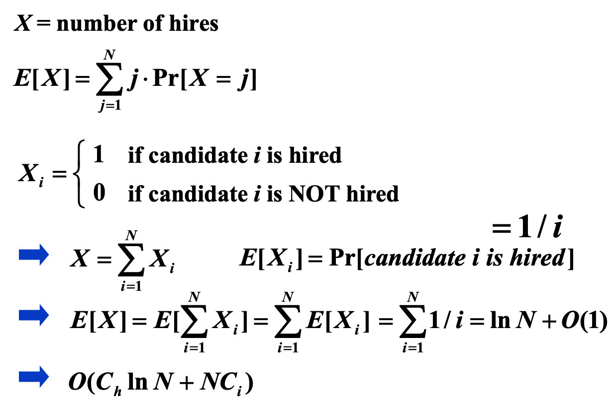

    * 随机算法：随机算法内部对于受试者顺序进行了重新打乱（permute），因此不再依赖于数据的分布

        ```c
        int RandomizedHiring ( EventType C[ ], int N )
        {   /* candidate 0 is a least-qualified dummy candidate */
            int Best = 0;
            int BestQ = the quality of candidate 0;

            randomly permute the list of candidates;

            for ( i=1; i<=N; i++ ) {
                Qi = interview( i ); /* Ci */
                if ( Qi > BestQ ) {
                    BestQ = Qi;
                    Best = i;
                    hire( i );  /* Ch */
                }
            }
        ```

        * 缺：打乱消耗时间
        * 优：**<u>不需要假设</u>**受试者按照随机顺序前来

    * 在线处理算法：只雇用一次

        * 面试前k天的所有人，找到前k天最优的质量

        * 继续面试，遇到比前k天质量更高的立即雇佣，不再面试

        * 面试完毕还没遇到比前k天质量更高的，雇佣前K天质量最高的人

            ```c
            int OnlineHiring ( EventType C[ ], int N, int k)
            {
                int Best = N;
                int BestQ = - ∞ ;
                for ( i=1; i<=k; i++ ) {
                    Qi = interview( i );
                    if ( Qi > BestQ )   BestQ = Qi;
                }
                for ( i=k+1; i<=N; i++ ) {
                    Qi = interview( i );
                    if ( Qi > BestQ ) {
                        Best = i;
                        break;
                    }
                }
                return Best;
            }
            ```

        * 关键：如何指定k，使雇佣到最好的人的概率最大？

            **独立事件**的同时发生概率—— 联合分布概率为**<u>各自之积</u>**

            **<u>此时$Pr[A] = 1/N$而非$1/i$ 原因是==在线算法==相当于已经面试了N个人，每个人是最优的概率相同</u>**

            **<u>$Pr[B] = k/(i-1)$是因为前i-1个最优的人在前k个中</u>**

            

            因为

            有

            根据求导得==当k = N/e时，Pr[S]取到最大值==

### Quicksort

* Problem
    * 在确定性快排中
        * $\Theta(N^2)$ worst-case running time
* $\Theta(N \log N)$ average case running time, assuming 
     every <u>input permutation is equally likely</u>


    * 通过随机的选择pivot，来达到随机算法的目的。但**如果划分不均匀**的话复杂度会退化到worst case

* Method

  * **Central splitter** **:= the pivot that divides the set so that each side contains** **at least** **n/4**

  * Pr[ find a central splitter ] = 1/2 （落在中间一半区域内）

    因此我们选到central splitter所需要的**<u>迭代次数的期望最大为2</u>**

    $1* 1/2 + 2*1/4+3*1/8……$

    * **Type** **j** **: the subproblem** **S（每一段大小为S) **is of** **type j** **if** 
    * 定理: 至多有个subproblem of type j
    * 
    * Number of different types = $\log_{4/3}N = O(\log N)$
    * ==logN层，每层复杂度为O(N) ,总时间复杂度为 T = O(N logN)==

## Parallel

### The summation problem

* Problem
    *  Input:  A(1), A(2), …, A(n)
    *  Output: A(1) + A(2) + … +A(n)

* Method

     * B作为二维数组，h为高度，i代表水平序号

     

* PRAM model

    * 每个时刻都需要指定N个处理器干什么—— 工作 或 静息 

    ```pseudocode
    for Pi ,  1 ≤ i ≤ n  pardo
      B(0, i) := A( i ) /* 第一层并行读入所有数据 */
      for h = 1 to log n do /* 高度为log n */
        if i ≤ n/2^h /* 每一层节点数 */
          B(h, i) := B(h-1, 2i-1) + B(h-1, 2i)
        else stay idle
      for i = 1: output B(log n, 1); for i > 1: stay idle
    ```

    * 性能分析：

        ==T(n) = log n +2==(常数：读入输出各需要一个循环)

    * 缺点

        * 每个时刻都要制定处理器干什么不必要
        * 一致性差：对于不同N需要处理器数目不同

* WD model

    * 通过编译器优化，**<u>pardo关键字</u>**，不用指定需要多少个处理器/每个处理器干什么</u>

        ```pseudocode
        for Pi ,  1 ≤ i ≤ n  pardo
           B(0, i) := A( i )
        for h = 1 to log n 
            for Pi, 1 ≤ i ≤ n/2^h  pardo
                B(h, i) := B(h-1, 2i-1) + B(h-1, 2i)
        for i = 1 pardo
           output  B(log n, 1)
        ```

    * 性能分析

        * ==T(n) = log n +2==
        * ==W(n) = n + n/2 + ...+n/2^k +1 = 2n==

    * 定理：==any P(n) 各CPU，可以用WD达到O(W(n)/p + T(n))的时间==

### Prefix-Sums

* Problem：求前i元素的和
    * Input:  A(1), A(2), …, A(n)
    * Output:  $\Sigma_{i=1}^1A(i), \Sigma_{i=1}^2A(i),\Sigma_{i=1}^3A(i)...\Sigma_{i=1}^nA(i)$

* Technique : 平衡二叉树

  * 在summation的基础上增加$C(h,i) = \Sigma_{k=1}^\alpha A(k)$

    **where (0, $\alpha$) is the rightmost descendant leaf of node (h, i).**

  * **<u>计算至顶向下</u>**

      * if ( i==1 ) ：C(h, i) := B(h, i)
      * if ( i%2 == 0 ) ： C(h, i) := C(h+1, i/2)
      * if (i%2 == 1 && i != 1)  C(h, i) := C(h+1, (i-1)/2) + B(h, i) 父节点左边的元素+B(h,i)


* Code

    ```pseudocode
    for Pi , 1 ≤ i ≤ n pardo
      B(0, i) := A(i)
    /* 算B：至底向上*/
    for h = 1 to log n
      for i , 1 ≤ i ≤ n/2^h pardo
        B(h, i) := B(h - 1, 2i - 1) + B(h - 1, 2i)
    /* 算C：至顶向下 */
    for h = log n to 0
      for i even, 1 ≤ i ≤ n/2^h pardo
        C(h, i) := C(h + 1, i/2)
      for i = 1 pardo
        C(h, 1) := B(h, 1)
      for i odd, 3 ≤ i ≤ n/2^h pardo
        C(h, i) := C(h + 1, (i - 1)/2) + B(h, i)
    for Pi , 1 ≤ i ≤ n pardo
      Output C(0, i)
    ```

* 性能分析
	 * T(N) = O(log N)
    * W(N) = O(N)

### Merging

* Problem

    * Merging – merge two non-decreasing arrays A(1), A(2), …, A(n) and B(1), B(2), …, B(m) into another non-decreasing array C(1), C(2), …, C(n+m) 
* Technique: Partitioning (分块)
    * To simplify, assume:
         * the elements of A and B are pairwise distinct
        * n = m
        * both log n and n/log n are integers
    * **Partitioning Paradigm**
       * partitioning - partition the input into a large number, say p, of independent small jobs, so that t<u>he size of the largest small job is roughly n/p</u>
       * actual work - do the small jobs concurrently, using a <u>separate (possibly serial) algorithm for each</u> 每个小块的算法可能是串行算法
* Method
   * 将merging问题转化为ranking问题，求B的每个元素在A中的排序
       * RANK( j, A) = i,   if A(i) < B(j) < A(i + 1), for 1 ≤ i < n
         RANK( j, A) = 0,  if B(j) < A(1) 
         RANK( j, A) = n,  if B(j) > A(n)

       * Claim: 当给出Ranking解后，Merging可以在==O(1) time ，O(n+m) work==完成 **<u>（并行拷贝入C）</u>**

         ```c
         for Pi , 1 ≤ i  ≤ n  pardo
             C(i + RANK(i, B)) := A(i) /* C中i+A(i)在B中排序 —— 有多少个元素比A(i)小*/ 
         for Pi , 1  ≤ i  ≤ m  pardo
             C(i + RANK(i, A)) := B(i)
         ```

   * 解决Ranking问题

       * BS

           * T(N) = O(log N) —— N个处理器同时运作可以在logN时间内完成Rank
           * W(N) = O(N logN)

           ```c
           for Pi , 1 ≤ i ≤ n  pardo
               RANK(i, B) := BS(A(i), B)
               RANK(i, A) := BS(B(i), A)
           ```

       * Serial Ranking (串行排序)

           * 
           * **<u>注意：默认增加了A(n+1)、B(n+1)，比原始的最大元大</u>**

           ```c
           i = j = 0; 
           while ( i ≤ n || j ≤ m ) {
               if ( A(i+1) < B(j+1) )
                   RANK(++i, B) = j;
               else RANK(++j, A) = i;
           }
           ```

       * 比较：串行算法减少了W，但增大了T

   * Parallel Ranking

       * **<u>注意：默认增加了A(n+1)、B(n+1)，比原始的最大元大</u>**

       * **Partitioning**:  块数： $p = n/\log n$     每块大小：log n

       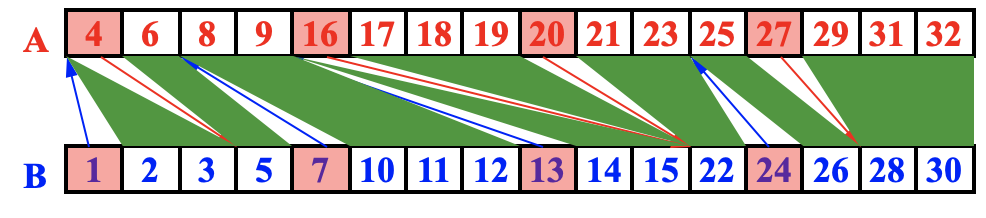

           *  找到每个块中的块头元素

            A_Select( i ) = A( 1+(i-1)logn )   for 1 ≤ i ≤ p
            B_Select( i ) = B( 1+(i-1)logn )   for 1 ≤ i ≤ p

            ==T = O(log n)==

            ==W = O(p log n) = O(n)==

           * 对选中元素进行排序

       * **Actual Ranking**:

           * 2p个箭头将问题划分成了2p个O(log n )大小子问题，每个块中元素比起左边块中大

           * 用O(p)个CPU进行排序进行串行排序

               ==T = O(log n)==

               ==W = O(log n)==

       * 总性能分析—— 在没有消耗更多的情况下跑得更快

           * ==T = O(log n)==
           * ==W = O(n)==
### Maximum Finding

* Problem

    *  **Replace “+” by “max” in the summation algorithm**

* Method

    * 套用求和问题算法：**<u>T = O(log n)    W = O(n)</u>**

    * **Compare all pairs** —— **<u>大功率跑车算法</u>**

        *  思想：利用长度为n的数组B初始化为0，**将最大值对应元素保持0，其余均变为1**
        *  可以使用**CRCW中的arbitrary rule**处理冲突即可
        *  性能分析：如果用$n^2$个CPU同时进行（约$n^2$个pairs）
            *  T = O(1)  —— 运算时间不受数据量影响
            *  W = O($N^2$)

        ```pseudocode
        for Pi , 1 ≤ i ≤ n  pardo
            B(i) := 0
        for i and j, 1 ≤ i, j ≤ n  pardo
            if ( (A(i) < A(j)) || ((A(i) = A(j)) && (i < j)) )
                    B(i) = 1 /*发现有元素比A(i)大，将B(i)置1*/
            else B(j) = 1
        for Pi , 1 ≤ i ≤ n  pardo
            if B(i) == 0
               A(i) is a maximum in A
        ```

    * **A Doubly-logarithmic Paradigm**

        * 假设h = log log n是个整数: n a= Partition by $\sqrt{n}$ —— 每块大小 $\sqrt{n}$ 

            *  块数也为 $n/ \sqrt{n} = \sqrt{n}$，使用 $\sqrt{n}$ 个CPU

            *  分块后递归排序：M1-$\sqrt{n}$~ T( $\sqrt{n}$), W($\sqrt{n}$)

            *  共有M1-$\sqrt{n}$个最大值，使用大功率跑车对$\sqrt{n}$个最大值排序—— T = O(1), W = O($\sqrt{n}^2$) = O(n)

            *  性能分析

                *  

                *  根据递归树

                    每层均为c, $n^{1/2^k} = const$, h = log log n

                    T = h*c * 1 = log log n

                    

        *  Partition by **h** **= log log** **n** —— 每块大小为h

            *  块数为n/h, n/h个CPU
            *  分块，每一块用串行算法：M1-n/h ~ O(h)
        *  共有M1-n/h个最大值，对这n/h个最大值用上面的分法排序—— T = O(log log n/h), W = O(n/h log log n/h)
            *  性能分析
                *  ==T(n) = O(h) + O(log log(n/h)) = O(log log n)==
                *  ==W(n) = O(h)*n/h + O(n/h log log n/h) = O(n)==

    *  Ramdom Sampling —— 采用随机采样技术，**高效，只在极高概率下保证正确的随机算法**

        *  Arbitrary CRCW PRAM

        *  A: n个元素 ——> 每$n^{1/8}$个元素中随机选一个得到$n^{7/8}$个元素，形成B

        *  将B中元素分为$n^{1/8}$大小的块，共$n^{7/8}/n^{1/8}=n^{3/4}$块

        *  每一小块使用大功率跑车算法—— T = O(1) , W = O($(n^{1/8})^2= O(n^{1/4})$

        *  此时总性能：T = O(1)，W = $n^{3/4}$ * $O(n^{1/4})$ = O(n)

        *  将得到的$n^{3/4}$个最大值继续按照$n^{1/4}$大小分块……

        *  总性能==$M(n^{7/8}) : T(n) = O(1) , W(n) = O(n)$==

        *  但此时，只有==1====/16（$n = 2^{32},n^{1/8}=16$)的概率找到正确的最大值==—— 改进

            ```pseudocode
            while (there is an element larger than M) {
                 for (each element larger than M)
                 Throw it into a random place in a new B(n^7/8);
                 Compute a new M;
            }/* 当挑出n^7/8个数时停止*/ 
            ```

            Claim : The algorithm finds the maximum among n elements.  With very high probability it runs in O(1) time and O(n) work.  The probability of not finishing within this time and work complexity is ==$O(1/n^c)$（找不到最大值的概率）== for some positive constant c.    **<u>c的大小与上述循环次数有关</u>**

