# Outline

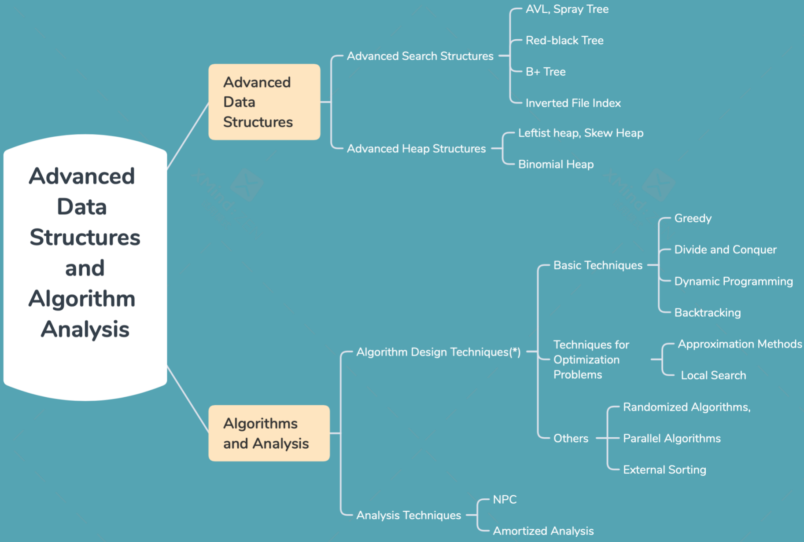

# 概念

## AVL

* **<u>height balance</u>**: 
    * Empty binary tree
    * TL and TR are height balanced, and
          $| h_L -h_R | <=1 $where  hL and hR are the heights of TL and TR , respectively.
* The balance factor **<u>BF( node ) = hL - hR</u>** .  In an AVL tree, BF( node ) = -1, 0, or 1

## RBT

* **<u>black-height</u>**：bh(x), is the number of black nodes on any simple path from x (x not included) down to a leaf.  bh(Tree) = bh(root).

## B+

* **<u>Def</u>**：A B+ tree of order M is a tree with the following structural properties:
    (1)  The root is **either a leaf** or has between 2 and M children.
    (2)  All nonleaf nodes (**except the root**) have between $\lceil M/2 \rceil$ and M **<u>children</u>**.
    (3)  All leaves are at the same depth.
    Assume each nonroot leaf also has between $\lceil M/2 \rceil$ and M **<u>keys</u>**

## Inverted FIle Index


* **<u>Term-Document Incidence Matrix</u>**——有效表征爬回的文档集

    * 0/1代表是否在文档中出现
    * 查找多关键字通过按位&操作得到—— silver&truck = 1010 & 1011 = 1010

    

* **<u>Def</u>**：Inverted file contains a list of **<u>pointers</u>** (e.g. the number of a page) to all occurrences of that term in the text.

    * Times: 出现次数—— **<u>便于提升多关键字检索的效率，见阈值控制</u>**
    * Documents，Words: （文档编号;文档中位置）—— **<u>便于返回这句话并高亮关键字</u>**

    

* **<u>Pre-processing</u>**

    * Word Stemming——提取词干，去除形态、词根等
    * Stop Words—— 停用词过滤，去除a,the

* 如果倒排索引文件无法放在一个主机上——**<u>分布式存储</u>**

    * Term-partitioned Index —— 按照关键字划分，全局建立索引**<u>（性能更高）</u>**
    * Document-partitioned Index —— 按照文件号划分，每台主机上局部索引 **<u>（更可靠）</u>**

* **<u>动态索引</u>**，同时建立主索引和辅助索引

    * Re-index：当辅助索引很大时并入Main

    * 删除文件——记录在一个无效位向量中

        

* 索引文件**<u>压缩</u>**

    * 将词典看为单一字符串，以消除用定长方法来存储单词所存在的空间浪费
    * docID的存储只记录与上一项docID的差值来减少docID存储长度

* **<u>阈值控制</u>**—— Thresholding

    * 文件：取根据weight排序的top x
    * 查询：将查询的terms根据其出现频率递增顺序排序，出现频率越低的关键字过滤效果越好

* **<u>性能评价</u>**—— User happiness

    * **Data Retrieval** Performance Evaluation (after establishing correctness)

        - Response <u>time</u>
        - Index <u>space</u>

    * **Information Retrieval** Performance Evaluation

        - How <u>relevant</u> is the answer set

            - **Precision 查准率**：RR/(RR+IR)

            - **Recall 查全率**：RR/(RR+RN)

            |               | Relevant | Irrelevant |
            | ------------- | -------- | ---------- |
            | Retrieved     | R~R~     | I~R~       |
            | Not Retrieved | R~N~     | I~N~       |

## Leftist Heap

* **<u>The null path length</u>**: Npl(X),of any node X is the length of the shortest path from X to a node without two children.  Define Npl(NULL) = –1

* Leftist Heap中Npl(left child) ≥ Npl(right child)


## 易混淆

* **NPL**：当前节点到没有两个子节点(**至少一个为NULL**)的节点的最短路径长，<u>自平衡的依据</u> (左式堆)
  **bh(x)**：从x节点开始往下的**黑**节点个数(所有同路一样的) (红黑树)


# 操作

## BST的旋转

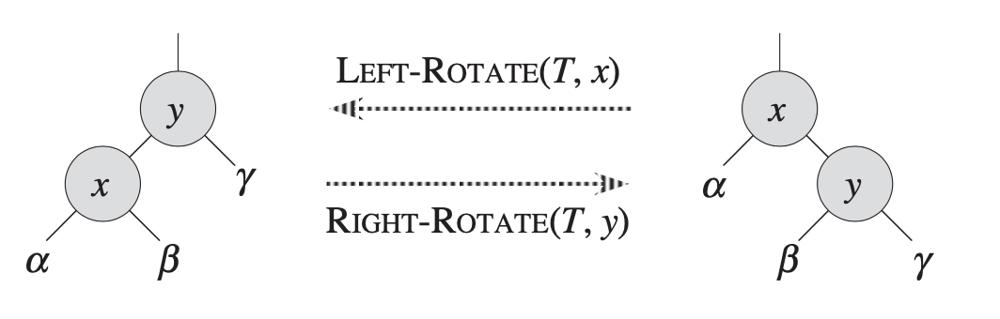

### AVL (insert/delete后的调整)

* RR：**以B为中心的左旋**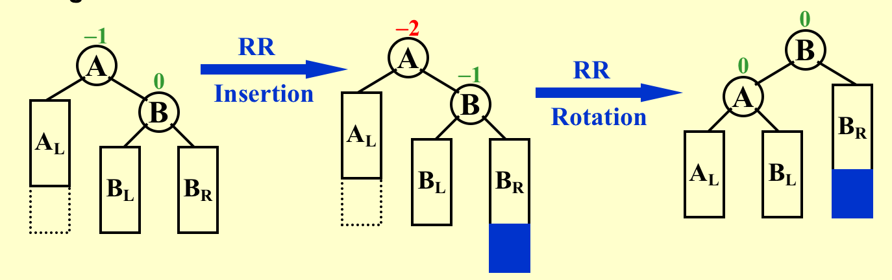
* LL：**以B为中心的右旋**
* LR：**以C为中心左旋后以C为中心右旋**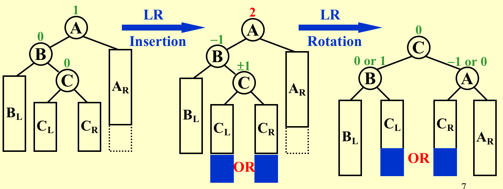
* RL：**以C为中心右旋后以C为中心左旋**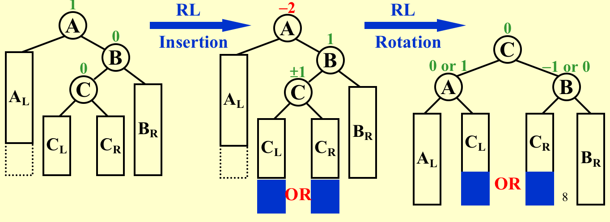

### Splay （find调整）

 For any nonroot node X , denote its parent by P and grandparent by G

* Case 1: P is the root -> Rotate X and P

* Case 2: P is not the root

    * Zig-zag：**以X为中心左旋后以X为中心右旋（同AVL LR）**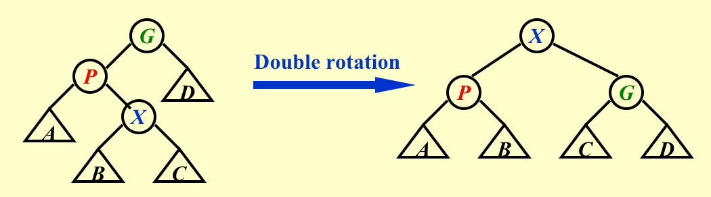

    * Zag-zig: **以X为中心右旋后以X为中心左旋（同AVL RL）**

    * Zig-zig：**以P为中心右旋（使P称为root）后以X为中心右旋（X为root）**==（注意先后，可以理解为一个AVL LL后再一个LL）==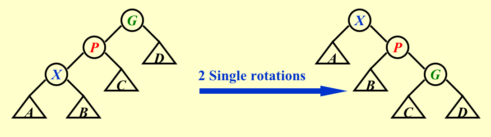

        > e.g.Insert: 1, 2, 3, 4, 5, 6, 7 Find: 1
        >
        > 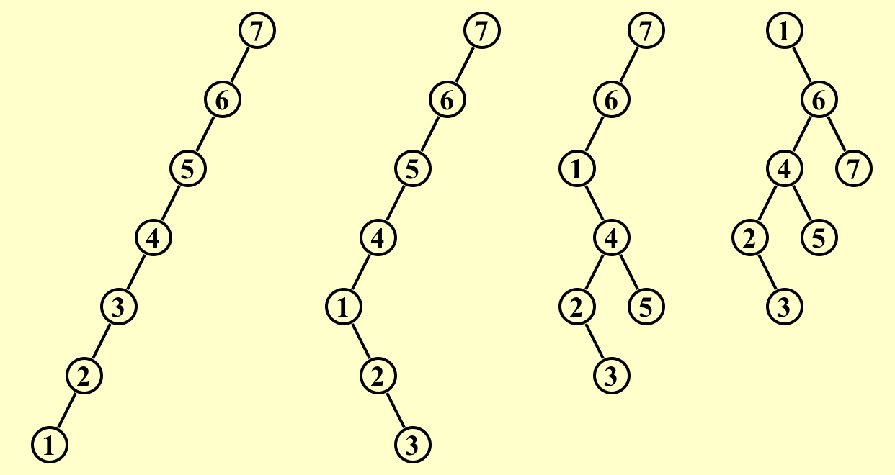
        >
        > 3 zig-zig

    * Zag-zag：**以P为中心左旋（使P称为root）后以X为中心左旋（X为root）**==（注意先后，可以理解为一个AVL RR后再一个RR）==

## 树的查找、插入、删除操作

### AVL

* 查找：BST查找
* 插入、删除后调整： [AVL](#AVL (insert/delete后的调整))

### Splay

* 查找：[Splay](#Splay （find调整）)
* 插入：BST插入
* 删除：
    * Find X （X是根）
    * Remove X （此时剩下TL,TR）
    * FindMax ( TL ) （TL中最大的元素作为根，没有右子树）
    * Make TR the right child of the root of TL 

### RBT

* 查找：BST查找

* 插入（把插入的节点**<u>涂为红色</u>**后调整）
    * Case 1: **<u>父亲与叔叔均为红</u>**
        * **父辈与爷爷调颜色**，但需**<u>递归向上</u>**(因出现了新的红节点) 
    * Case 2、3: **<u>父辈异色</u>**
      * 先调整到爷、父、子一条线
      * 将爷爷与父亲交换颜色
      * 旋转改结构，**<u>不需再向上调整</u>**
      

* 删除：

    * 操作同BST，被替换节点要保持被删节点的颜色（删除黑色节点需要调整，此时将替换节点增加一层黑色，如果替换节点本身为红色那么不需要调整；如果替换节点为黑色，那么双黑节点x需要调整）

      * Case 1: <u>**兄弟为红**</u>: **（将红兄弟换为黑兄弟）**
          * 因为x-path没法+1个黑色的所以必须调整结构
          * 将兄弟与父亲换色
          * 以w为中心左旋，此时x的兄弟为w的左子树（一定为黑节点）
          * 进入Case 2/3/4
      * Case 2: **<u>兄弟为黑，兄弟的儿子均为黑</u>**
          * 将兄弟w变为红色，给父节点加一个黑色
              * 如果父节点为红色，则变为黑色，结束
              * 如果父节点为黑色，则父节点作为新的双黑节点x 向根节点推进问题
      * Case 3: **<u>兄弟为黑，父亲、兄弟、兄弟的红儿子不在一条线上</u>**
          * 将红色儿子与w换色
          * 以原红色儿子（此时为黑色）为中心右旋或左旋**<u>（总之是为了让父亲、兄弟、兄弟的红儿子在一条线上）</u>**
          * 进入Case 4
      * Case 4：**<u>兄弟为黑，兄弟的右儿子为红</u>**
          * 将兄弟与父亲换色，将红色儿子置黑
          * 以兄弟位置为中心左旋 

      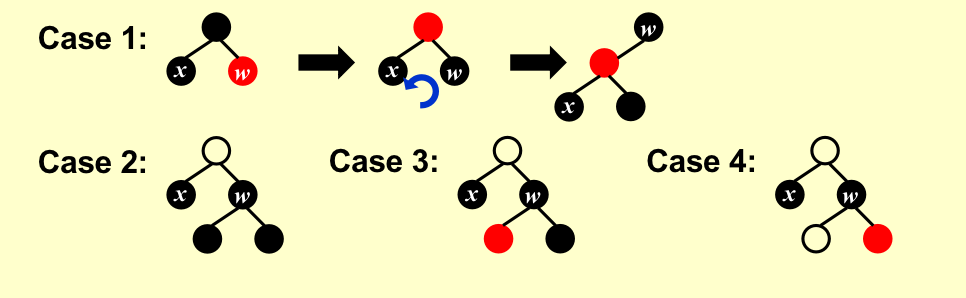
      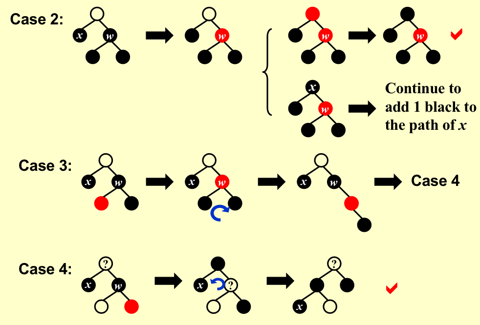

### B+

* 查找（略）
* 插入
    * 注意split
    * 前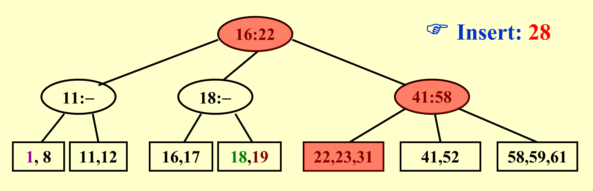
    * 后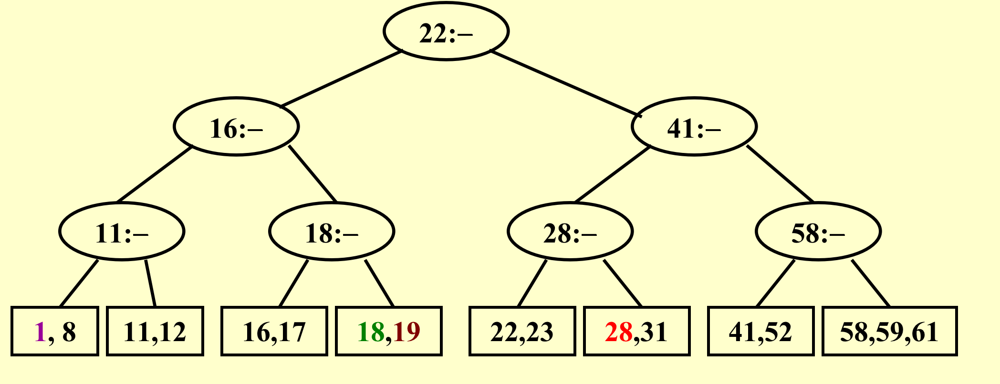

* 删除
    * 删掉之后就与兄弟节点合并，如果节点只有一个儿子，那么就尝试与其兄弟合并，至于key是什么根据data分析

## 堆的插入、删除、归并

### Leftist Heap

* 归并
    * 递归
        * 将大根的merge到小根的右子树上，最后调整根部是否交换
        * 注意更新NPL为新的右儿子NPL+1, **<u>否则所有零路径长均为0,不再是左式堆</u>**
    * 迭代
        * 直接将有路径上的节点顺序排列，不改变左子树
        * 如果出现不满足NPL的，交换左右子树
* 插入是归并的特例（单节点和Heap归并）
* 删除：删根节点后归并

### Skew Heap

* 归并

    * 迭代：仍然将右路径节点排序，然后大的插入小的右子树，**<u>始终左右交换</u>**（所以最后右路径按顺序排在左路径）

        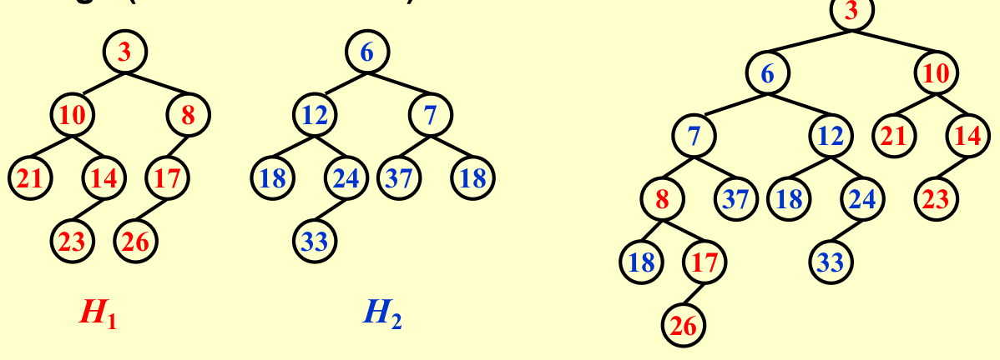

### BinomialQ

* FindMin：最小值在根中，因为最多有$\lceil logN \rceil $个根，T = $O(log N)$
* 归并（类似二进制加法），需要让二项队列中的树按照高度顺序排列，T = $O(log N)$
* 插入是归并的特例
* DeleteMin:
    * FindMin: in $B_k$	$O(log N)$
    * Remove $B_k$   $O(1)$
    * Remove root from $B_k$    $  O(log N)$ —— 将子树形成一个新的BQ H’‘
    * Merge(H', H'')    $O(log N)$

# 程序

## B+树

insert

```pseudocode
Btree  Insert ( ElementType X,  Btree T ) 
{ 
	Search from root to leaf for X and find the proper leaf node;
	Insert X;
	while ( this node has M+1 keys ) {
    		split it into 2 nodes with 「(M+1)/2 and (M+1)/2」 keys, respectively;
    		if (this node is the root)
        		create a new root with two children;
    		check its parent;
	}
} 
```

## Inverted File Index

Index generator

```pseudocode
while ( read a document D ) {
    while ( read a term T in D ) {
        if ( Find( Dictionary, T ) == false )
            Insert( Dictionary, T );
        Get T’s posting list;
        Insert a node to T’s posting list;
    }
}
Write the inverted index to disk;

//if not enough memory
BlockCnt = 0; 
while ( read a document D ) {
  while ( read a term T in D ) {
    if ( out of memory ) {
      Write BlockIndex[BlockCnt] to disk;
      BlockCnt ++;
      FreeMemory;
    }
    if ( Find( Dictionary, T ) == false )
      Insert( Dictionary, T );
    Get T’s posting list;
    Insert a node to T’s posting list;
  }
}
for ( i=0; i<BlockCnt; i++ )
  Merge( InvertedIndex, BlockIndex[i] );
```

## Leftist Heap

归并操作

```c
PriorityQueue  Merge ( PriorityQueue H1, PriorityQueue H2 )
{ 
	if ( H1 == NULL )   return H2;	
	if ( H2 == NULL )   return H1;	
	if ( H1->Element < H2->Element )  return Merge1( H1, H2 );
	else return Merge1( H2, H1 );
}

static PriorityQueue
Merge1( PriorityQueue H1, PriorityQueue H2 )
{ 
	if ( H1->Left == NULL ) 	/* single node */
		H1->Left = H2;	/* H1->Right is already NULL 
				    and H1->Npl is already 0 */
	else {
		H1->Right = Merge( H1->Right, H2 );     /* Step 1 & 2 */
		if ( H1->Left->Npl < H1->Right->Npl )
			SwapChildren( H1 );	/* Step 3 */
		H1->Npl = H1->Right->Npl + 1;
	} /* end else */
	return H1;
}
```

## BinomialQ

Merge、DeleteMin

```c
typedef struct BinNode *Position;
typedef struct Collection *BinQueue;
typedef struct BinNode *BinTree;  /* missing from p.176 */

struct BinNode 
{ 
	ElementType	    Element;
	Position	    LeftChild;
	Position 	    NextSibling;
} ;

struct BinQueue 
{ 
	int	    	CurrentSize;  /* total number of nodes */
	BinTree	TheTrees[ MaxTrees ];
} ;

BinTree	CombineTrees( BinTree T1, BinTree T2 )
{  /* merge equal-sized T1 and T2 */
	if ( T1->Element > T2->Element )
		/* attach the larger one to the smaller one */
		return CombineTrees( T2, T1 );
	/* insert T2 to the front of the children list of T1 */
	T2->NextSibling = T1->LeftChild;
	T1->LeftChild = T2;
	return T1;
}

BinQueue  Merge( BinQueue H1, BinQueue H2 )
{	BinTree T1, T2, Carry = NULL; //加数、被加数、进位
	int i, j;
	if ( H1->CurrentSize + H2-> CurrentSize > Capacity )  ErrorMessage();
	H1->CurrentSize += H2-> CurrentSize;
	for ( i=0, j=1; j<= H1->CurrentSize; i++, j*=2 ) { //根据j，此循环最多logN次
	    T1 = H1->TheTrees[i]; T2 = H2->TheTrees[i]; /*current trees */
	    switch( 4*!!Carry + 2*!!T2 + !!T1 ) { //!!可将其转换为数字0/1方便索引
		case 0: /* 000 */
	 	case 1: /* 001 */  break;	
		case 2: /* 010 */  H1->TheTrees[i] = T2; H2->TheTrees[i] = NULL; break;
		case 4: /* 100 */  H1->TheTrees[i] = Carry; Carry = NULL; break;
		case 3: /* 011 */  Carry = CombineTrees( T1, T2 );
			            H1->TheTrees[i] = H2->TheTrees[i] = NULL; break;
		case 5: /* 101 */  Carry = CombineTrees( T1, Carry );
			            H1->TheTrees[i] = NULL; break;
		case 6: /* 110 */  Carry = CombineTrees( T2, Carry );
			            H2->TheTrees[i] = NULL; break;
		case 7: /* 111 */  H1->TheTrees[i] = Carry; 
			            Carry = CombineTrees( T1, T2 ); //新
			            H2->TheTrees[i] = NULL; break;
	    } /* end switch */
	} /* end for-loop */
	return H1;
}

ElementType  DeleteMin( BinQueue H )
{	BinQueue DeletedQueue; 
	Position DeletedTree, OldRoot;
	ElementType MinItem = Infinity;  /* the minimum item to be returned */	
	int i, j, MinTree; /* MinTree is the index of the tree with the minimum item */

	if ( IsEmpty( H ) )  {  PrintErrorMessage();  return –Infinity; }

	for ( i = 0; i < MaxTrees; i++) {  /* Step 1: find the minimum item */
	    if( H->TheTrees[i] && H->TheTrees[i]->Element < MinItem ) { 
		MinItem = H->TheTrees[i]->Element;  MinTree = i;    } /* end if */
	} /* end for-i-loop */
	DeletedTree = H->TheTrees[ MinTree ];  
	H->TheTrees[ MinTree ] = NULL;   /* Step 2: remove the MinTree from H => H’ */ 
	OldRoot = DeletedTree;   /* Step 3.1: remove the root */ 
	DeletedTree = DeletedTree->LeftChild;   free(OldRoot);
	DeletedQueue = Initialize();   /* Step 3.2: create H” */ 
	DeletedQueue->CurrentSize = ( 1<<MinTree ) – 1;  /* 2^MinTree – 1 */
	for ( j = MinTree – 1; j >= 0; j – – ) {  
	    DeletedQueue->TheTrees[j] = DeletedTree;
	    DeletedTree = DeletedTree->NextSibling;
	    DeletedQueue->TheTrees[j]->NextSibling = NULL;
	} /* end for-j-loop */
	H->CurrentSize  – = DeletedQueue->CurrentSize + 1;
	H = Merge( H, DeletedQueue ); /* Step 4: merge H’ and H” */ 
	return MinItem;
}

```


# 结论整理

## 树

* 目的：支持动态集上的操作（ 插入、删除、查找）

    * AVL、Splay、RB、B+首先是BST，其performance与**<u>树的高度</u>**有关

    * 有水平方向的顺序限制（order constraint）

    * 垂直方向的平衡限制可略放松

* AVL：$BF(node) = -1,0,1$

     ==$n_h$(minimum nodes) $= n_{h-1}+n_{h-2}+1$(root) ——  h=O(logN)==

* Splay：BST基础上要求每次访问一个节点将其通过旋转push到根部（保证数据访问的邻近性）

* RB：==$bh(tree) >= h(tree)/2$==

     * 根是黑色

     * 叶是黑的，NIL、不存数据

     * <font color = "#FF0000">红节点</font>的两个子都是黑

          * 最长路不会超过最短路两倍
          * 没有连续的红节点

     * 每条路径上的**黑高（BH）相等**（不一定是从根节点开始的路径）

          ==有N个中间节点（不包括根）的红黑树树高最高为$2log(N+1)$==

          ==引理：$sizeof(x) >= 2^{bh(x)}-1$==

          > proof
          > $$
          > Proof:\\1：sizeof(x) >= 2^{bh(x)}-1\\hx=0, sizeof(x) = 0\\h(x) = k+1, bh(child) = bh(x) || bh(x)-1\\h(child) <= k, sizeof(child) >= 2^{bh(child)}-1>= 2^{bh(x)-1}-1\\1+2sizeof(child)>=2^{bh(x)}-1\\2：bh(Tree)>=h(Tree)/2\\sizeof(root) = N >= 2^{bh(Tree)}-1
          > $$

     * B+树降低了宽度限制

         *  多叉搜索树结构
         *  Width:$ \lceil M/2 \rceil$~M

### 复杂度


|              | 访问                                                         | 插入(amo)                                                    | m次插入 | 删除(amo) |
| ------------ | ------------------------------------------------------------ | ------------------------------------------------------------ | ------- | --------- |
| AVL          | O(logN)                                                      | O(logN)                                                      |         | O(logN)   |
| Splay        | O(logN)  <u>**(amo,a single may O(N))**</u>                  |                                                              |         |           |
| RB           | O(logN)**<u>（worst）</u>**                                  | ==O(1) **<u>(amo)</u>**==                                    | O(m+N)  | O(1)      |
| B+(M为order) | $O(\log M *(\log N/\log M) )\\ = O(\log N)$<br />(深度:$O(\lceil \log_{\lceil M/2\rceil} N\rceil)= O(logN/logM)$<br/>每个节点M个元素，二分查找复杂度$O(\log M)$) | $O(M *(\log N/\log M) )\\= O(\frac{M}{\log M}\log N)$<br/>(最坏：从根节点一路向叶节点分裂，分裂复杂度$O(M)$) |         |           |

## 堆

* 目的：在原始堆基础上提升Merge的效率（原来为O(N))
    * Order property （不变）
    * Structure property: Binary tree，但可以**<u>不平衡</u>**
* 左式堆
    * ==Npl(X) = min { Npl(C) + 1 for all C as children of X }==
    * 左长右短：Npl(left child) ≥ Npl(right child) 
    * ==右路上有r个节点的左式堆至少有$2^r-1$个节点（平衡时相等）==——==一个N节点的左式堆右路径最多含有$\lfloor log(N+1) \rfloor$个节点==，**<u>归并操作都在右路上</u>**，所以可以达到O(logN)
* 斜堆
    * **<u>不需要左倾</u>**
    * 不需要额外存储NPL的空间
    * 不需要测试是否需要交换左右儿子
* 二项队列
    * heap-ordered forest
    * 二进制系统结构：每个高度一棵二进制树
    * ==$B_k$ consists of a root with k  children, which are    $B_0, B_1, …, B_k – 1 $ .  $B_k$ has exactly  $2^k$  nodes.  The number of nodes at depth d is $C_k^d$==
    * 实现二项树：**left-child_next silbling**, 同时==子树必须有序，且按照**<u>降序排列</u>**==，**<u>可以消除合并时候的遍历开支</u>**

### 复杂度

|               | 访问最小                                              | 插入(amo)                                       | m次插入  | 删除最小(amo) | Merge   |
| ------------- | ----------------------------------------------------- | ----------------------------------------------- | -------- | ------------- | ------- |
| Leftiest      | O(1)                                                  | O(1)                                            |          | O(logN)       | O(logN) |
| Skew          | O(1)                                                  | ==O(logV)==                                     | O(mlogN) | O(logN)       | O(logV) |
| BinomialQueue | O(logN)或者 <br/>O(1)(如果我们记住最小值并且每次更新) | O(1)<br/>Const*(i+1)($B_i$是最小不存在的二项树) | O(m)     | O(logN)       | O(logN) |
| BinaryHeap    |                                                       | O(logN)                                         |          | O(1)          |         |

DP: 课件样例都是O(N^3^)，产品组装为O(N)

