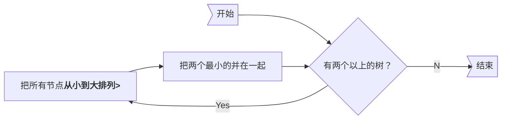

# Greedy

## 活动选择问题

不冲突的情况下选**最多个**活动


### DP solution

用ai表示第i个任务

a1 a2 ...ai ...ak ...aj ...an，用Sij表示ai结束之后开始，在aj开始之前结束的所有任务的集合

$\large \displaystyle c_{ij} = \begin{cases} 0 & S_{ij} = \empty \\ \max_{a_k \in S_{ij}}(c_{ik} + c_{kj} + 1) & S_{ij} \neq \empty \end{cases}$

### Greddy

**策略**

* Select the interval which starts earliest (but not overlapping the already chosen intervals)
    * 如果最早的那个持续了一天就完蛋
* Select the interval which is the shortest (but not overlapping the already chosen intervals)
    * 三个活动：0~12; 12~24; 11~13，完蛋
* Select the interval with the fewest conflicts with other remaining intervals (but not overlapping
    the already chosen intervals)
    * 看ppt
* Select the interval which ends first (but not overlapping the already chosen intervals)

**重要定理**：<u>必然存在一个最优解，包含了最早结束的那个任务</u> (反证法，若不存在，则可以把某个最优解的最早任务换成最早结束的那个，构造处一个新的最优解)

### Another Look at DP

$\large \displaystyle c_{1j} = \begin{cases} 1 & j=1 \\ \max(c_{1,j-1}, c_{1,k(j)} + 1) & j > 1 \end{cases}$

(where c~1j~ is the optimal solution for a1 to aj , and a~k(j)~ is the <u>nearest compatible</u> activity to aj that is <u>finished before</u> aj)

如果是有权重的：

$\large \displaystyle c_{ij} = \begin{cases} 1 & j=1 \\ \max(c_{1,j-1}, c_{1,k(j)} + w_j) & j > 1 \end{cases}$？？？

有权重的情况DP还能用，贪心就不行了

## Huffman

所有节点都在叶节点上，且频率越高离根节点越近

Huffman的贪心算法：



手推了一下，Huffman树应该满足关系式`总节点数 = 2×对象数-1`

**重要定理1**(lemma)：设x,y为两个最小频的对象，则<u>必然存在一个最优解，xy都在同一层，且都在最深层</u>(同样反证)

**重要定理2**：一个最优解，将其拆为两个，两个都作为子节点，最优性不会丢失

算法：每轮先排序，将最小的两个合并，和作为父节点，进入下一轮

```pseudocode
void Huffman ( PriorityQueue  heap[ ],  int  C ) {
    consider the C characters as C single node binary trees, and initialize them into a min heap;
    for ( i = 1; i < C; i++ ) {
        create a new node;
        /* be greedy here */
        delete root from min heap and attach it to left_child of node;
        delete root from min heap and attach it to right_child of node;
        weight of node = sum of weights of its children;
        /* weight of a tree = sum of the frequencies of its leaves */
        insert node into min heap;
    }
}
```


