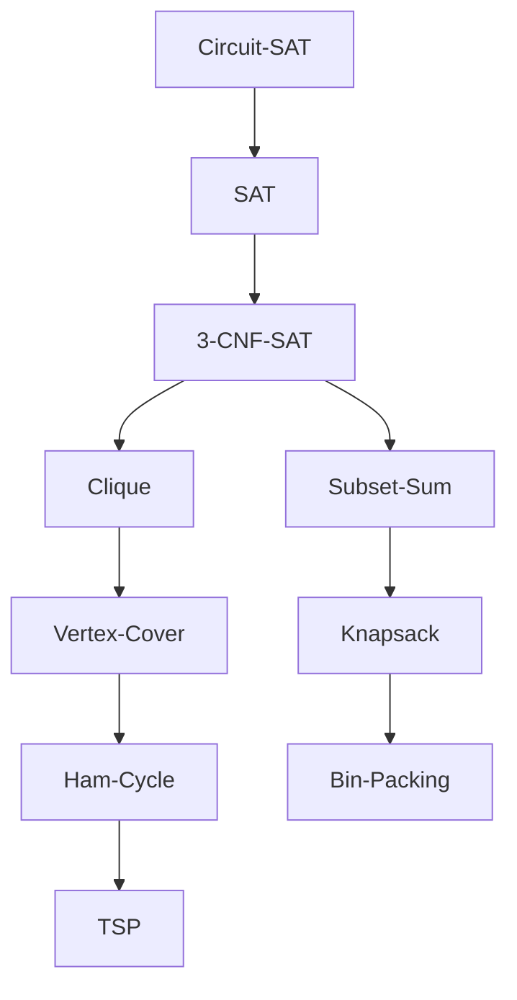
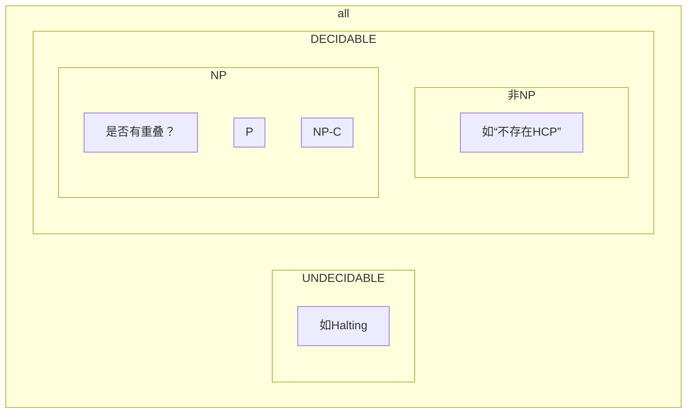

# Computational Complexity

第一个NPC：C-SAT

伪多项式时间算法：0-1背包：T(N)=O(N•W)



**Optimal Lower Bound**

* Bin packing: total size
* TSP: 最小生成树
* Vertex cover: number of mutual disjoint edges(相互之间没有共同交点的边)
* Knapsack(0-1): 分数情况最优解
* Scheduling: m台机器，每个percent time为pi，则为$\large\max(\frac{\sum p_i}{m}, \max(p_i))$
* Max-cut: Sum of all edges
* K-center: Binary Search

---


https://blog.csdn.net/huang1024rui/article/details/49154507

相似

| P             | NP           |
| ------------- | ------------ |
| Euler         | Hamilton     |
| Shortest Path | Longest Path |
| 2-CNF         | 3-CNF        |

**可计算理论(Computability Theory**

* 可计算性Computability
* 计算复杂性Computational Complexity

**Piano公理，实数完备性**

Hilbert 23问之一：Question of **Decidability**: Could there exist, at least in principle, any definite method or process by which all mathematical questions could be decided?

Kurt Gödel不完备定理: not all true statements that evolve from an axiomatic system can be proven – we can never know everything nor prove everything we discover.

不可判断问题

> Ex. Halting problem：能否写出一个程序，判断给定程序是否会死循环？
>
> 不存在。反证：假设存在，则必能自查，无穷套娃(recursively undecidable)
>
> \\	下面这个Loop不是停机程序。。。停机程序是在"P(P) loops?"这边用到的
>
> ```cpp
> Loop( P ) {
> /* 1：若会死循环则输出"Yes" */
>     if ( P(P) loops )
>         print (YES);
> /* 2：为什么要这样？而不是print(NO) */
>     else
>         infinite_loop();	// 如 while(1){}
> }
> // 若 &P = Loop
> // Terminate --> 2 --> 意味着是Loops
> // Loops --> 1 --> 意味着是Terminate
> // 效果同“这句话是假话”
> // 出错的地方只能在于 "P(P) loops"(其他地方不可能有错)，因为这是无法判断的
> ```
>
> 类似于理发师悖论

## 计算模型

* 递归函数

    * 分为初始函数、递归算子(用于构造复杂函数的递推关系)
    * Ex. 加法：`f(m,0)=m; f(m,n+1)=s(f(m,n)); s(i)=i+1;/*后继函数*/`

* λ算法

    * 变量替换
    * 将所有函数定义为一元函数
        * 多元函数可以转化为一元函数的组合

        ```cpp
        f (x) = x + 1:		λ x. x + 1    
        f(2):				(λ x. x + 1) 2
        f(x, y) = x - y:	λ x. λ y. x – y
        ```

* 图灵机

    * 能够抽象出模型，并且定义计算过程，就是可计算的
        * 与前两者不同，前两者都是数学方法
    * Deterministic Turing Machine
    * Nondeterministic Turing Machine

### 图灵机

模型：一个无限的存储带，一个可左右移动的读写头，一个有穷控制器(FSM，控制读写头)

* Deterministic Turing Machine
    * 就像上面x+1这种，可以按照确定好的方法一步一步来
* Nondeterministic Turing Machine
    * free to choose its next step from a finite set. And if one of these steps leads to a solution, it will “

<!---->

<!---->

<!---->

## Complexity Type

**NP**:

* Nondeterministic Polynomial-time
* 给出一个答案(certificate)，可在<u>多项式时间</u>被<u>非确定图灵机</u>**证明/判定**答案正误的问题
    * 汉密尔顿回路问题就是NP的
    * 但是像”给定一个图，是否**不**存在汉密尔顿回路“就是 非NP 问题(可以判断但不是NP)

[**NP-C**](# NPC): NP-Complete

* An NP-complete problem has the property that **any** problem in NP can be **polynomially reduced** to it. (所有NP可在多项式时间内归约为NPC)
    * If we can solve any(任意一个) NP-complete problem in polynomial time, then we will be able to solve, in polynomial time, all the problems in NP!
* 若NPC和P有交集，则NP=P
    * $已知P \subseteq NP，未知 P \subset NP$

**co-NP**：补问题属于NP的问题

即$L \in co-NP \Longleftrightarrow \bar{L} \in NP$

[NP-Hard](# NP-Hard)

---




---

### A Formal-language Framework

**Abstract problem** 

an <u>abstract problem Q</u> is a binary relation on a <u>set I</u> of problem <u>instances</u> and a <u>set S</u> of problem <u>solutions</u>.

Ex1. Optimization

* Q = SHORTEST-PATH
* I = { <G, u, v>: G=(V, E) is an undirected graph; u, v ∈ V };
* S = { <u, w1, w2, …, wk, v>: <u, w1>, …, <wk, v> ∈ E }

Ex2. Decision (基本上通过加个k都能转换)

* Q = PATH
* I = { <G, u, v, k>: G=(V, E) is an undirected graph; u, v ∈ V; k ≥ 0 is an integer };
* S = { 0, 1 }.

**Encoding**

一个Q对应的**I**可以被映射到{0, 1}构成的数据(binary string)，则Q为**Concrete problem**

如binary representaion: 19=10011, unary representation: 19=1111111111111111111


<u>决策问题(1/0)与优化问题是等价的</u>

### Formal-language Theory

* <u>An alphabet Σ is a finite set of symbols</u> (For dicision problem, **∑ = { 0, 1 }**)
* <u>A language L over Σ is any set of strings made up of symbols from Σ</u> (For dicision problem, **L = { x ∈ Σ\*: Q(x) = 1 }**) (对应就是问题，例如TSP问题、HCP问题等等都是一种language
* Denote empty string by ε
* Denote empty language by Ø
* <u>Language of **all** strings over Σ is denoted by Σ\*</u> (这是无穷的吗？应该是，反正他没有实际意义)
* <u>The complement of L is denoted by Σ\*-L</u>
* The *concatenation* of two languages L~1~ and L~2~ is the language
    \\	L = { x~1~x~2~ : x~1~ ∈ L~1~ and x~2~ ∈ L~2~ }.
* The *closure* or Kleene star of a language L is the language
    \\	L*= {ε} ∪ L ∪ L^2^ ∪ L^3^ ∪ ···,
    where L^k^ is the language obtained by concatenating L to itself k times

---

#### 用判定算法定义P

* Algorithm A *accepts* a string x ∈ {0, 1}\* if A(x) = 1
* Algorithm A *rejects* a string x if A(x) = 0
* A language L is *decided* by an algorithm A if **every** binary string *in* L is *accepted* by A and **every** binary string *not in* L is *rejected* by A
    * To accept a language, an algorithm need only worry about strings in L; But to decide a language, it must correctly accept or reject every string in {0, 1}\*
* <u>P = { L ⊆ {0, 1}\* : there exists an algorithm A that decides L in polynomial time }</u> (可以在多项式时间内被某算法decides的语言L)

---

#### 用验证算法定义NP

* A verification algorithm is a two-argument algorithm A, where one argument is an ordinary *input* string *x*(Language) and the other is a binary string  *y* called a *certificate*. (x是个Instance，y是x的一个可能解)

    * certificate实际也是给Nondeterministic图灵机的一个额外输入，以帮助其"always choose the correct one"

    

* A two-argument algorithm A verifies an input string x if there exists a certificate y such that A(x, y) = 1.

* The language verified by a verification algorithm A is 
    \\	L = { x ∈ {0, 1}\* : there exists y ∈ {0, 1}* such that A(x, y) = 1}.

* A language L belongs to NP iff there exist a two-input <u>polynomial-time</u> algorithm A and a constant c such that <u>L = { x ∈ {0, 1}\* : there exists a certificate y with |y| = O(|x|^c^) such that A(x, y) = 1 }</u>.  We say that algorithm A verifies language L in polynomial time.

---

NP对取补操作是否封闭

$(L \in NP \Longrightarrow \overline{L} \in NP) ?$

co-NP = the set of languages L such that $\overline{L} \in NP$


### 多项式归约

#### Turing Reductions

也叫 Oracle Reductions(黑盒归约？

多项式时间的图灵归约叫Cook Reductions

What is **polynomially reduced**?

* Given any instance α ∈ Problem A, if we can find a program R(α) -> β ∈ Problem B with T~R~(N) = O(N^k1^), and another program D(β) to get an answer in time O(N^k2^).  And more, if the answer for β is the same as the answer for α. Then
    * 多项式转换时间算法R能将α转化为问题β，D(β)为多项式复杂度的<u>decision problem(Yes or No)</u>

#### Karp Reductions

图灵归约的特殊情况，<u>基于判定问题</u>

**定义<u>语言</u>的多项式归约方法**

A language L1 is polynomial-time reducible to a language L2 ( L1 ≤~P~ L2，called *<u>no harder than</u>*，==注意方向==) if there exists a polynomial-time computable function  f : {0, 1}\* → {0,1}\* such that <u>for all x ∈ {0, 1}\*, x ∈ L~1~ **==iff==** f (x) ∈ L~2~</u>.

We call the function f the *reduction function*, and a polynomial-time algorithm F that computes  f  is called a *reduction algorithm*.

##### NPC

A language L ⊆ {0, 1}* is *NP-complete* if
1. L ∈ NP
2. L’ ≤~P~ L for **every** L’ ∈ NP.

##### NP-Hard

A language L ⊆ {0, 1}* is *NP-hard* if

1.  L’ ≤~P~ L for **every** L’ ∈ NP.

#### 归约例

**Ex. HCP-->TSP** 

Suppose that we already know that the Hamiltonian cycle problem is NP-complete.  Prove that the traveling salesman problem is NP-complete as well. (in polynomial time)

\\	Traveling salesman problem(判定问题版本，优化问题版本是求最小值): Given a complete graph G=(V, E), with edge costs, and an integer K, <u>is there</u> a simple cycle that visits all vertices and has total cost <= K?(本质上就是完全图(两两连线)中最小代价的汉密尔顿问题

证法见PPT15(反的，由TSP推HCP) (R()= 1.构建完全图；2.赋不同权重1, 2；3.用HCP找到长度为N的回路；is polynomial)

<u>由此，若能找到一个Poly的NP问题，则可证明所有NP都是Poly的</u>

第一个NP问题：可满足性问题(布尔运算式)

**Ex. 子团问题-->顶点覆盖**

已知子团问题(存在至少有k个顶点的完全子图(子团)？)是NPC，问顶点覆盖(存在至少k个顶点的子图，使得原图中每条边至少有一个顶点在子图中(即覆盖了所有的边)？)是不是NPC？

Proof1：顶点覆盖是NP(视V=E^2^，则为O(N^3^))

Proof2：用补图(点不变，边集的补)，f(G)=$\rm \overline G$

1. G has a *clique* of size K $\Longleftrightarrow$ $\rm \overline G$ has a *vertex cover* of size |V|-K
    * $\Longrightarrow$：设G的子团为V'，则显然V-V'为$\rm \overline G$的一个顶点覆盖，得证
    * $\Longleftarrow$：设$\rm \overline G$的顶点覆盖为V'，则V-V'是G的一个子团
        * 对**所有**u,v属于V
            * 若u∈V'或v∈V'，则(u,v)∈$\rm \overline G$
            * 若u∉V'且v∉V'，则(u,v)∈G
        * 由此可见<u>所有</u>两个顶点都不在V'中(都在V-V'中)的边都在G中，此即完全子图的定义，得证
2. F显然是O(E)=O(N^2^)的