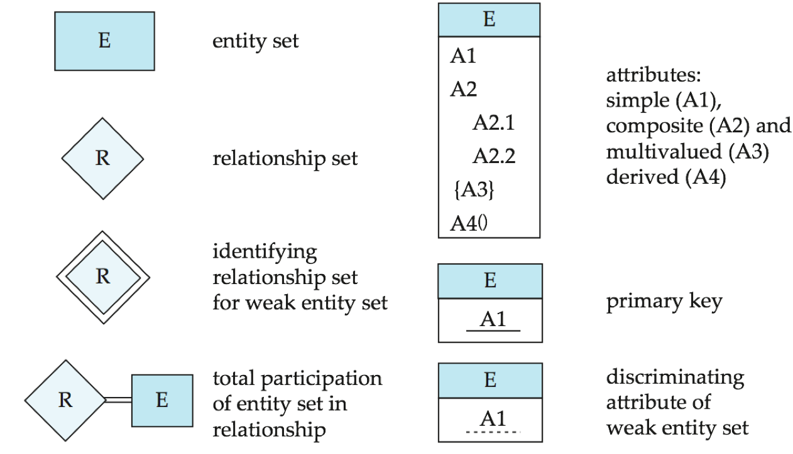
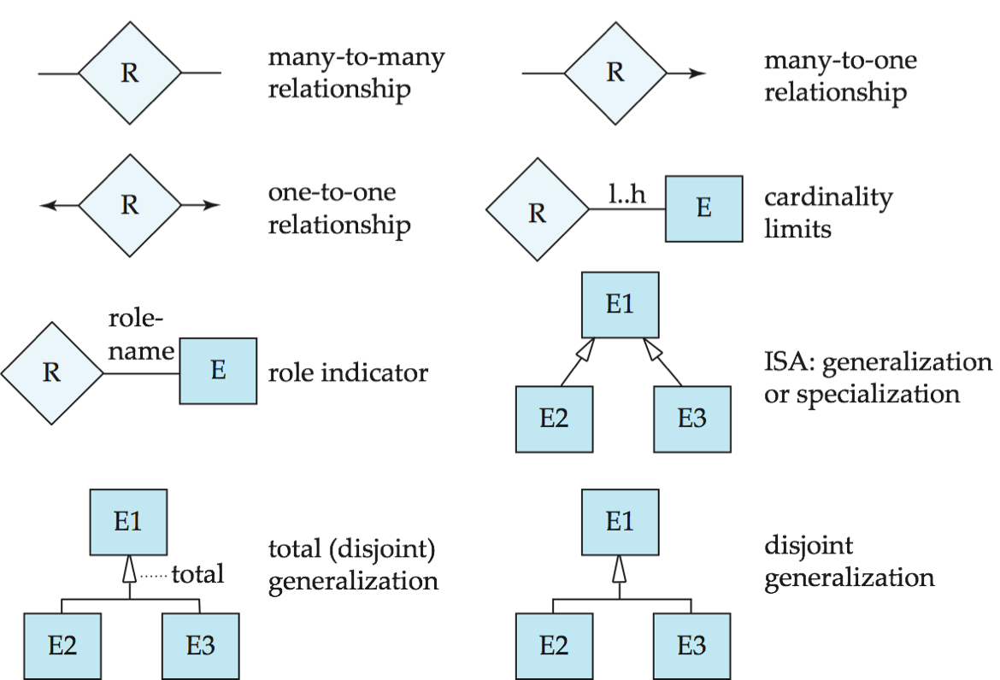
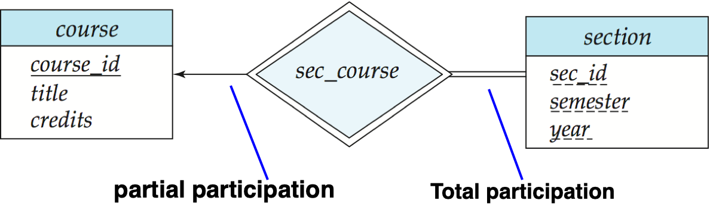
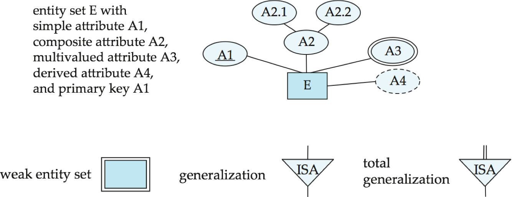
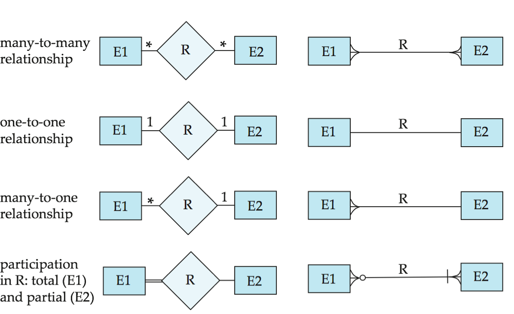
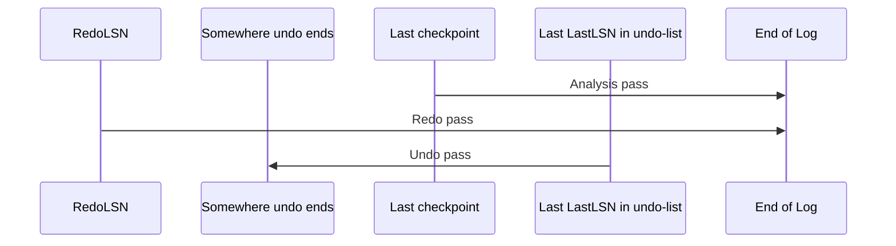

**Algebra**

$\large company\_name \mathcal{G}_{avg(salary)as\ avg\_salary}(works)$(group by company_name)

$\large \Pi_{person\_name,city}(\sigma_{company\_name = "FBC"\wedge salary > 10,000}(works)\Join employee)$

---

**SQL**

* in：判断是否在表里，注意需要属性相同
* exists：判断是否为空
* except：差运算，需要属性相同
* join on跟的是predicate不是attr
* view：`create view vName (attrlist, 可忽略) as select ... from ... where ...;`
* having：`group by dept_name having avg(salary) > 100000;`
* distinct：`select distinct expression[,expression...] from tables [where conditions];`  `count(distinct campus)`

思路

* exists+except可解决任意性问题：`select ... from ... except select ... from ... where exists ...;`
* 用笛卡尔积(逗号)将两个表串联可以将subquery消除：`select ... from A join B where a in (select ... from B where ...);` $\Longrightarrow$ `select ... from A join B as B1, B as B2 where ...;`
* 更新表的题目注意是否要多表更新，如插入消费记录的同时要更新卡片余额

---











* 单画弱实体集(只有表名)需要用双线方块


---

**Armstrong**

* ${\rm if}\ \beta \subseteq \alpha, {\rm then}\ \alpha \rightarrow \beta$ 
    * (`(ID, name) -> ID`)
* ${\rm if}\ \alpha \rightarrow \beta, {\rm then}\ \gamma\alpha \rightarrow \gamma\beta$
    * (`(name, ID) -> (name, salary)`)
* ${\rm if}\ \alpha \rightarrow \beta\ {\rm and}\ \beta \rightarrow \gamma, {\rm then}\ \alpha \rightarrow \gamma$
    * (`(ID, name) -> ID -> salary`)

* ${\rm if}\ \alpha \rightarrow \beta\ {\rm and}\ \alpha \rightarrow \gamma, {\rm then}\ \alpha \rightarrow \beta\gamma$

* ${\rm if}\ \alpha \rightarrow \beta\gamma, {\rm then}\ \alpha \rightarrow \beta\ {\rm and}\ \alpha \rightarrow \gamma$

* ${\rm if}\ \alpha \rightarrow \beta\ {\rm and}\ \gamma\beta \rightarrow \delta, {\rm then}\ \alpha\gamma \rightarrow \delta$

---

**3NF**

对F^+^中所有的函数依赖α->β，以下**至少有一项成立**

* α->β是平凡的(β⊆α)[若α不是超码，不平凡的α->β就是Partial Dependency]
* **α是R的超码**(α->R, R⊆α^+^)
* β-α(若不相交则为β)的每个属性都是Prime Attribute(From Candidate Key)

无损且依赖保持

```python
令Fc 是F 的正则覆盖;
i = 0;
将R中在F中未出现的模式单独拎出来记为R0
for each Fc 中的函数依赖α->β:
    if 没有模式Rj (1 <= j <= i)包含αβ:
        i = i + 1;
        Ri =(α, β)	# αβ可能都是多个属性

if 没有模式Rj (1 <= j <= i)包含R的候选码:	# 保证至少有一个Ri中有候选吗，从而保证是无损分解
    i = i + 1;
    Ri = R的任意候选码;
return (R0, R1, R2, ..., Ri)
```

---

**BCNF**

对F^+^中所有的函数依赖α->β，以下**至少有一项成立**

* α->β是平凡的(β⊆α)[若α不是超码，不平凡的α->β就是Partial Dependency]
* **α是R的超码**(α->R, R⊆α^+^)

无损但不一定依赖保持

```c++
result = {R}
compute Fplus;

while result 中有Ri不为BCNF:
    找到Ri上的一个非平凡函数依赖α->β/*α->Ri2*/，使得α->R不属于Fp/*α不为超码*/，且α∩β=∅/*不平凡*/;	// 一定能找到吗？？ 可以，不然就是BCNF了； **另外，β可以尽量取大**
    result = (result - Ri)/*第一次循环时此处为R-R=空集*/ ∪ (Ri - β)/*Ri1*/ ∪ (α, β)/*Ri2*/;	// α为Ri1与Ri2的共同属性
```

---

**4NF**

无损但不一定依赖保持

```cpp
result = {BCNF of R};
done = false;
D+ 为类似F+的东西，但是里面全部是MVD

while (在result 中有不属于4NF的模式Ri):
    令α->->β是在Ri上成立的一个非平凡多值依赖，它使得α->Ri不属于Di，并且α∩β=∅;
    result := (result - Ri)/*原结果去掉Ri*/ ∪ (Ri - β)/*去掉多值依赖于别人的*/ ∪ (α, β)
```

---

**无损**

分解后的二个子模式的共同属性必须是R1或R2的超码，即`R1∩R2->R1`和`R1∩R2->R2`至少有一个要属于F^+^

**依赖保持**

$\displaystyle F'^+ = (\bigcup_{i=1}^n F_i)^+  = F^+$

检查依赖α->β是否被保持的伪代码(课本P195)：

```python
# 若对F中的每个函数依赖都能有一个Ri满足该函数依赖，则该分解保持依赖
result = α
while(result 有变化)
    for each 分解后的 Ri	# 对于F中的某个α->β，投影到各个Ri中，判别是否有某个Ri能保持函数依赖α->β
        t = (result ∩ Ri)_plus ∩ Ri	# 这是干啥？找出
        result = result ∪ t
# 若最后result包含β中的所有属性，则α->β得到保持
```

---

**DTD**

```dtd
<!DOCTYPE movie_comment[
    <!ELEMENT movie_comment(movie*)>
    <!ELEMENT movie(director, comment+)>
    <!ATTLIST movie title ID #REQUIRED>
    <!ELEMENT director(#PCDATA)>
]>
<!DOCTYPE university_doc [
    <!ELEMENT university ((department|course|instructor)+)>
    <!ELEMENT department (building+, budget)>
    <!ATTLIST department dept_name ID #REQUIRED >	<!--ID/IDREF(S)不用写进ELEMENT的括号里-->
    <!ELEMENT building(#PCDATA)>
]>
```

**XML Schema**

```xml
<xs:schema xmlns:xs="http://www.w3.org/2001/XMLSchema">
    <xs:element name="university" type="universityType" />
    <xs:element name="department">
        <xs:complexType>
            <xs:sequence>
                <xs:element name="dept_name" type="xs:string" />
                <xs:element name="budget" type="xs:decimal" />
            </xs:sequence>
        </xs:complexType>
    </xs:element>
    ...
    <xs:complexType name="UniversityType">
        <xs:sequence>
            <xs:element ref="department" minOccurs="0" maxOccurs="unbounded" />
            ...
        </xs:sequence>
    </xs:complexType>
</xs:schema>
```

**XML**

```xml
<campus_cards>
    <pos pno="p003">	<!--ID和IDREF(S)作为属性-->
        <location> 四食堂 </location>
    </pos>
    <card cno="c0003">
        <name> 王浩 </name>
        <balance> 300 </balance>
        <detail pno="p003" ctime="...">
            <amount> 25 </amount>
        </detail>
        <detail pno="..." ctime = "...">...</detail>
    </card>
</campus_cards>
```

---

**XPath**

* `and` `or` `not()`，==`@`取属性==，`count()`
* 特殊字符
    * `/u3/course[@dept_name="CS"] | /university-3/course[building="曹主"]` 并集
    * `/university-3//name`

Ex. `/campus_cards/card[name="张帅"]/detail[amount=50]/id(pno)/location/text()` id(pno)获得是detail[amount=50]对应的pos元组

Ex2. `/movie_comment/movie[type=”action” and ./comment/user_name=”Alice” and ./comment/grade=5]/@title`

---

**XQuery**

* FLOWR
* 取属性(XMLSch)/主码(DTD)用@
* `for`+`,`是笛卡尔积的join
* 返回值记得加tag，加`{}`取变量值

Nested Query

```xquery
... return <university-1> {for $d in /university/department
        return <department> { $d/* }
            { for $c in /university/course[dept_name = $d/dept_name] return {$c} }
        </department>
    } </university-1>
```

##### Sort

```xquery
for $i in /university/instructor
order by $i/name [ascending/descending]
return <instructor> { $i/* } </instructor>
```

Ex.

```xquery
for $p in /movie_comment/movie[director="Yimou Zhang"]
where count($p/comment[grade=5]) >= 1
return {$p/@title}
```

```xquery
for $x in /campus_cards/card/detail, $y in /campus_cards/card[name="张帅"]/detail
where $x/@pno=$y/@pno and $x/cdate=$y/cdate and $x/@cno != $y/@cno
return <cno> {$x/@cno} </cno>

<!--不能写下面这样，因为一人不止一张卡-->

for $x in /campus_cards/card/detail[not name="张帅"], $y in /campus_cards/card[name="张帅"]/detail
where $x/@pno=$y/@pno and $x/cdate=$y/cdate
return <cno> {$x/cno} </cno>
```

---

**B+**

MaxFanout：最大子节点数

* 根节点：$2$\~$n$个child，$1$~$n-1$个keys
    * `keyNum = childNum - 1`
* 非叶：$\lceil n/2 \rceil$~$n$个child($\lceil n/2 \rceil-1$~$n-1$个keys)
    * `keyNum = childNum - 1`
* 叶：$\lceil (n-1)/2 \rceil$~$n-1$个keys
    * `keyNum = ptrNum`

计算Fanout：IndexSize \* (N-1) + PtrSize \* N ≤ BlockSize

---

**符号表示**

* n~r~: number of tuples in a relation r.
* b~r~: number of blocks containing tuples of r.
* b~b~: [每个归并段(run)的buffer数](# External Merge)/[每个关系的buffer数](# Merge Join)
* f~r~: blocking factor of r
    * i.e., the number of tuples of r that fit into one block.
* l~r~: number of bytes for a tuple in r
* I~f~: tuples of r are stored together physically in a file, then:
* V(A, r): number of distinct values that appear in r for attribute A; same as the size of A(r).
* SC(A, r): selection cardinality of attribute A of relation r ; average number of records that satisfy equality on A.
    * Sc(A, r) == n~r~ / V(A, r)
* F~i~: average **fan-out** of internal nodes of index i, for tree-structured indices such as B+-trees.
* Ht~i~ : number of levels in index i — i.e., the height of index i.
    * For a balanced tree index (such as B+-tree) on attribute A of relation r: $HT_i = \lceil \log_{F_i} (V(A,r)) \rceil$.
    * For a hash index, HT~i~ is 1.

---

**Cost**

**Select**

|      | Algorithm                                   | Cost                           |
| ---- | ------------------------------------------- | ------------------------------ |
| A1   | Linear Search                               | tS + br ∗ tT                   |
| A1   | Linear Search, Equality on Key              | Average cost: tS + (br/2) ∗ tT |
| A2   | Primary B+-tree Index, Equality on Key      | (hi +1) ∗ (tT +tS)             |
| A3   | Primary B+-tree Index, Equality on Nonkey   | (hi+1)tS + (hi+b)tT            |
| A4   | Secondary B+-tree Index, Equality on Key    | (hi +1) ∗ (tT +tS)             |
| A4   | Secondary B+-tree Index, Equality on Nonkey | (hi +n) ∗ (tT +tS)             |
| A5   | Primary B+-tree Index, Comparison           | (hi+1)tS + (hi+b)tT            |
| A6   | Secondary B+-tree Index, Comparison         | (hi +n) ∗ (tT +tS)             |

**Join**

Nested Loop：$(b_r + n_r \times b_s) t_t + (b_r + n_r \times 1) t_s$；$(b_r + b_s) t_t + 2t_s$

Block Nested Loop：$(b_r + b_r \times b_s)t_t + 2b_rt_s$；$(b_r + b_s)t_t + 2 t_s$ 

Block Nested Loop with given buffer size：$(\lceil b_r/(M-2) \rceil \times b_s + b_r)t_t + 2 \lceil b_r/(M-2) \rceil t_s$

Indexed Nested Loop：$b_r(t_t+t_s) + n_r\times c$，$c = (H_{t_i} + 1)(t_t+t_s)$ for B+，inner table has B+ index on the join attribute(s)

Merge Join

* Sort Cost: $[(2\lceil \log_{M-1}(b_r/M) \rceil +2)b_r + (2\lceil \log_{M-1}(b_s/M) \rceil +2)b_s]t_t \\+ [2 \lceil b_r/M \rceil + 2 \lceil b_r / b_b \rceil \times \lceil \log_{M-1}(b_r/M) \rceil + 2 \lceil b_s / b_b \rceil \times \lceil \log_{M-1}(b_s/M) \rceil]t_s$
    * 这里要把final write也算上了
* Join cost: $(b_r+b_s)t_t + (\lceil b_r / b_b \rceil + \lceil b_s / b_b \rceil)t_s$

**Merge**

<u>For final pass, we don’t count write cost，因为最后不一定要写回磁盘</u>

<u>Merge</u>PassNum = $\lceil \log_{M-1}(N_0) \rceil$ = $\lceil \log_{M-1}(b_r/M) \rceil$

BlockTransNum = $(2\lceil \log_{M-1}(b_r/M) \rceil +1)b_r$

SeekNum = $2 \lceil b_r/M \rceil + (2 \lceil b_r / b_b \rceil \times \lceil \log_{M-1}(b_r/M) \rceil - \lceil b_r / b_b \rceil)$

Where b~b~ denotes 每个run文件(每次寻道？)读写的块数，通常为1 (1表示所有block分散在不同的磁道，如果放得紧一点就能是M了？

**补充**

N-way的利弊：N大的话可以少IO几次，加快时间；但是如果数据量远远远大于内存容量，就必须多归并几次了

---

**size**

### Select size

* **Equi Sel**
    * 选择结果占用的块数：$\lceil SC(A, r) / f_r \rceil$
    * Ex. BinarySearch cost: $\lceil \log(b_r) \rceil + \lceil SC(A, r) / f_r \rceil - 1$ ？？？？？为什么要-1
* **Sel with cmp**
    * Take $\sigma_{A \leqslant V}(r)$ for example
        * v < min(A,r)：结果元组数 = 0
        * else: 结果元组数 = $\displaystyle n_r \times \frac{v - \min(A,r)}{\max(A, r) - \min(A, r)}$
* **Complex Select**
    * Selectivity 中选率
    * **Negation**
        * $\sigma_{¬\theta}(r)$
        * n~r~ = size(σ~θ~(r)) = n~r~×(1 - S~i~/n~r~) ($\sigma_{!\theta}$的中选率为1 - S~i~/n~r~)
    * **Conjunction**
        * $\sigma_{\theta_1 \wedge \theta_2 \wedge ... \wedge \theta_n}(r)$
        * 结果元组数 = 
    * **Disjunction**
        * $\sigma_{\theta_1 \vee \theta_2 \vee ... \vee \theta_n}(r)$
        * 结果元组数 = 

**Join**

* **Cartesian prod**
    * nr\*ns tuples, each for Ir+Is bytes
* If R∩S is a <u>key for r</u>, then s中一个元组最多和r中一个元组Join (symmetric for s)，连接结果得到的行数≤s的行数
* If R∩S forms a <u>foreign key in r, referencing s</u>，则结果行数＝r的行数, 即结果行数通常等于参照关系的行数 (symmetric for s referencing r)
* If R∩S = {A} is <u>not a key for R nor S</u>. If we assume that each value of A appears with equal probability, then every tuple *t* in *R* produces tuples in $R\Join S$, the number of tuples in $R\Join S$ is estimated to be: $\large \min(n_r \times r中元组中选率, n_s \times s中元组中选率) = \min(\frac{n_r \times n_s}{V(A, s)}, \frac{n_r \times n_s}{V(A, r)}) = \frac{n_r \times n_s}{\max(V(A,r), V(A,s))}$

---

LockPoint：一个事务得到所有锁的时间

2PL为冲突可串的充分不必要条件，2PL无法防止死锁，Strict2PL可以避免级联回滚

树形锁：只有X锁；只能锁子节点，不能越级到孙节点，且父子锁来自同事务；任何事务上锁得从上往下遍历

前驱图：T1$\Rightarrow$T2, T2$\Rightarrow$T3, T1$\Rightarrow$T3时，即使是在同一个table上的，也不能省略T1$\Rightarrow$T3

前驱图acyclic(无环)的就是conflict serializable(冲突可串)的，拓扑排序

无级联调度：事务T2要读先前被T1写过的数据，则**T1的commit必须在<u>T2的read</u>**之前，其也是**<u>可恢复的</u>**

**Intention lock**

**Deadlock Prevention**

* Non-preemptive（非抢占式）: **Wait-die** scheme，早等后滚
* Preemptive（抢占式）: **Wound-wait** scheme，早抢后等


**Detection**：**Wait-for graph**，有向图，点是事务，有向边表示"要等待的事务(申请)-->被等待的事务(正在占用)"，若wf图有环，则系统会进入死锁状态(充要条件)，

---

| LSN                 | PageLSN                    | RecLSN                       | RedoLSN |
| ------------------- | -------------------------- | ---------------------------- | ------- |
| Log sequence number | 页上，最后update的log的LSN | 页上，最后写到disk的log的LSN |         |

Normal log record

| LSN  | TransID | PrevLSN | RedoInfo | UndoInfo |
| ---- | ------- | ------- | -------- | -------- |
|      | 事务    |         |          |          |

compensation log record (**CLR**)

| LSN  | TransID | UndoNextLSN | RedoInfo |
| ---- | ------- | ----------- | -------- |
|      |         |             |          |

**RecLSN** is an LSN such that <u>log records before this LSN have already been applied to the page version on disk</u>

* Set to current <u>end of log</u> when a page is inserted into dirty page table (just before being updated)
* Recorded in checkpoints, helps to minimize redo work



1. Analysis pass：决定哪些事务要undo，哪些页是脏的(disk版本不是最新的)，确定RedoLSN(LSN from which redo should start，该点之前的log records已经反映到database disk上了)

    1. 从最后一个checkpoint开始
        * RedoLSN := `有脏页 ? 脏页表中RecLSN最小值 : checkpoint的LSN`
        * undo-list(初值) := checkpoint的log中的事务集(比如是concurrent的就有多个)，记录LastLSN
    2. 开始向后扫描
        * 更新undo-list和LastLSN
        * 如果发现update的log且Page不在脏页表上则添加（此时的RecLSN设置为LSN of the update log record）

2. Redo

    1. 从redo LSN开始：

        ```python
        if Page不在脏页表 or log的LSN<所在Page的RecLSN:
            pass
        else:
            if LSN≤拿出来的PageLSN(说明是在写入磁盘后的新的log):
                pass
            else:
                redo()
        ```

3. Undo
    1. 从LastLSN开始
    2. 边undo undo-list里的，边写log
    3. 遇到Tx begin就写个`<Tx, abort>`，并移除出undo-list

    * 要优化可以写CLR