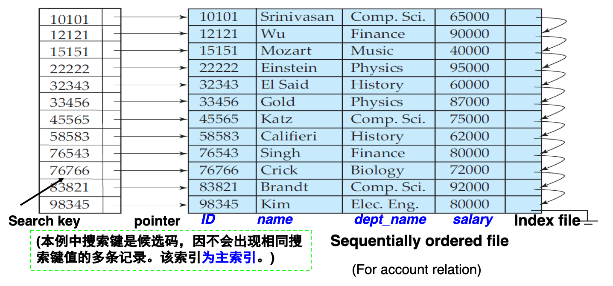
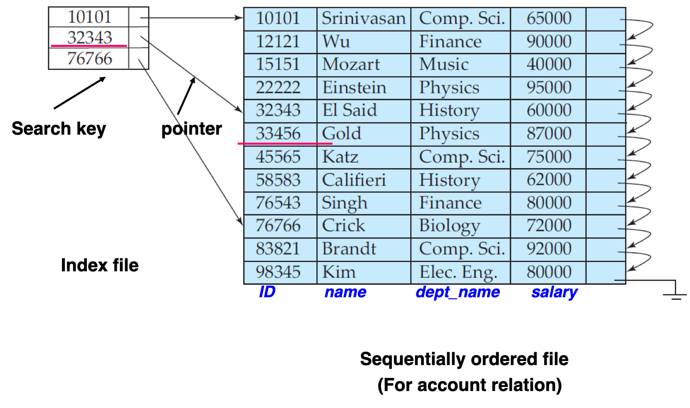
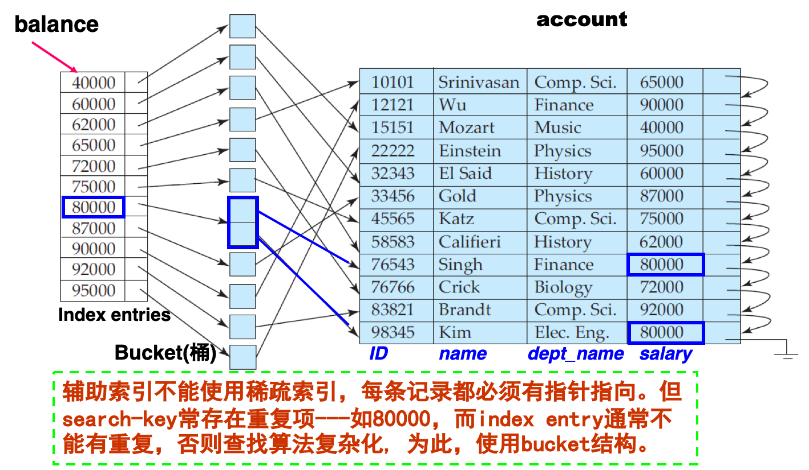
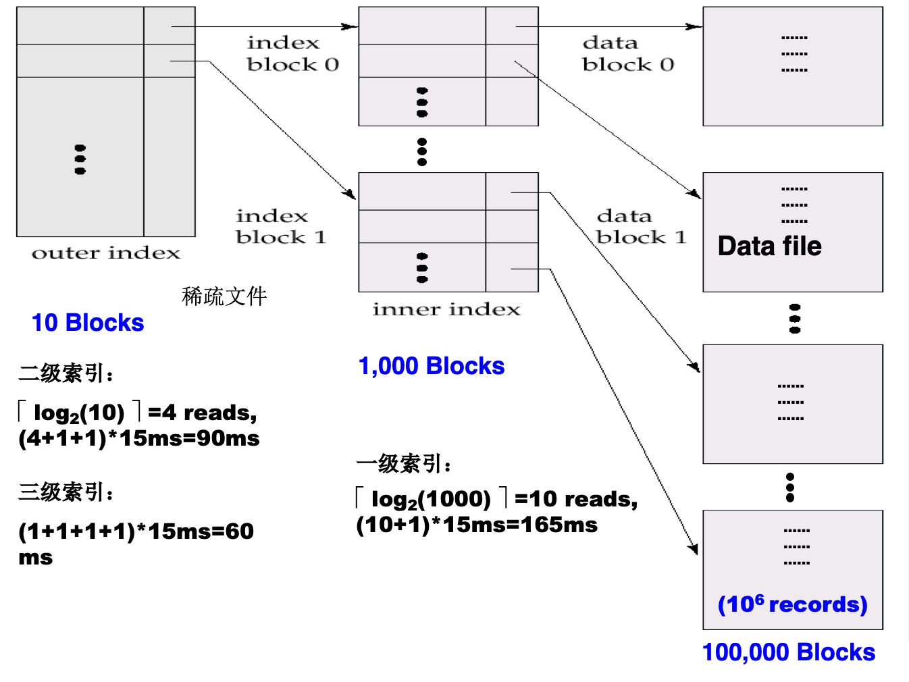

# Basic

* Indexing mechanisms used to speed up access to desired data.

    * E.g., author catalog in library

* An index file consists of records (called index entries) of the form:

    | Search-Key                                                   | Pointer |
    | ------------------------------------------------------------ | ------- |
    | attribute or set of attributes used to look up records in a file. |         |

* Index files are typically much smaller than the original file.

* Two basic kinds of indices: (index文件中索引记录如何组织？取决于索引类型)

    * Ordered indices (顺序索引):  search keys (index entries) are stored in sorted order
    * Hash indices (散列索引):  search keys (index entries) are distributed uniformly across “buckets” using a “hash function”. 

## Evaluation Metrics(度量指标)

* Access types which are supported efficiently (能有效支持的存取类型).  E.g., 
    * records with a specified value in the attribute. 
        * where Col=v
    * or records with an attribute value falling in a specified **range** of values.  
        * E.g. where Col Between v1 and v2 . 
    * <u>Hash index is not good for ‘Between’ query condition, but ordered index is good.</u>
* Access time
* Insertion time
* Deletion time
* Space overhead (空间开销)
* 时间效率和空间效率是衡量索引技术最主要的指标，也是数据库系统组织和管理技术的关注的焦点之一。

# Ordered Indices

**基本概念**

* In an ordered index, index entries are stored <u>sorted on the search key value</u>. E.g., author catalog in library.
* Sequentially ordered file (顺序排序文件): The records in the file (data file) are ordered by a search-key. (Chapter 10)
* **Primary index**: is an index whose search key equal to the search key of the sequentially ordered data file, on which the index is made. (与对应的数据文件本身的排列顺序相同的索引称为主索引)
    * Also called **clustering index** (聚集索引)
    * The search key of a primary index is usually but not necessarily the primary key. 主索引的搜索键通常是但并非一定是主码。
        * Non-sequential files don’t have primary index, but the relations can have primary key.
    * Index-sequential file (索引顺序文件): sequentially ordered file with a primary index.
* Secondary index (辅助索引): an index whose search key specifies an order different from the sequential order of the file. Also called non-clustering index. 与本来的不一样的索引，另一种索引方式？
* Two types of ordered indices: 
    * dense index (稠密索引)
    * sparse index (稀疏索引)

### Dense Index File

File中每个search-key都有一个索引项，索引项包括search-key以及指向具有该search-key的<u>第一条数据记录</u>的指针



### Sparse Index File

只有search-key的某些值有索引项，索引项包括search-key以及指向具有该search-key的<u>第一条数据记录</u>的指针 (Usually, one block of data gives an index entry, a block contains a number of ordered data records)



只有当关系<u>按索引码排序时</u>才能用 (就是clustering)

* To locate a record with search-key value K , (搜索方法)
    * Step1: Find index record with largest search-key value < K。 E.g. for 33456 -> 32343 (See next page)
    * Step2: Search file sequentially starting at the record to which the index entry points

### Secondary Indices

**辅助索引**

主索引不能用来查询(不能排序)，因此要用二级索引。比如老师表按ID排序，但是查找时想查某个系的老师，或者想找工资在某个range的老师，但是这个又没有排序

<u>二级索引不能是稀疏的</u>(因为数据文件不是按照二级索引所在的属性进行排序的；且不一定是个key(比如dept\_name))

**bucket**：比如多个老师收入一样，就是同一个桶，桶里再有指针分别指向这几个老师



### Multilevel Index

在数据很大的时候用。数据过大可能会导致1. 内存装不下2. 查找开销很大

* outer index – a sparse index of **primary index**
* inner index – the **primary index**-sequential file
* If even outer index is too large to fit in main memory, yet another level of index can be created, and so on. (可以推广到任意多层索引)
* Indices at all levels must be updated on insertion or deletion from the file. 所以维护开销会变大



可以用于聚集索引也可以用于非聚集索引

## Index Update

### Deletion

1. 找到并删除
2. 更新索引文件 (PPT11.19有可放映的动态演示)
    * Dense
        * 同个search-key对应单个tuples：直接删除索引
        * 同个search-key对应多个tuples(只能是多级的，否则就是Sparse了)
            * Secondary：删掉bucket中指向tuple的指针
            * Index Entry
                * Index Entry是这个key：换成同一个bucket中的下一个key(这里有点迷，如果bucket中只有一个是不是要全部删掉？应该是的，类似Sparse的情况
                * Index Entry不是这个key：不管
    * Sparse
        * 删除项不在索引里出现：不干活
        * 出现了：替换成删除项的下一个记录(如果下一个已经有了那直接删掉就行了(因为这说明被删除的是个孤儿))
    * Multilevel：从底向上每层干上述两种事情

### Insertion

1. 利用索引找到并先插入
2. 修改索引
    * Dense
        * 没这个search-key：直接插入
        * 有这个search-key了：改bucket和index entry
    * Sparse（假设一个block对应一个index entry）
        * 创建了一个新的block：用本block最小的索引值更新索引
        * 是本block最小的：更新对应entry指向的位置
        * 其他：不动

## Summary of Primary and Secondary Indices

* Indices offer substantial benefits when searching for records.
* ordered indices: dense index; sparse index. But secondary indices must be dense.
* <u>Sequential scan using primary index is efficient. But a sequential scan using a secondary index is expensive(是O(N)的无序访问).</u>
    * each record access may fetch a new block from disk.
* When a file is modified, every index on the file must be updated; Updating indices imposes overhead on database modification.

# B+

## Brief

* Disadvantage of indexed-sequential files
    * performance degrades as file grows, since many overflow blocks get created
    * Periodic reorganization of entire index file is required.
* Advantage of B+-tree index files
    * Automatically reorganizes itself with small, local, changes, in the face of insertions and deletions
    * Reorganization of entire file is not required to maintain performance
* Disadvantage of B+-trees
    * extra insertion and deletion overhead
    * space overhead. 空间浪费
* Advantages of B+-trees outweigh disadvantages, and they are used extensively.

## 结构

MaxFanout：最大子节点数

* 根节点：$2$\~$n$个孩子，$1$~$n-1$个keys
    * `keyNum = childNum - 1`
* 非叶：$\lceil n/2 \rceil$~$n$个孩子($\lceil n/2 \rceil-1$~$n-1$个keys)
    * `keyNum = childNum - 1`
* 叶：$\lceil (n-1)/2 \rceil$~$n-1$个keys？？？这和ADS的应该是不一样的规则，为什么不一样？因为这里叶节点的指针也是要存指向data的ptr的
    * `keyNum = ptrNum`

### Leaf

指向bucket(search-key不为主键)或直接指向tuple

### Non-Leaf

本质是多层的稀疏索引(<u>本来多层是不能稀疏的</u>，但是由于这里是有顺序的因此可以)

## 属性

## 操作

### Query

**Find all records with a search-key value of k.**

1. Start with the root node
    1. Examine the node for the smallest search-key value > k (在节点中找比k大的最小键值, 即遇到第一个比K大的键值) (E.g. K= ‘Downtown’)，==不是>\===
    2. If such a value exists, assume it is Vi.  Then follow Pi to the child node (沿左指针指向子节点)
    3. Otherwise k >= Vm–1, where there are m pointers in the node.  Then follow Pm to the child node.
2. If the node reached by following the pointer above is not a leaf node, repeat the above procedure on the node, and follow the corresponding pointer. (继续往下找)
3. Eventually reach a leaf node.  If for some i, key Vi = k  follow pointer Pi  to the desired record or bucket.  Else no record with search-key value k exists.

### Insertion

有bucket了就在bucket里更新

否则更新leaf(`findMin()`)

超：拆分出右节点，更新父节点(`findMin()`)，递归

### Deletion

Omitted

不足：合并，删除右节点，更新父节点中keys(`findMin()`)，递归

## File Organization

叶节点存记录

* Index file degradation problem is solved by using B+-Tree indices.  Data file degradation problem is solved by using B+-Tree File Organization.
* <u>The leaf nodes in a B+-tree file organization store data records, instead of pointers.</u> ？
* Since records are larger than pointers, the maximum number of records that can be stored in a leaf node is less than the number of pointers in a nonleaf node.
* Leaf nodes are still required to be half full.
* Insertion and deletion are handled in the same way as insertion and deletion of entries in a B+-tree index.
* Good space utilization is important since records use more space than pointers.
* To improve space utilization, involve more sibling nodes in redistribution during splits and merges
    * Involving 2 siblings in redistribution (to avoid split / merge where possible) results in each node having at least $\lfloor 2n/3 \rfloor$ entries

## QA

为什么数据库中要把节点做大>？因为如果对节点中进行遍历采用二分查找，复杂度就不是ADS顺序查找的$T_{Insert}(M,N) = O(M\log_MN) = O(\frac{M}{\log M}\log N)$了，而是$O(\log M\log_MN) = O(\log N)$

为什么能保持叶节点深度一样>？层的增减是在root进行的

# Index in SQL

```sql
create index <index-name> on <table-name>(<attribute-list>);
-- E.g
create index b-index on branch(branch-name);
create index cust-strt-city-index on customer(customer-city, customer-street);
```

