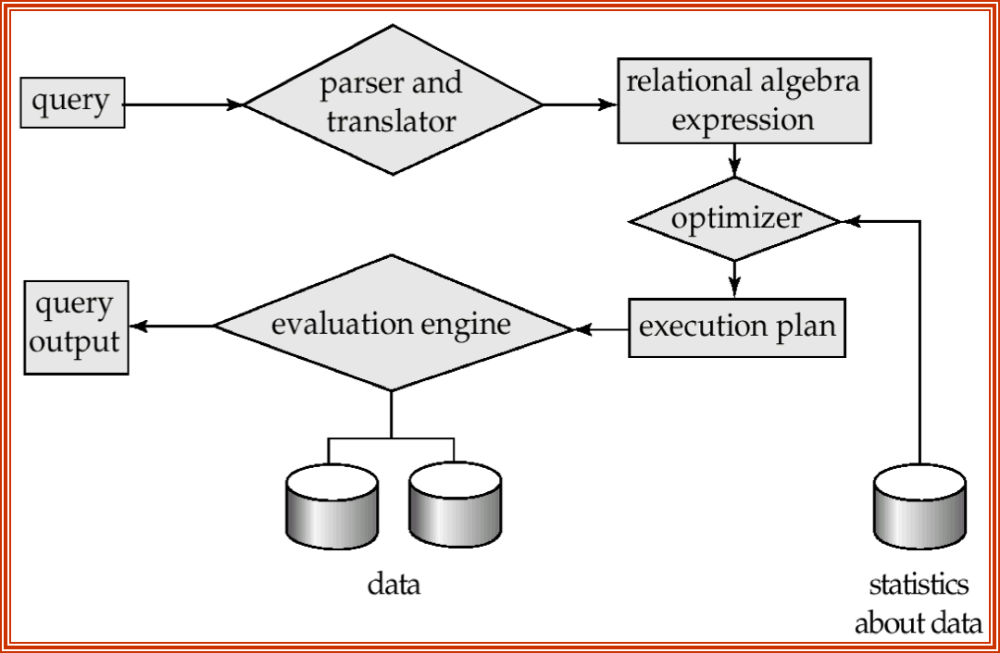
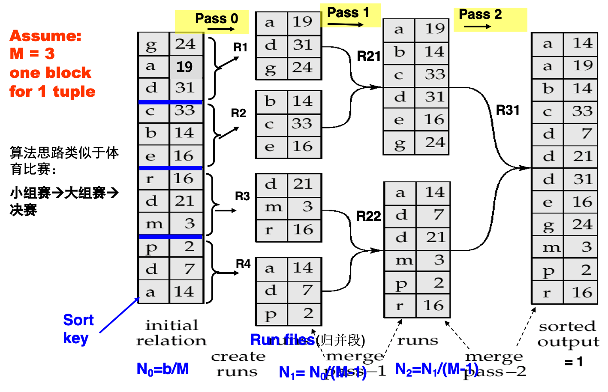

[TOC]



# Measures

**符号表示**

* n~r~: number of tuples in a relation r.
* b~r~: number of blocks containing tuples of r.
* b~b~: [每个归并段(run)的buffer数](# External Merge)/[每个关系的buffer数](# Merge Join)
* f~r~: blocking factor of r
    * i.e., the number of tuples of r that fit into one block.
* I~f~: tuples of r are stored together physically in a file, then:
* l~r~: number of bytes for a tuple in r
* V(A, r): number of distinct values that appear in r for attribute A; same as the size of A(r).
* SC(A, r): selection cardinality of attribute A of relation r ; average number of records that satisfy equality on A.
    * Sc(A, r) == n~r~ / V(A, r)


* F~i~: average **fan-out** of internal nodes of index i, for tree-structured indices such as B+-trees.
* Ht~i~ : number of levels in index i — i.e., the height of index i.
    * For a balanced tree index (such as B+-tree) on attribute A of relation r: $HT_i = \lceil \log_{F_i} (V(A,r)) \rceil$.
    * For a hash index, HT~i~ is 1.


time_cost = **disk_accesses** ＋ CPU ＋ network_communication

* Typically disk access is the predominant cost, and is relatively easy to estimate. Measured by taking into account:
    * Number of seek operations performed
    * Number of blocks read × average-block-read-cost
    * Number of blocks written × average-block-write-cost
        * Cost to write a block is greater than cost to read a block (data is read back after being written to ensure that the write was successful) 但是不考虑RW差距
* For simplicity, we just use the number of block transfers from disk and the number of seeks as the cost measures:
    * t~T~ – time to transfer one block.  (≈ 0.1ms)
    * t~S~ – time for one seek 寻道.  (≈ 4ms)
    * Cost for b block transfers plus S seeks：`b * tT + S * tS`
* We ignore CPU costs for simplicity. But real systems do take CPU cost into account
* We do not include cost to writing the *final result* back to disk in our cost formulae.

# Select

## Linear

* **File scan** – search algorithms that locate and retrieve records that fulfill a selection condition, <u>do not use index</u>. + 1 seek
    * Algorithm **A1** (linear search线性搜索).  Scan each file block and test all records (tuples) to see whether they satisfy the selection condition.
        * Cost estimate = 1 seek + br block transf
            * br denotes number of blocks in the file for relation r
        * If selection is on a key attribute, 
            * cost = 1 seek + (br /2)block transfers 
        * Linear search can be applied regardless of 
            * selection condition or
            * ordering of records in the file, or 
            * availability of indices
* Note: <u>binary search generally does not make sense since data is not stored consecutively</u>
    * except when there is an index available,
    * and binary search requires more seeks than index search

## Index and equality

* Index scan – search algorithms that <u>**use a B+ index**</u>. Selection condition must be on search-key of index.
    * **A2**：主索引，码属性的等值比较
        * Retrieve a single record that satisfies the corresponding equality condition
        * Cost = (Hi + 1)* (tS + tT),   其中Hi 为索引树高
            * ~~b=1的A3~~
            * Hi是找到tuple的指针，1是找指针指向的元组
    * **A3**：主索引，非码属性的等值比较
        * Retrieve multiple records.   --- duplicate  
        * Records will be on consecutive blocks 
        * Cost = Hi * (tT + tS) + tS + tT * b, ~~b containing retrieved records (\$b=\lceil sc(A, r) / f_r \rceil$？？)~~ b is the number of blocks containing records with the specified search key
            * Hi是找到bucket，tT * b是在bucket中搜索，tS是找到元组
    * **A4**：利用辅助索引的等值比较（==B+的辅助索引是什么？：利用叶节点作为index entries，存储指向bucket的指针？==）
        1. Retrieve a <u>single record</u> if the search-key is a <u>candidate</u> key
            * 实际就是A2
            * Cost = (hi + 1) * (tT + tS)
        2. Retrieve <u>multiple records</u> if search-key is <u>non-candidate</u> key:
            * <u>each of n matching records may be on a different block</u>
                * 有点无序访问的意思
            * Cost = hi * (tT +tS)+ n* (tT + tS)= (hi + n) * (tT + tS)
                * bucket里指针每个都要访问一遍所以是n（同b）
                * Can be very expensive!
                * <u>May be more worse than linear scan (因为寻道更花时间)</u>

|      | Algorithm                                   | Cost                           | Reason                                                       |
| ---- | ------------------------------------------- | ------------------------------ | ------------------------------------------------------------ |
| A1   | Linear Search                               | tS + br ∗ tT                   | One initial seek plus br block transfers, where br denotes the number of blocks in the file. |
| A1   | Linear Search, Equality on Key              | Average cost: tS + (br/2) ∗ tT | Since at most one record satisfies condition, scan can be terminated as soon as the required record is found. In the worst case, br blocks transfers are still required. |
| A2   | Primary B+-tree Index, Equality on Key      | (hi +1) ∗ (tT +tS)             | (Where hi denotes the height of the index.) Index lookup traverses the height of the tree plus one I/O to fetch the record; each of these I/O operations requires a seek and a block transfer. |
| A3   | Primary B+-tree Index, Equality on Nonkey   | hi ∗ (tT + tS) + b ∗ tT        | One seek for each level of the tree, one seek for the first block. Here b is the number of blocks containing records with the specified search key, all of which are read. These blocks are leaf blocks assumed to be stored sequen- tially (since it is a primary index) and don’t require additional seeks. |
| A4   | Secondary B+-tree Index, Equality on Key    | (hi +1) ∗ (tT +tS)             | This case is similar to primary index.                       |
| A4   | Secondary B+-tree Index, Equality on Nonkey | (hi +n) ∗ (tT +tS)             | (<u>Where n is the number of records fetched</u>.) Here, cost of index traversal is the same as for A3, but each record may be on a different block, requiring a seek per record. Cost is potentially very high if n is large. |
| A5   | Primary B+-tree Index, Comparison           | hi ∗ (tT + tS) + b ∗ tT        | Identical to the case of A3, equality on nonkey.             |
| A6   | Secondary B+-tree Index, Comparison         | (hi +n) ∗ (tT +tS)             | Identical to the case of A4, equality on nonkey.             |

## Comparisons

`< <= <> > >=`

* Linear
    * **A1**
* Using Indices
    * **A5**：基于主索引的比较
        * `>=`：找到第一个`>=`的元组，然后从那开始
        * `<=`：直接从头开始，直到第一个`>`的停止
    * **A6**：基于辅助索引
        * `>=`：找到第一个`>=`的**index entry**，然后从那开始
            * <u>一个entry符合意味着它指向的bucket里的所有元组都符合</u>
        * `<=`：直接从头开始，直到第一个`>`的停止
    * In either case, retrieve records that are pointed to
        * requires an I/O for each record
        * Linear file scan may be cheaper if many records are to be fetched!

## Complex Select

**同一关系的多条件查询**

### Conjunction

$\large \displaystyle \sigma_{\theta_1 \wedge ... \wedge \theta_n}(r)$

* **A7**：找一个代价最小的索引先选择，然后再去掉多余的使之符合其他condition(对于每个tuple进行测试)
* **A8**：组合索引(composite index)，然后视作等值比较用A2~A4算法即可
* **A9**：先根据个条件取出<u>识别符(元组的指针的集合)</u>，然后对集合进行合取运算获得<u>结果指针集</u>，再去取数据
    1. Use corresponding index for each condition, and take intersection of all the obtained sets of record pointers. 
    2. Sort the list of pointers obtained by step(1)
    3. Fetch records from file according to the result pointers of step(2).
    4. If some conditions do not have appropriate indices, apply test in memory.

### Disjunction

$\large \displaystyle \sigma_{\theta_1 \vee ... \vee \theta_n}(r)$

* **A10**：识别符并集进行析取选择
    * Applicable if all conditions have available indices.
        * Otherwise use linear scan.
    * Use corresponding index for each condition, and take union of all the obtained sets of record pointers. 
    * Then fetch records from file

# Sort

* 在内存的：快排
* 不全在的：外部归并

## External Merge



### Steps

[https://zh.wikipedia.org/wiki/外排序](https://zh.wikipedia.org/wiki/外排序)

Let M denote memory size (内存中<u>用于排序</u>的块数), b is the total blocks of the relation.

1. Create sorted runs. Let i be 0 initially. Repeatedly do the following till the end of the relation:

    1. Read M blocks of relation into memory
    2. Sort the in-memory blocks
    3. Write sorted data to run Ri(磁盘上？是的)
    4. increment i.

    Let the final value of  i  be N~0~= $\lceil b / M \rceil$( = 4)

    Note: When sorting a file, several subfiles are generated in the intermediate steps. <u>We refer to each subfile as a run(归并段).</u>

2. Merge the runs (N-way merge). Assume that N = M-1( = 2).

    1. Use N=M-1 blocks of memory to buffer input runs, and 1 block to buffer output. (实践中，将输入缓冲适当调小，而适当增大输出缓冲区能获得更好的效果) Read the first block of each run into its buffer page
    2. repeat
        1. Select the first record (in sort order) among all N=M-1 buffer pages
        2. Write the record to the output buffer.  <u>If the output buffer is full write it to disk.</u>
        3. <u>Delete the record from its input buffer page.</u> If the input buffer page becomes empty then read the next block (if any) of the run into the buffer. (在上面的例子中一个block对应一个record所以...)

        until all input buffer pages are empty

如果block比M还大

E.g.  If br=1000 blocks, M=11

* Pass 0: N0 = 1000/11 = 91 runs
    * Each 11 times the size of the initial runs except one 10 times
* Pass 1: N1= 91/10 = 10 runs
    * Each 10 times the size of the initial runs except one as same as
* Pass 2: N2 = 10/10 =1 runs
    * Each 10 times the size of the initial runs

### Cost

<u>For final pass, we don’t count write cost，因为最后不一定要写回磁盘</u>

<u>Merge</u>PassNum = $\lceil \log_{M-1}(N_0) \rceil$ = $\lceil \log_{M-1}(b_r/M) \rceil$ = 2

BlockTransNum = (MergePass+1)(In+Out) - FinalWrite = $(2\lceil \log_{M-1}(b_r/M) \rceil +1)b_r$ = (2\*2+1)\*12

SeekNum = SeekNumDuring_Init + SeekNumDuring_Merge

\\                = SeekNumDuring_Init + MergePass(In+Out) - FinalWrite

\\                = $2 \lceil b_r/M \rceil + (2 \lceil b_r / b_b \rceil \times \lceil \log_{M-1}(b_r/M) \rceil - \lceil b_r / b_b \rceil)$ ~~(一个block要寻一次道？？是的，因为不一定放一起所以索性按照不放在一个磁道算)~~

\\                = 2\*4 + (2\*2-1)\*12

Where b~b~ denotes 每个run文件(每次寻道？)读写的块数，通常为1 (1表示所有block分散在不同的磁道，如果放得紧一点就能是M了？

**补充**

N-way的利弊：N大的话可以少IO几次，加快时间；但是如果数据量远远远大于内存容量，就必须多归并几次了

# Join

<u>前三个重要</u>

<u>并且以下前两个计算cost都假设一个关系的所有block在一个磁道上</u>

## Nested Loop

```pseudocode
for each tuple tr in r do begin     // Outer
    for each tuple ts in s do begin // Inner
        test pair (tr,ts) to see if they satisfy the join condition 
        if they do, add tr • ts to the result.
    end
end
```

* Requires no indices and can be used with any kind of join condition.
* Expensive since it examines every pair of tuples in the two relations.

**Cost**

* In the worst case, if there is enough memory only to hold <u>one block</u> of each relation, the estimated cost is $(b_r + n_r \times b_s) t_t + (b_r + n_r \times 1) t_s$
     * 寻道：内层是全部扫描一次需要一次寻道(假设s中所有block的数据都在一个磁道)，外层是扫描一块需要一次寻道
* In the best case, If the <u>smaller(larger？) relation fits entirely in memory</u>, use that as the inner relation:
     cost is $(b_r + b_s) t_t + 2t_s$

Ex. br=2,bs=3,nr=6,ns=9. Worst: TransNum = 20, SeekNum = 8;

## Block Nested Loop

优化了一下，r中一块先和s中整块比较完再去比较s的下一块

```pseudocode
for Br : r begin
    for Bs : s begin
        for tr : Br begin
            for ts : Bs begin
                Check if (tr,ts) satisfy the join condition 
                if they do, add tr • ts to the result.
            end
        end
    end
end
```

**Cost**

* Worst case(一次进一个r的Block和一个s的Block): $(b_r + b_r \times b_s)t_t + 2b_rt_s$
    * Let the relation with <u>smaller</u> number of blocks be <u>outer</u> relation
    * 寻道：内层是全部扫描一次需要一次寻道(假设s中所有block的数据都在一个磁道)，外层是扫描一块需要一次寻道
* Best case(s能全部进内存): $(b_r + b_s)t_t + 2 t_s$ (2是因为探针可以一直在r所在磁道并且假设r的所有block是在同一个磁道？)
    * Let the relation with <u>smaller</u> number of blocks be <u>inner</u> relation (如果两个都能塞下哪个放inner倒无所谓)
    * 空间：$\min(b_r, b_s) + 1 + 1$
* Improvements：
    * 外层不以磁盘块大小为分块依据，一次读取r中M-2块，将s中的每一块与外层中的M-2块作链接。worst cost变为$(\lceil b_r/(M-2) \rceil \times b_s + b_r)t_t + 2 \lceil b_r/(M-2) \rceil t_s$
    * 自然连接/等值连接的属性是内层的码，则内层循环找到了即可break
    * 蛇形扫描+LRU

## Indexed Nested Loop

直接比较内层的连接属性的索引和外层的连接属性

**条件**

* Only for equi-join or natural join.
* **内层**关系得有连接属性上的索引

**Cost**

* Worst Case: $b_r(t_t+t_s) + n_r\times c$，c denotes [对s进行一次选择的花费](# Select)，例如对于用B+主索引的、且存储在不同磁道的s，$c = (H_{t_i} + 1)(t_t+t_s)$
    * 如果两个关系都有连接属性上的索引，则用元组少的作为外层
* Best Case: Transfer：一次传输；Seek：读两个Block+索引加载？

## Merge Join

**条件**

* <u>Only for equi-join or natural join.</u>
* Sort both relations on their join attribute (if not already sorted on the join attributes).
* Merge the sorted relations to join them
    * Every pair with same value on join attribute must be matched
    * Detailed algorithm in book, as fig.12.6 (in book p507)

**Cost**

每个block只需要读一次(假设所有S均可装入内存)，每个关系有$b_b$个buffers

* Sort Cost: $[(2\lceil \log_{M-1}(b_r/M) \rceil +2)b_r + (2\lceil \log_{M-1}(b_s/M) \rceil +2)b_s]t_t \\+ [2 \lceil b_r/M \rceil + 2 \lceil b_r / b_b \rceil \times \lceil \log_{M-1}(b_r/M) \rceil + 2 \lceil b_s / b_b \rceil \times \lceil \log_{M-1}(b_s/M) \rceil]t_s$
    * 这里要把final write也算上了
* Join cost: $(b_r+b_s)t_t + (\lceil b_r / b_b \rceil + \lceil b_s / b_b \rceil)t_s$
    * 都显然

### Hybrid Merge-Join

一个是排好序的，一个有B+🌲的辅助索引

叶节点只是逻辑连续，物理上并不连续，寻道花费的时间可能更大

## Hash Join

<u>Only for equi-join or natural join.</u>

对r, s分别进行partition，然后对每一划分进行连接

**Cost**

~~\$(b_r+b_s)t_t + 2n_ht_s$~~ 有点复杂

**Example**

Assume that memory size M is 20 blocks
bdepositor= 100 and bcustomer = 400.
depositor is to be used as build input.  Partitioning it into 6 partitions (=100/(20-2)), each of size 18 blocks.  This partitioning can be done in one pass.
Similarly, partition customer into 6 partitions, each of size 400/6≈67.  This is also done in one pass.
Therefore total cost:  3(100 + 400) = 1500 block transfers.  Seeks=2(100/3+400/3)+2*6 (÷3是因为20//6==3)
ignores the cost of writing partially filled blocks

## Complex Join


# Evaluation of Expression

* Alternatives for evaluating an entire expression tree
    * Materialization (实体化、物化): generate the results of an expression,  and store the results to disk.   
    * Pipelining (流水线，管道>？): pass on tuples to parent operations even as an operation is being executed.

## Materialization

* Materialized evaluation is <u>always applicable</u>
* Cost of writing results to disk and reading them back can be quite expensive. (频繁IO)
    * Our cost formulas for operations ignore cost of writing results to disk, so
        * Overall cost  =  Sum of costs of individual operations + cost of writing intermediate results to disk
* （改进）Double buffering: use two output buffers for each operation, when one is full write it to disk while the other is getting filled
    * Allows overlap of disk writes with computation and reduces execution time

## Pipelining

* <u>Much cheaper than materialization: no need to store a temporary relation to disk.</u>
* Pipelining may not always be possible. (depend on the type of next operations, and whether the output is sorted, etc.) 
* For pipelining to be effective, use evaluation algorithms that generate output tuples even as tuples are received for inputs to the next operation. 
* Pipelines can be executed in two ways:  demand driven(需求驱动，由上而下) and producer driven(生产者驱动，由下而上)

