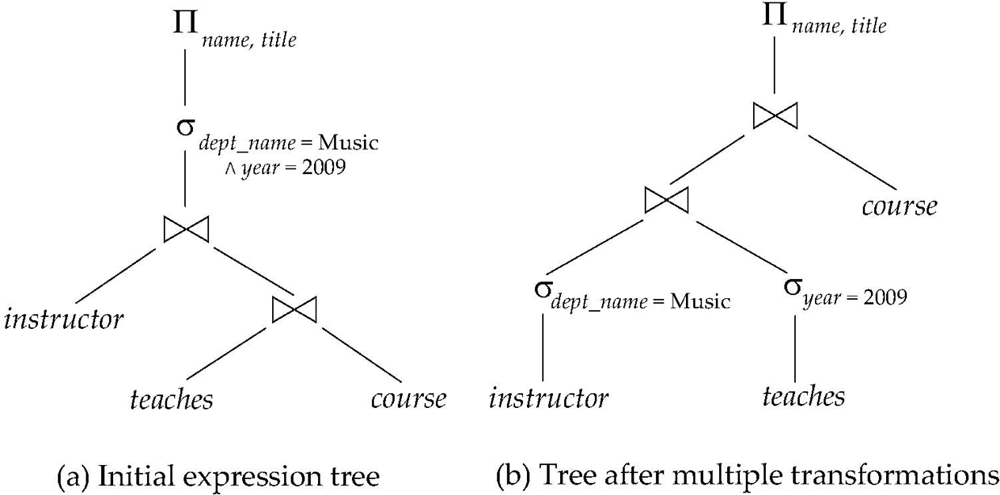
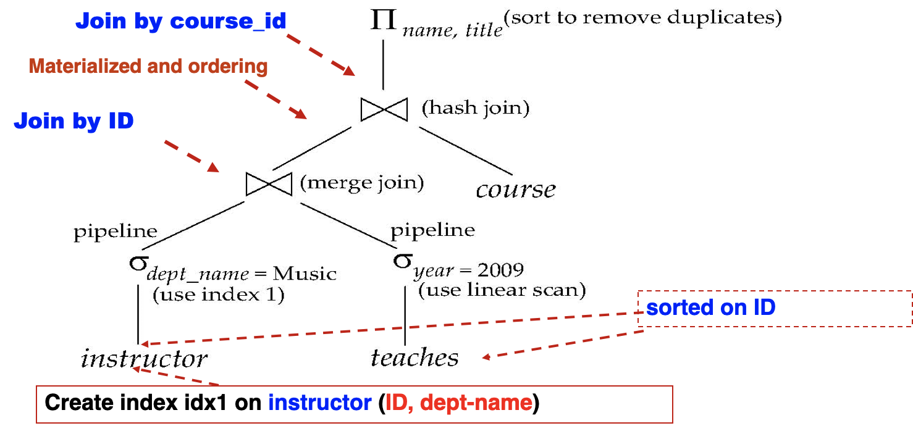

[TOC]

# Intro

画出Pictorial Depiction of Query，然后将select和project尽量往下拉

# Transformation of reex

## Equivalence Rules

<u>**选择和投影优先**</u>

1. $\sigma_{\theta_1 \wedge \theta_2}(E) = \sigma_{\theta_1}(\sigma_{\theta_2}(E))$
2. $\sigma_{\theta_1}(\sigma_{\theta_2}(E)) = \sigma_{\theta_2}(\sigma_{\theta_1}(E))$
3. $\Pi_{t_1}(\Pi_{t_2}(...(\Pi_{t_n}(E))...)) = \Pi_{t_1}(E)$
4. 笛卡尔积
    1. $\sigma_\theta(E_1 \times E_2) = E_1 \Join_\theta E_2$
    2. $\sigma_{\theta_1}(E_1 \Join_{\theta_2} E_2) = E_1 \Join_{\theta_1 \wedge\theta_2} E_2$
5. $E_1 \Join_{\theta} E_2 = E_2 \Join_{\theta} E_1$
6. Join
    1. $(E_1 \Join E_2) \Join E_3 = E_1 \Join (E_2 \Join E_3)$
    2. $(E_1 \Join_{\theta_1} E_2) \Join_{\theta_2 \wedge \theta_3} E_3 = E_1 \Join_{\theta_1 \wedge \theta_2} (E_2 \Join_{\theta_3} E_3)$ ($\theta_3$只有$E_2$和$E_3$的属性)
    3. <u>**让连接结果较小的连接运算先进行**</u>
7. 选择操作的分配律：先连后选==>先选后连
    1. $\sigma_{\theta_1}(E_1 \Join_\theta E_2) = (\sigma_{\theta_1}(E_1)) \Join_\theta E_2$ ($\theta_1$只有$E_1$中有)
    2. $\sigma_{\theta_1 \wedge\theta_2}(E_1 \Join_\theta E_2) = (\sigma_{\theta_1}(E_1) \Join_\theta \sigma_{\theta_2}(E_2))$ ($\theta_1$只有$E_1$有，$\theta_2$只有$E_2$中有)
    3. <u>Performing the selection as early as possible reduces the size of the relation to be joined</u>
8. 投影操作在下面二个条件下对$\theta$连接运算具有分配律：先连后投==>先投后连
    1. $\Pi_{L_1 \cup L_2}$

。。。。。。

## Transformation example

**Using 7.1**

$\Pi_{name, title}(\sigma_{dept\_name= “Music”} (instructor \Join (teaches \Join \Pi_{course\_id, title} (course)))) \\ \ = \Pi_{name, title}((\sigma_{dept\_name= “Music”} (instructor)) \Join (teaches \Join \Pi_{course\_id, title} (course)))$

**Using 6.1 & 7.2(Select early)**

$\Pi_{name, title}(\sigma_{dept\_name= “Music” \wedge year = 2009} (instructor \Join (teaches \Join \Pi_{course\_id, title} (course)))) \\ = \Pi_{name, title}(\sigma_{dept\_name= “Music” \wedge year = 2009} (instructor \Join teaches) \Join \Pi_{course\_id, title} (course)))) \\ = \Pi_{name, title}(\sigma_{dept\_name= “Music”}(instructor) \Join \sigma_{year = 2009} (teaches) \Join \Pi_{course\_id, title} (course))))$

**Using 8.1 & 8.2(Project early)**

$\Pi_{name, title} ((\sigma_{dept\_name= “Music”} (instructor) \Join teaches) \Join \Pi_{course\_id, title} (course)) \\ = \Pi_{name, title} (\Pi_{name, course\_id}(\sigma_{dept\_name= “Music”} (instructor) \Join teaches) \Join \Pi_{course\_id, title} (course))$

这里的instructor上本来是没有投影的但是为了减小计算量就加了个投影

## Enumeration of Equivalent Expressions

等价表达式的枚举

直接枚举耗时耗空间

节省空间：用指针在用同样子句的ex之间共享子句；检测是否重复生成子句

节省空间：动态规划

# Statistical

## Catalog Information about relation

* n~r~: number of tuples in a relation r.
* b~r~: number of blocks containing tuples of r.
* f~r~: blocking factor of r
    * i.e., *the number of tuples of r that fit into one block.*
    * If tuples of r are stored *together* *physically* in a file, then: ==$b_r = \lceil \frac{n_r}{f_r} \rceil$==
* l~r~: number of bytes for a tuple in r (字母是L不是i)
* V(A, r): number of distinct values that appear in r for attribute A; same as the size of $\Pi_A$(r). r中A属性的unique值个数
* SC(A, r): selection cardinality of attribute A of relation r ; average number of records that satisfy equality on A. r里A属性平均一个unique值对应的元组数
    * Sc(A, r) == nr / V(A, r)
    * 候选码A的SC为1

## Catalog Information about Indices

* F~i~: average **fan-out** of internal nodes of index i, for tree-structured indices such as B+-trees.
* Ht~i~ : number of levels in index i — i.e., the height of index i.
    * For a balanced tree index (such as B+-tree) on attribute A of relation r: $HT_i = \lceil \log_{F_i} (V(A,r)) \rceil$.
    * For a hash index, HT~i~ is 1.

## Size Estimation(都是估算)

### Select size

* **Equi Sel**
    * 选择结果占用的块数：$\lceil SC(A, r) / f_r \rceil$
    * Ex. BinarySearch cost: $\lceil \log(b_r) \rceil + \lceil SC(A, r) / f_r \rceil - 1$ ？？？？？为什么要-1
* **Sel with cmp**
    * Take $\sigma_{A \leqslant V}(r)$ for example
        * v < min(A,r)：结果元组数 = 0
        * else: 结果元组数 = $\displaystyle n_r \times \frac{v - \min(A,r)}{\max(A, r) - \min(A, r)}$
* **Complex Select**
    * Selectivity 中选率
    * **Negation**
        * $\sigma_{¬\theta}(r)$
        * n~r~ = size(σ~θ~(r)) = n~r~×(1 - S~i~/n~r~) ($\sigma_{!\theta}$的中选率为1 - S~i~/n~r~)
    * **Conjunction**
        * $\sigma_{\theta_1 \wedge \theta_2 \wedge ... \wedge \theta_n}(r)$
        * 结果元组数 = 
    * **Disjunction**
        * $\sigma_{\theta_1 \vee \theta_2 \vee ... \vee \theta_n}(r)$
        * 结果元组数 = 

### Join size

* **Cartesian prod**
    * nr\*ns tuples, each for Ir+Is bytes
* If R∩S is a <u>key for r</u>, then s中一个元组最多和r中一个元组Join (symmetric for s)，连接结果得到的行数≤s的行数
* If R∩S forms a <u>foreign key in r, referencing s</u>，则结果行数＝r的行数, 即结果行数通常等于参照关系的行数 (symmetric for s referencing r)
    * $teaches \Join instructor$(`foreign key (ID) referencing instructor(ID)`), n~result~ = n~teaches~
* 4) If R∩S = {A} is <u>not a key for R nor S</u>. If we assume that each value of A appears with equal probability, then every tuple *t* in *R* produces tuples in $R\Join S$, the number of tuples in $R\Join S$ is estimated to be: $\large \min(n_r \times r中元组中选率, n_s \times s中元组中选率) = \min(\frac{n_r \times n_s}{V(A, s)}, \frac{n_r \times n_s}{V(A, r)}) = \frac{n_r \times n_s}{\max(V(A,r), V(A,s))}$

**Ex.**

> Compute the size estimates for takes student <u>without</u> using information about foreign keys:
> V(ID, takes) = 2500, and V(ID, student) = 5000

The two estimates are 5000\*10000/2500 = 20000 and 5000\*10000/5000 = 10000
We choose the lower estimate, which in this case, is the same as our earlier computation using foreign keys. (=n~takes~)

> Example2:   Given: 
> `lib_card(cno, name, depart, type),`
> `borrow(cno, bno, borrow_date, return_date).`
> n~lib~=20,000,   f~lib~ = 2lhy5 ;  n~borrow~=45,000,   f~borrow~= 30
> The relation lib_card has B+-tree index on primary key cno, (assume its fan-out Fi=60 ); the cno of borrow references the cno of lib_cad.
> Assume the allowed memory is in the worst case. Please estimate the cost of the join operation lib_card $\Join$ borrow using:
> (1) Block nested-loop join strategy
> (2) Indexed nested-loop join strategy
> (3) Estimate the size of the join.

(1) br=20000/25=800, bs= 45000/30=1500, 
\\    BT: 800 x 1500 + 800= 1,200,800; ST: 2* 800=1600
(2) log60/2 20000 ≈ 3(估算高度),  BT=ST=45000 x (3+1) + 1500 =181,500 
(3) Size = 45000

### Other's size

* **Projection**: $\Pi_A(r)$: V(A, r)
* **Aggregation**: $_A\mathcal{G}_F(r)$: V(A, r)
    * 因为在A中的任意一个不同取值，$_A\mathcal{G}_F(r)$有一个元组与其对应
* **Set ops**
    * unions/intersections of sel on same relation: $\sigma_{\theta_1}(r) \cap/\cup \sigma_{\theta_2}(r) \Rightarrow \sigma_{\theta_1 \wedge/\vee \theta_2}(r)$ then count
    * On diff relations
        * \|r ∩ s\| = min(\|r\|, \|s\|)
        * \|r ∪ s\| = \|r\| + \|s\|
        * \|r - s\| = \|r\|
        * 都是上界
* **Outer Join**
    * \|r ⟕ s| = \|r ⋈ s\| + \|r\|
    * \|r ⟗ s| = \|r ⋈ s\| + \|r\| + \|s\|
    * 都是上界

## Distinct Val

* **Select**
    * $\sigma_\theta(r)$
    * Equi Select: $V(A, \sigma_\theta(r))$ = 1
    * Equi Select on a set of values S: $V(A, \sigma_\theta(r))$ = \|S\|
    * θ is "A op v"(op in {<, <=, <>, >=, >}): $V(A, \sigma_\theta(r))$ = V(A, r) \* s (这是估算)
        * s: selectivity(选择率) of selection $\sigma_\theta(r)$
    * 所有其他情况，只能估算：$V(A, \sigma_\theta(r)) = \min(V(A,r), n(\sigma_\theta(r)))$
* **Join**
    * $r \Join s$ (可能有交集也可能没有(没有就是r和s的笛卡尔积))

    * A全是r中的：$V(A, r \Join s) = \min(V(A, r), n_{r \Join s})$ (后面那个用size的方法算)
    * A有A1来自r，A2来自s：$V(A, r \Join s) = \min(V(A1, r)\times V(A2-A1, s), V(A1-A2, r) \times V(A2, s), n_{r \Join s})$
        * 前两个就是通过笛卡尔积算的
* **Projection**
    * $\Pi_A(r)$
    * $V(A, \Pi_A(r)) = V(A, r)$
* **Aggregated values**
    * $\Large _G\mathcal{G}_{F(A)}(r)$
    * G denotes grouping attributes，A是要进行计算的目标属性
    * sum, count, avg: All aggregated values are dinstinct(假设), and are V(G,r) values
    * min, max: distinct values num: min(V(A, r), V(G, r)) [前者表示有重复，后者表示全是distinct]

# Choice of evaluation

An evaluation plan defines exactly

① what algorithm is used for each operation (e.g. scan, index, merge-join)
② how the execution of the operations is coordinated (e.g. pipeline).

* Must consider the interaction of evaluation techniques when choosing evaluation plans:  choosing the cheapest algorithm for each operation independently may not yield best overall algorithm.(局部最优不保证全局最优)  E.g:
    * merge-join may be costlier than hash-join, but may provide a sorted output which reduces the cost for an outer level aggregation.
    * nested-loop join may provide opportunity for pipelining(流水线)
* Practical query optimizers incorporate elements of the following two broad approaches:
    * Search all the plans and choose the best plan in a cost-based fashion.(计算开销)
    * Uses heuristics（启发式）to choose a plan.

## CBO

**Join order**

动态规划

**Interesting order**(感兴趣的排列顺序)

为了使结果元组按我想要的方式排列，宁愿牺牲一点时间

Cost of optimisation

## Heuristics

按规则进行

* 尽早select
* 尽早project
* 

### Step

1.	Deconstruct conjunctive selections into a sequence of single selection operations (Equiv. rule 1.).
2.	Move selection operations down the query tree for the earliest possible execution (Equiv. rules 2, 7a, 7b, 11).
3.	Execute first those selection and join operations that will produce the smallest relations (Equiv. rule 6).
4.	Replace Cartesian product operations that are followed by a selection condition by join operations (Equiv. rule 4a).
5.	Deconstruct and move as far down the tree as possible lists of projection attributes, creating new projections where needed (Equiv. rules 3, 8a, 8b, 12).
6.	Identify those subtrees whose operations can be pipelined, and execute them using pipelining.

# Materialized Views

view只是逻辑概念，物化视图才是有物理实体的视图，需要额外的资源进行维护

通过增量式视图维护 incremental view maintenance

View maintenance can be done by

* Manually defining triggers on insert, delete, and update of each relation in the view definition
* Manually written code to update the view whenever database relations are updated 
* Supported directly by the DBMS

