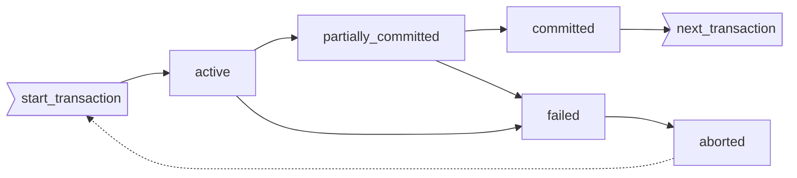
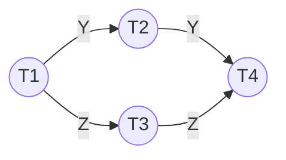

[TOC]

# Concept

结果：commit or rollback

过程中肯定会有不一致，但是一旦commit了就要保证一致性

## ACID Properties of transaction

* Atomicy
    * Either all operations of the transaction are properly reflected in the database or none are.
    * transaction-management component + recovery-management component
* Consistency
    * 数据库中的数据要是一致的，借助隔离性实现
    * duty of application programmer
* Isolation
    * Although multiple transactions may execute concurrently, each transaction must be unaware of other concurrently executing transactions. Intermediate transaction results must be hidden from other concurrently executed transactions.
    * concurrency-control component
* Durablity
    * 更新能persist，宕机能恢复
    * recovery-management component

Ex. A转账50给B

```pseudocode
read(A)
A := A – 50
write(A)
read(B)
B := B + 50
write(B)
(commit)
```

* A：4\~6出问题的话，必须保证部分更改不会反映到数据库上
* C：AB余额之和必须不变
* I：在3\~6之间有另一个事务访问的话会发现数据库inconsistent，可以通过串行执行事务来解决这个问题
* D：一旦用户得到了事务完成的反馈，数据库上的更新就必须persist，无论有没有遇到failure

# State

* **Active**, the initial state; the transaction stays in this state while it is executing
* **Partially committed**, after the final statement has been executed.  （此时要输出的结果数据可能还在内存buffer中）
* **Failed**, after the discovery that normal execution can no longer proceed.
* **Committed**, after successful completion.
* **Aborted**, after the transaction has been <u>rolled back</u> and the database restored to its state prior to the start of the transaction.  Two options after it has been aborted:
    * restart the transaction – only if no internal logical error
    * kill the transaction



# Implementation of A&D

## Shadow-DB

**影子数据库**：一个指针(db_pointer)指向当前数据库的拷贝current_copy(这里的copy指的是在内存中的硬盘的拷贝)，所有更新都先在拷贝上进行

* 失败了，new_copy删掉
* 成功了，将new_copy写进磁盘，将指针指向new_copy作为current_copy，将old_copy删掉

扇区的电容的作用：断电了也要有电来写

# Concurrent Exec

**并发执行**

* Multiple transactions are allowed to run concurrently in the database system.
* Advantages of concurrent executions are:  
    * increased processor and disk utilization, leading to better transaction throughput (吞吐量): one transaction can be using the CPU while another is reading from or writing to the disk.
    * reduced average response time for transactions: short transactions need not wait behind long ones.

* Problems: concurrency may <u>destroy consistency</u>, despite the correctness of each individual transaction. (如并发售票问题)，所以需要并发控制
* Concurrency control schemes – mechanisms  to achieve isolation, i.e., to control the interaction among the concurrent transactions in order to prevent them from destroying the consistency of the database. --- The important  job of DBMS
    * Here we study the notion of correctness of concurrent executions, serializability, recoverability, etc.
    * Will study concurrency control in Chapter 15 

## Schedule

**调度**

sequences that indicate the chronological(时间先后) order in which instructions of concurrent transactions are executed (因为CPU一次只能执行一条)

* a schedule for a set of transactions must consist of all instructions of the transactions
* must preserve the order in which the instructions appear in each individual transaction.

Ex.

| T1                                                           | T2                                                           |
| ------------------------------------------------------------ | ------------------------------------------------------------ |
| read(A)<br />A-=50<br />write(A)<br />read(B)<br />B+=50<br />write(B)<br /> | read(A)<br />tmp = A*0.1<br />A-=tmp<br />write(A)<br />read(B)<br />B+=tmp<br />write(B) |

### serial schedule 

**串行调度**

A=1000, B=2000

| T1                                                           | T2                                                           | T1                                                           | T2                                                           |
| ------------------------------------------------------------ | ------------------------------------------------------------ | ------------------------------------------------------------ | ------------------------------------------------------------ |
| read(A)<br />A-=50<br />write(A)<br />read(B)<br />B+=50<br />write(B)<br /><br /><br /><br /><br /><br /><br /><br /> | <br /><br /><br /><br /><br /><br />read(A)<br />tmp = A*0.1<br />A-=tmp<br />write(A)<br />read(B)<br />B+=tmp<br />write(B)<br /> | <br /><br /><br /><br /><br /><br /><br />read(A)<br />A-=50<br />write(A)<br />read(B)<br />B+=50<br />write(B)<br /> | read(A)<br />tmp = A*0.1<br />A-=tmp<br />write(A)<br />read(B)<br />B+=tmp<br />write(B)<br /><br /><br /><br /><br /><br /><br /> |
| Schedule 1                                                   | A=855, B=2145                                                | Schedule 2                                                   | A=850, B=2150                                                |

* Both schedule1 and schedule2 are serial (串行的)
* N个并行事务有n!种可选择的串行调度 (如<t1,t2,t3,…>, <t2,t1,t3,…>,<t3,t1,t3,…>, …)
* 串行的调度必能保持一致性，但低效。

### concurrent schedule 

**并发调度**

| T1                                                           | T2                                                           | T1                                                           | T2                                                           |
| ------------------------------------------------------------ | ------------------------------------------------------------ | ------------------------------------------------------------ | ------------------------------------------------------------ |
| read(A)<br />A-=50<br />write(A)<br /><br /><br /><br /><br />read(B)<br />B+=50<br />write(B)<br /><br /><br /><br /> | <br /><br /><br />read(A)<br />tmp = A*0.1<br />A-=tmp<br />write(A)<br /><br /><br /><br />read(B)<br />B+=tmp<br />write(B)<br /> | read(A)<br />A-=50<br /><br /><br /><br /><br /><br />write(A)<br />read(B)<br />B+=50<br />write(B)<br /><br /><br /> | <br /><br />read(A)<br />tmp = A*0.1<br />A-=tmp<br />write(A)<br />read(B)<br /><br /><br /><br /><br />B+=tmp<br />write(B)<br /> |
| Schedule 3                                                   | A=855, B=2145                                                | Schedule 4 不行                                              | A=950, B=2100, A+B != 3000                                   |

* In both Schedule 1, 2 and 3, the sum A + B is preserved.---consistency 
* But Schedule 4 does not preserve the value of the the sum A + B    ---not consistent. - a bad schedule!

怎么判断调度是否是好的？怎么生成好的调度？

# Serializability

**可串化**

<u>串行执行多个事务一定能保持一致性</u>

Definition: A schedule is serializable if it is *equivalent to a serial schedule*. A serializable schedule must be correct.

we ignore operations other than read and write instructions on below

## Conflict Serializability

<u>冲突可串：将并行调度无冲突的转化为串行调度</u>

Def：*conflict*：二个事务对<u>同一数据项</u>进行读写操作，当其中<u>至少一个为写</u>时，则称这二个操作是冲突的。(充要条件)

Def：*conflict equivalence*(冲突等价)：可以通过non-conflict instructions转化的schedule S和S'称为冲突等价的

Def：*conflict serializable*(冲突可串)：和serial schedule冲突等价的concurrent schedule S称为冲突等价的

# Recoverability

**可恢复性**

Def：*Recoverable schedule*(可恢复的调度)：事务T2要读先前被T1写过的数据，则T1的commit必须在<u>T2的commit</u>之前

## Cascadeless schedules

**避免级联回滚**：级联很耗资源

无级联调度：事务T2要读先前被T1写过的数据，则T1的commit必须在<u>T2的read</u>之前

# Implementation of Isolation

* A policy in which only one transaction can execute at a time generates serial schedules, but provides a poor degree of concurrency. 
* Schedules must be conflict or view serializable, and recoverable, for the sake of database consistency, and preferably cascadeless.
* Concurrency-control schemes tradeoff between the amount of concurrency they allow and the amount of overhead that they incur. ---- Chpt15
* Some schemes allow only conflict-serializable schedules to be generated, while others allow  view-serializable schedules that are not conflict-serializable.

# Testing for Serializability

## Precedence graph

**(优先图，前驱图)**

* We draw an arc from Ti to Tj if the two transaction conflict, and <u>Ti</u> accessed(读写都算？) the data item on which the conflict arose <u>earlier</u>.
    * Tj读之前，Ti写
    * Tj写之前，Ti读
    * Tj写之前，Ti写
    * ~~Tj读之前，Ti读~~(不影响的)
* We may label the arc by the item that was accessed.

Ex.

| T1                                                           | T2                                                           | T3                                                           | T4                                                           | T5                                                           |
| ------------------------------------------------------------ | ------------------------------------------------------------ | ------------------------------------------------------------ | ------------------------------------------------------------ | ------------------------------------------------------------ |
| <br />rY<br />rZ<br /><br /><br /><br /><br /><br /><br />rU<br /><br /><br /><br />rU<br /><u>**w**U</u><br /> | rX<br /><br /><br /><br /><br />rY<br /><u>**w**Y</u><br /><br /><br /><br /><br /><br /><br /><br /><br /> | <br /><br /><br /><br /><br /><br /><br /><br /><u>**w**Z</u><br /><br /><br /><br /><br /><br /><br /> | <br /><br /><br /><br /><br /><br /><br /><br /><br /><br />rY<br /><u>**w**Y</u><br />rZ<br /><u>**w**Z</u><br /><br /> | <br /><br /><br />rV<br />rW<br />rW<br /><br /><br /><br /><br /><br /><br /><br /><br /><br /> |



前驱图acyclic(无环)的就是conflict serializable(冲突可串)的，例如上面这个可以改成1234或1324，<u>具体的实现就是拓扑排序</u>

## Concurrency Control vs. Serializability Tests

* Testing a schedule for serializability after it has executed is a little too late!
* Goal – to develop concurrency control protocols that will assure serializability.  They will generally not examine the precedence graph as it is being created; instead a protocol will impose a discipline that avoids nonseralizable schedules. 
    * Will study such protocols in Chapter 15.
* Tests for serializability help understand why a concurrency control protocol is correct. 