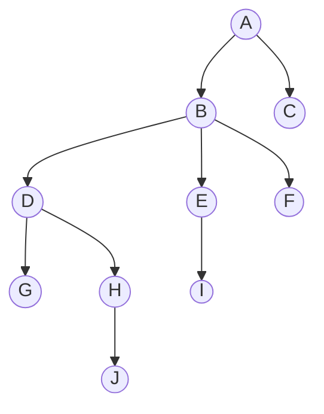
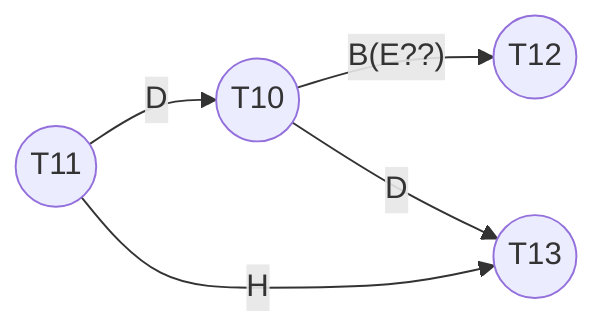
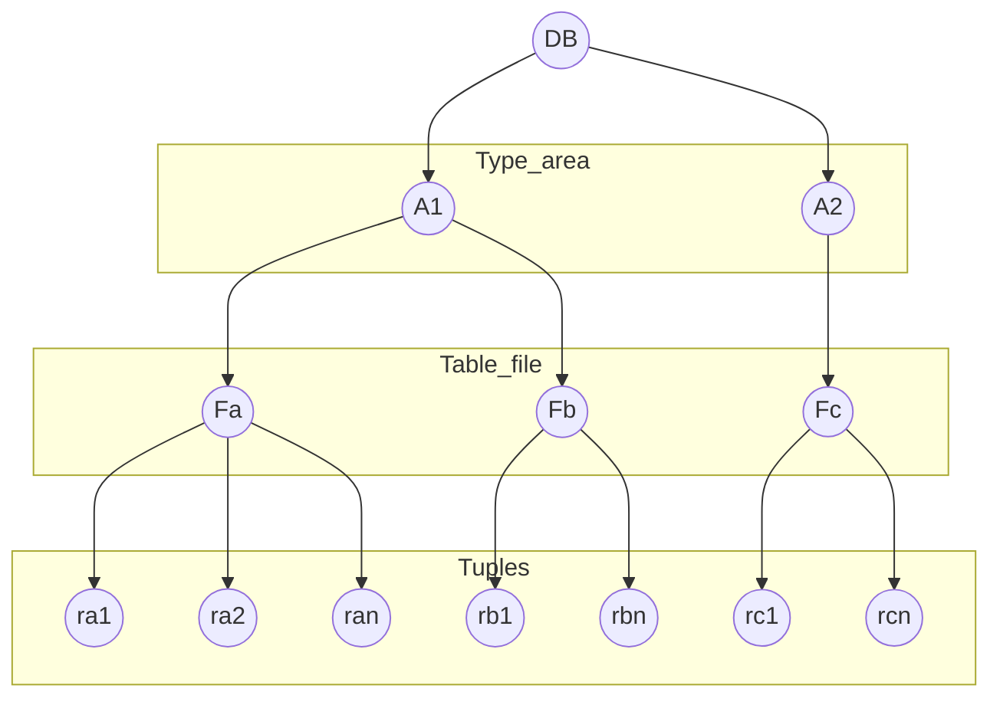

[TOC]

# Lock-Based Proto

调度中对某个表加锁，可以防止并行控制中的冲突

**Type**

* **S**: shared
    * T获得了Q上的S-lock，则T<u>只可读不可写</u>Q
* **X**: exclusive
    * T获得了Q上的X-lock，则T<u>既可读又可写</u>Q

相容性矩阵

|       | **S** | **X** |
| ----- | ----- | ----- |
| **S** | 1     | 0     |
| **X** | 0     | 0     |

在事务Ti访问数据像之前，必须先给该数据项加锁，如果该数据项已经被另一个事务加上了**不相容**的锁，则必须等待其他**所有**不相容类型的该事项的锁被释放。

**Abbr**

l for lock, u for unlock, w for write

## Pitfalls

* Deadlock：分别等待对方释放lock
    * [Deadlock Handling](# Deadlock Handling)
* Starvation：例如一个想加X锁，其他一个接一个的加了S锁，这个事务就得一直等他们
    * 当Ti申请对Q加M型锁，并发控制器的加锁条件：
        1. 不存在Q上有其他事务有与M的冲突的锁
        2. 不存在等待对Q加锁且先于Ti申请加锁的事务
            * 防止一个加锁请求被其后的加锁请求阻塞

## 2PL Protocol

**Two-Phase Locking Protocol (两段锁协议)**


*Phase是针对单个事务而不是对调度的*

* Phase1:
    * 只能加锁不能释放
* Phase2:
    * 只能释放不能加锁


**serializability**

<u>The protocol assures serializability.</u> It can be proved that if a schedule is following the 2PL, then the transactions can <u>be serialized in the order of their lock points</u> (锁点，i.e. the point where a transaction acquired its final lock).

> Prove: <u>The 2PL protocol ensures conflict serializability</u>，反证法+前驱图
> \\	这个为什么时间alpha0要出现两次
>
> Prove2: For T0, T1 ... Tn-1 following 2PL in schedule, suppose Ti with the first lock point, we claim it is possible to move all read and write actions of Ti forward to the beginning of the schedule without passing any conflicting actions

冲突可串不一定要2PL，即2PL为充分不必要条件；但是如果没有提供附加信息，2PL则是实现冲突可串的必要条件


**deadlocks**

2PL does not ensure freedom from deadlocks (like above example)


**Special 2PL**

* Strict(严格) 2PL
    * a transaction must hold all its <u>X-locks</u> till it commits/aborts.
    * 保证未提交事务所写的任何数据在commit/abort之前均通过X锁，防止其他事务读这些数据
    * 作用：**避免**级联回滚
* Rigorous(强) 2PL
    * <u>all locks</u> are held till commit/abort.
    * 作用：使事务可以按其提交的顺序串行化
* 以降低并发度为代价
* 串行化是为了保证并发调度的正确性，即数据一致性。2PL理论上可保证可串化，但不能避免死锁。(死锁并不会破坏一致性)


## Lock Conversions

* Upgrade: S->X
* Downgrade: X->S

## Automatic Acquisition of Locks

**read**(D)

```pseudocode
if Ti has a lock on D then
    read(D)
else begin
    if necessary wait until no other transaction has a X-lock on D
    grant Ti a S-lock on D;	/* 保证其他也能读 */
    read(D)
end
/* All locks are released after commit or abort */
```

**write**(D)

```pseudocode
if Ti has a X-lock on D then
    write(D)
else begin	/* No lock or S-Lock */
    if necessary wait until no other trans. has any lock on D,
    if Ti has a S-lock on D then
        upgrade lock on D to X-lock
    else
        grant Ti a X-lock on D
    write(D)
end
/* All locks are released after commit or abort */
```

## Implementation of Locking？？？

* Lock Manager
    * A Lock manager can be implemented as <u>a separate process</u> to which transactions send lock and unlock requests
    * The lock manager replies to a lock request by sending a lock grant messages (or a message asking the transaction to roll back, in case of a deadlock)
    * The requesting transaction waits until its request is answered
* Lock Table
    * The lock manager maintains a data structure called a lock table to record granted locks and pending requests
    * The lock table is usually implemented as an in-memory **hash table** <u>indexed on the name of the **data item** being locked</u>


* Black rectangles indicate (transactions with) granted locks, white ones indicate waiting requests
* Lock table also records the type of lock granted or requested
* New request is added to the end of the queue of requests for the data item, <u>and granted if it is compatible with all earlier locks(怎么判断这个？？)</u>
* Unlock requests result in the request being deleted, and later requests are checked to see if they can now be granted
* If transaction aborts, all waiting or granted requests of the transaction are deleted 
    * lock manager may keep a list of locks held by each transaction, to implement this efficiently

## Graph-Based Protocols

**(基于图的加锁协议)**

* Graph-based protocols are an alternative to two-phase locking
* Impose a partial ordering([偏序]([https://zh.wikipedia.org/wiki/%E5%81%8F%E5%BA%8F%E5%85%B3%E7%B3%BB](https://zh.wikipedia.org/wiki/偏序关系))：在[计算机科学](https://zh.wikipedia.org/wiki/计算机科学)中，找到偏序的线性扩展的算法叫做[拓扑排序](https://zh.wikipedia.org/wiki/拓扑排序)): on the set D = {d1, d2 ,..., dh} of all data items.
    * <u>If di -> dj, then any transaction accessing both di and dj must access di before accessing dj.</u>
    * Implies that the set D may now be viewed as a directed acyclic graph(有向无环图), called a database graph.
* The tree-protocol（树形协议） is a simple kind of graph protocol. 

### Tree

Rules

1. <u>Only **X-locks** are allowed</u>.
2. The first lock by Ti may be on any data item.
3. Subsequently, <u>a data Q can be locked by Ti only if the parent of Q is currently locked by Ti</u>. 只能锁子节点
4. Data items may be <u>unlocked at any time.</u>
5. <u>A data item Q can not be relocked by the same Ti  after locked and unlocked</u>

---

Ex.

A, B, ..., J是data items





| T10                                                          | T11                                                          | T12                                                          | T13                                                          |
| ------------------------------------------------------------ | ------------------------------------------------------------ | ------------------------------------------------------------ | ------------------------------------------------------------ |
| lock-X(B)<br /><br /><br /><br />lock-X(E)<br />lock-X(D)<br />u(B)<br />u(E)<br /><br /><br /><br />lock-X(G)<br />u(D)<br /><br /><br /><br /><br /><br /><br />u(G)<br /> | <br />lock-X(D)<br />lock-X(H)<br />u(D)<br /><br /><br /><br /><br /><br /><br />u(H)<br /><br /><br /><br /><br /><br /><br /><br /><br /><br /> | <br /><br /><br /><br /><br /><br /><br /><br />lock-X(B)<br />lock-X(E)<br /><br /><br /><br /><br /><br /><br /><br />u(E)<br />u(B)<br /><br /> | <br /><br /><br /><br /><br /><br /><br /><br /><br /><br /><br /><br /><br />lock-X(D)<br />lock-X(H)<br />u(D)<br />u(H)<br /><br /><br /><br /> |

Procedure graph(这里是用l和u的时间确定的？)



Serializable Schedules

11->10->12->13 or 11->10->13->12

---

### Attr

* **Advantages**
    * The tree protocol <u>ensures conflict serializability</u> as well as <u>freedom from deadlock.</u>
    * Unlocking may occur earlier in the tree-locking protocol than in the two-phase locking protocol. (？？)
        * shorter waiting times, and <u>increase in concurrency</u>
        * protocol is deadlock-free, <u>no rollbacks for deadlock are required</u>
        * But the <u>abort of a transaction can still lead to cascading rollbacks.</u> 
* **Disadvantage**
    * a transaction may have to lock data items that it does not access. 
        E.g: <u>to access data item A, J, need lock A,B,D,H,J</u> (因为规则里面要求只能lock子节点而不是子树节点)
        * increased locking overhead, and additional waiting time
        * potential decrease in concurrency
* Schedules not possible under two-phase locking are possible under tree protocol, and vice versa. (互不兼容？)

# Multiple Granularity

For the convenience, allow data items to be locked in various sizes according to the requirements - **multiple granularity(多粒度)**

## Granularity Hierachy

* Define a hierarchy of data granularities, where the small granularities are nested within larger ones, and can be represented graphically <u>as a tree</u> (but <u>don't confuse with tree-locking protocol(一个是data内部关系，一个是data之间关系)</u>) (see next page)
* When a transaction locks a node in the tree explicitly, it implicitly locks all the node's descendents in the same mode.

Granularity of locking (level in tree where locking is done):

* coarse granularity (粗粒度，higher in tree): low locking overhead, low concurrency
* fine granularity (细粒度，lower in tree): high concurrency, high locking overhead



The highest level in the example hierarchy is the entire database. The levels below are of type area, file and record in that order

## Intention Lock

**意向锁**

对上层节点加锁可以避免对子节点进行检查

* Problem:  T1 locked ra1 in X-lock,T2 locked Fb in S-lock. Now T3 wishes to lock Fa in S-lock ?  T4  wishes to lock the entire DB in S-lock ? (search the entire tree!)
* Intention locks are put on <u>all the ancestors of a node</u> before that node is locked explicitly. (比如要锁rb1，就给Fb, A1, DB都加上意向锁)
* Intention locks allow a higher level node to be locked in S or X mode without having to check all descendent nodes.

### Type

there are three intention lock modes with multiple granularity:

* intention-shared (IS，共享型意向锁): indicates explicit locking at a lower level of the tree with shared locks.  (表明其后代存在S锁)
* intention-exclusive (IX ，排它型意向锁): indicates explicit locking at a lower level with exclusive locks。 (表明其后代存在X锁)
* shared and intention-exclusive (SIX，共享排它型意向锁): the subtree rooted by that node is locked explicitly in shared mode and explicit locking is being done at a lower level with exclusive-mode locks.    SIX=S+IX (？？子树中有S explicit，更深的节点中有X explicit？那有没有ISX呢)

兼容性矩阵

|         | **IS** | **IX** | **S** | **SIX** | **X** |
| ------- | ------ | ------ | ----- | ------- | ----- |
| **IS**  | 1      | 1      | 1     | 1       |       |
| **IX**  | 1      | 1?     |       |         |       |
| **S**   | 1      |        | 1     |         |       |
| **SIX** | 1      |        |       |         |       |
| **X**   |        |        |       |         |       |

## Multiple Granularity Locking Scheme

????????

* Transaction Ti can lock a node Q, using the following rules:
    1. The lock compatibility matrix must be observed.
       2. The root of the tree must be locked first, and may be locked in any mode.
      3. A node Q can be locked by Ti in S or IS mode only if the parent of Q is currently locked by Ti in either IX or IS mode.
      4. A node Q can be locked by Ti in X, SIX, or IX mode only if the parent of Q is currently locked by Ti in either IX or SIX mode.  
      5. Ti can lock a node only if it has not previously unlocked any node 
         (that is, Ti is two-phase --- 2PL).
      6. Ti can unlock a node Q only if none of the children of Q are currently locked by Ti. (解锁自下而上)
  * Observe that locks are acquired in root-to-leaf order, whereas they are released in leaf-to-root order. (加锁自顶向下，解锁自下而上，且遵守2PL协议)
  * Advantages: 增强并发性，降低加锁开销。

# Deadlock Handling

**（死锁处理）**

处理思路

* prevention
* detection & recovery

## Prevention

* Protocol
    * Require that each transaction locks all its data items before it begins execution (predeclaration) – **conservative 2PL**. (Either all or none are locked )
        * Disadvantages: bad concurrency, hard to predict
    * Impose partial ordering of all data items and require that a transaction can lock data items only in the order (**graph-based protocol**). --- therefore never form a cycle.
* transaction timestamps for the sake of deadlock prevention alone, and use rollback mecmechanism. (to decide which one to be rollback) 抢占式和非抢占式
    * Non-preemptive: **Wait-die** scheme (早rb后wait)
        * older transaction may wait for younger one to release data item. Younger transactions never wait for older ones, they are rolled back instead. E.g fig 15.7—T4 lock-x(B), T4 rollback (PPT15.58)
        * a transaction may die several times before acquiring needed data item
    * Preemptive: **Wound-wait** scheme (早wait后rb)
        * older transaction wounds (forces rollback) of younger transaction instead of waiting for it. Younger transactions may wait for older ones.
        * may be fewer rollbacks than wait-die scheme.
    * Both in wait-die and in wound-wait schemes, a rolled back transactions is restarted with its original timestamp. Older transactions thus have precedence over newer ones, and <u>starvation is hence avoided.</u>
* Timeout-Based Schemes: (这里还🈚️👀)
    * a transaction waits for a lock only for a specified amount of time. After that, the wait times out and the transaction is rolled back.
    * Advantage: thus deadlocks are not possible; simple to implement.
    * But starvation is possible. Also difficult to determine good value of the timeout interval. Too long and too short are bad.

## Detection

**Wait-for graph**

有向图，点是事务，有向边表示


若wf图有环，则系统会思索(充要条件)

## Recovery

When deadlock is detected :

* Some transaction will have to rolled back (made a victim) to break deadlock.  
* Select that transaction as victim (受害者) that will incur minimum cost. (选择代价最小的事务进行回滚)
* How far to roll back transaction
    * Total rollback: Abort the whole transaction and then restart it.
    * Partial rollback: More effective to roll back transaction only as far as necessary to break deadlock.
* Starvation happens if same transaction is always chosen as victim. 解决办法：Include the number of rollbacks in the cost factor to avoid starvation

# Appendix

**Lock Point**：一个事物得到所有锁的时间