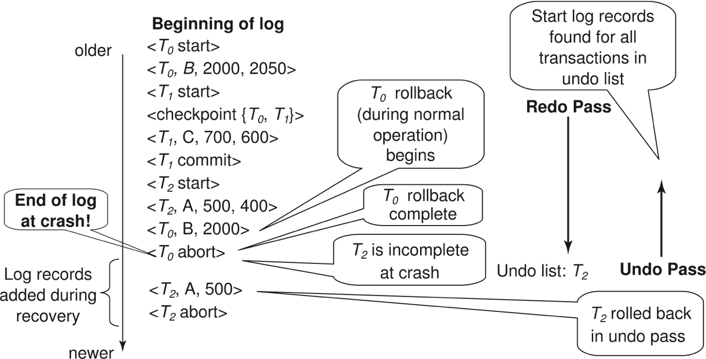
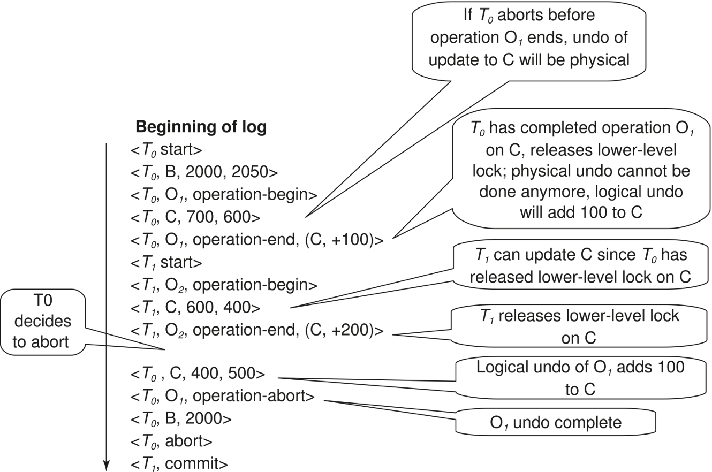
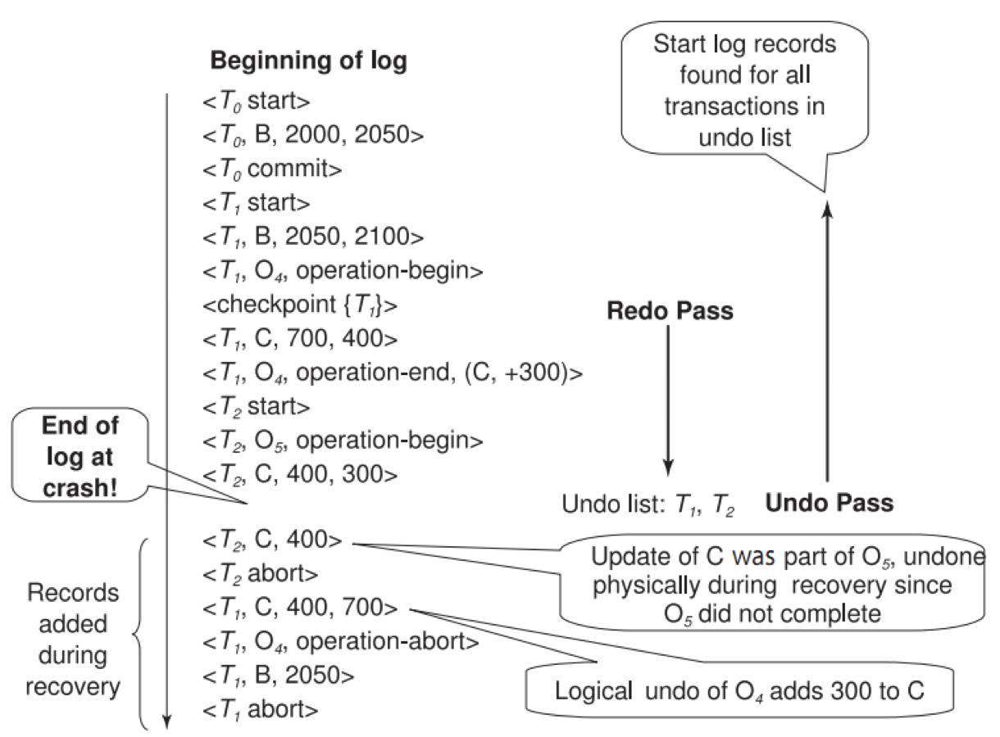
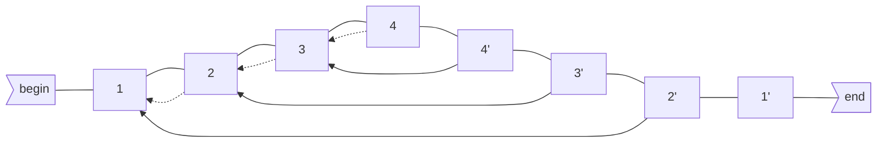
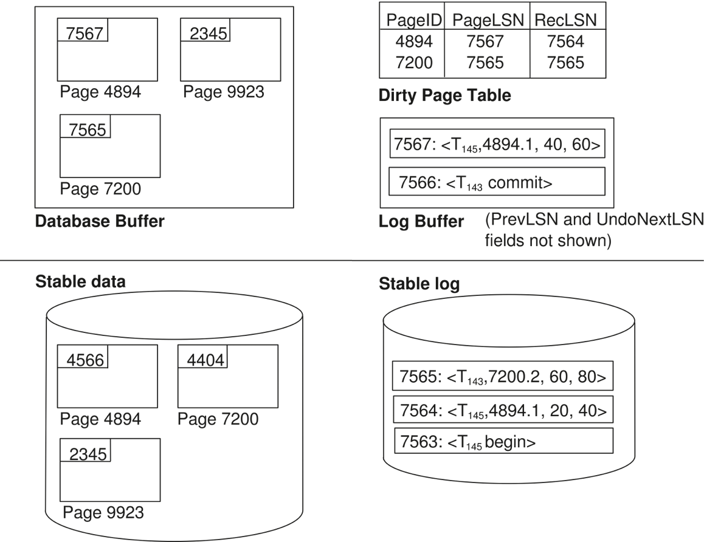
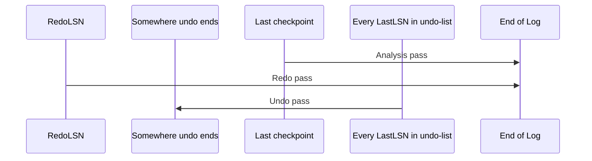

[TOC]

# Failure Classification

* Transaction failure :
    * Logical errors: transaction cannot complete due to some internal error condition: overflow, bad input, data not found, …
    * System errors ( Internal State Errors ) : the database system must terminate an active transaction due to an error condition (e.g., deadlock)
* System crash: a power failure or hardware or software failure causes the system to crash.
    * Software Failure: Problem with the DBMS implementation (e.g., uncaught divide-by-zero exception)
    * Hardware Failure: The computer hosting the DBMS crashes (e.g., power plug gets pulled)
    * Fail-stop assumption (故障停止假设): non-volatile storage contents are assumed to not be corrupted by system crash
        * Database systems have numerous integrity checks to prevent corruption of disk data 
* Disk failure:
    *  a head crash or similar disk failure destroys all or part of disk storage
    * Destruction is assumed to be detectable: disk drives use checksums to detect failures
    * <u>No DBMS can recover</u>  from this. Database must be restored from archived version.

## Recovery Algorithms

* Def ：Recovery algorithms are techniques to ensure database consistency and transaction atomicity and durability despite failures.
* Recovery algorithms have two parts
    1. Actions taken during normal transaction processing to ensure enough information exists to recover from failures （failure前）
    2. Actions taken after a failure to recover the database contents to <u>a state that ensures atomicity, consistency, and durability</u>（failure后）
* 考虑因素
    * 一个事务已经提交，但它对数据库的修改还存在disk buffer里，没有进入disk
    * 仍处于活跃状态的事务（未提交）已经修改了数据库，作为后来发生故障的结果，这个事务需要中止
* Undo vs. redo
    * **Undo:** The process of removing the effects of an incomplete or aborted txn.
    * **Redo:** The process of re-instating the effects of a committed txn for durability.

# Storage Structure

* Volatile storage
* Nonvolatile storage
* Stable storage(**稳定存储器**)
    *  a mythical form of storage that survives all failures
    * approximated by maintaining <u>multiple copies on distinct nonvolatile media</u>

## Stable-Storage implementation

* 需求：Maintain multiple <u>copies of each block on separate disks</u>, and <u>protecting storage</u> media from failure during data transfer 
    * RAID
    * copies can be at remote sites to protect against disasters such as fire or flooding
    * 16.9: 远程备份系统
* 内存和磁盘间进行的块传输结果：
    * Successful completion

    * Partial failure: destination block has <u>incorrect information</u>
    * Total failure: destination block was <u>never updated</u>
* 要求如果数据传送故障（data-transfer failure）发生，系统能检测到并且**调用恢复过程将块恢复成一致的状态**
    * 假设每一个块有2个拷贝，则输出操作执行如下：
        * Write the information onto the first physical block.
        * When the first write successfully completes, write the same information onto the second physical block.
        * <u>T</u><u>he output is completed only after the second write successfully completes</u>.
    * 故障发生可能两个拷贝不一致，要恢复：
        * First find inconsistent blocks
        * If either copy of an inconsistent block is detected to have an error (bad checksum), <u>overwrite it by the other copy</u>. If both have no error, but are different, <u>overwrite the second block by the first block</u>. 
    * 恢复过程都要保证，**<u>对定存储器的写要么完全成功(即更新所有拷贝)，要么没有任何改变</u>**

## Data Access

* **Physical blocks** ：blocks residing on the disk.
* **System buffer blocks**  ：blocks residing <u>temporarily in main memory</u>
    * 内存中用于临时存放块的区域叫做磁盘缓冲区（disk buffer）
* **<u>Block movements</u> between disk and main memory**
    * **input**(B) ：transfers the physical block B to main memory.
    * **output**(B) ：transfers the buffer block B to the disk, and replaces the appropriate physical block there.
* work-area：Each transaction Ti has its private work-area in which <u>local copies of all data items accessed and updated by it</u> are kept
    * $T_i$'s local copy of a data item X is denoted by $x_i$
    * $B_X$ denotes block containing X
    * **Transferring data items <u>between system buffer blocks and its private work-area</u>** done by
        * **read**(X) 
            * 若X所在块$B_X$不在main memory中，执行input($B_X$)
            * assigns the value of data item X to the local variable xi.
        * **write**(X)
            * 若X所在块$B_X$不在main memory中，执行input($B_X$)
            * assigns the value of local variable xi to data item X in the buffer block.
* Transactions：
    * Must perform **read**(X) before accessing X for the first time (该事务对于X的更新都作用于xi)
    * The **write**(X) can be executed at any time before the transaction commits
    * 在对x进行最后的写之后，必须**write**(X) 
* Note that **output**($B_X$) need not immediately follow **write**(X). 因为Bx可能包含其他仍然在被访问的数据项

# Log-Based Recovery

## Log

* <u>Be kept on stable storage</u>（保存在稳定存储器上）

* a **sequence** of **log records**, and maintains a record of update activities on the database.

* Update Log records **Include**

    ```xml
    <Ti start>
    <Ti, X, V1, V2> or <Ti, X, V2>	// Ti对X进行写操作，写前写后的X值分别为V1,V2
    <Ti commit>
    <Ti abort>
    ```

* <u>We assume for now that log records are written directly to stable storage (that is, they are not buffered)</u>

* A transaction is committed as long as(所以是先写log再commit？==是的吧==) the record `<Ti commit>` is written to log file. 在数据库修改前建立Log records并写入Log

* A transaction is said to have committed **<u>when its commit log record is output to stable storage</u>**

* Two approaches using logs

    * Deferred database modification (延迟的数据库修改): 一个事务直到提交时才会修改数据库（指对disk本身或disk buffer的修改）
    * ==Immediate database modification== (立即的数据库修改)：数据库修改在事务活跃时（未提交）发生

## Defered Modification

* The deferred database modification scheme <u>records all modifications to the log</u>, but <u>defers all the writes to after partial commit</u>. (先把待写信息存在log，等到partial commit之后再实际写)
* 修改操作的log改成`<Ti, X, V>` (V直接是X的新值，不用存旧值了)
* When Ti partially commits, `<Ti commit>` is written to the log
* Finally, the log records are read and used to actually execute the previously deferred writes

Ex. A=1000, B=2000, C=700, T0={A-=50, B+=50}, T1={C-=100}

| Transaction                                                  | Log                                                          |
| ------------------------------------------------------------ | ------------------------------------------------------------ |
| read(A)<br />write(A)<br />read(B)(为什么PPT上没有？)<br />write(B)<br /><br />commit<br />read(C)<br />write(C)<br />commit<br /> | \<T0 start><br />\<T0, A, 950><br /><br />\<T0, B, 2050><br />[开始写A,B]<br />\<T0 commit><br />\<T1 start><br />\<T1, C, 600><br />\<T1 commit><br />[开始写C] |

### Recovery

* During recovery after a crash, a transaction needs to be redone **IFF** **both** `<Ti start>` and `<Ti commit>` are there in the log.
* Redoing a transaction Ti (redo Ti) sets the value of all data items updated by the transaction to the new values.
* Crashes can occur while
    * the transaction is executing the original updates, or
    * while recovery action is being taken
* 未提交的事务不需恢复。
* 已提交但数据未真正写到磁盘上数据库中的事务必须恢复---借助于log中的信息进行恢复---向前恢复---REDO

Ex.

| 1                                                  | 2                                                            | 3                                                            |
| -------------------------------------------------- | ------------------------------------------------------------ | ------------------------------------------------------------ |
| \<T0 start><br />\<T0, A, 950><br />\<T0, B, 2050> | \<T0 start><br />\<T0, A, 950><br />\<T0, B, 2050><br />\<T0 commit><br />\<T1 start><br />\<T1, C, 600> | \<T0 start><br />\<T0, A, 950><br />\<T0, B, 2050><br />\<T0 commit><br />\<T1 start><br />\<T1, C, 600><br />\<T1 commit> |

1. No redo actions need to be taken
2. redo(T0) must be performed since `<T0 commit>` is present, 不用redo(T1)
3. redo(T0) must be performed followed by redo(T1) since `<T0 commit>` and `<Ti commit>` are present

## Immediate Modification

* The immediate database modification scheme allows database updates of an uncommitted transaction to be made as the writes are issued
* since undoing may be needed, update logs must have both old value and new value: `<Ti, X, V1, V2>`
* <u>先写log再写数据库</u>
    * log得写到稳定存储
    * Can be extended to postpone log record output, so long as prior to execution of an output(B) operation for a data block B, and all log records corresponding to items B must be flushed to stable storage
        * log其实可以采取延迟写(postpone log record output)，只需保证在某data block要从buffer写到disk之前写(写到buffer？)，并且所有与该block相关的log会flush到稳定存储
* Output(<u>from buffer to disk</u>) of updated blocks can <u>take place at any time</u> before or after transaction commit, <u>order can also be different</u>，但是日志项之间的顺序一定不能乱

Ex.

| Log                                                          | Write (to buffer)                                            | Output (from buffer to disk)                                 |
| ------------------------------------------------------------ | ------------------------------------------------------------ | ------------------------------------------------------------ |
| \<T0 start><br/>\<T0, A, 1000, 950> <br/><br/><T0, B, 2000, 2050 ><br/><br/>\<T0 commit><br/>\<T1 start><br/>\<T1, C, 700, 600><br/><br/><br/>\<T1 commit> | <br /><br />A=950<br /><br />B=2050<br /><br /><br /><br />C=600<br /><br /> | <br /><br /><br /><br /><br /><br /><br /><br />b~B~, b~C~ <br /><br />b~A~ |

*Note: b~X~ denotes block containing X.*

*Explain>：由例子可以看出，Write操作的发生均紧随log之后，但是Output就比较随意而且顺序也随意*

### Recovery

* Recovery procedure has two operations instead of one:
    * undo(Ti) restores the value of all data items updated by Ti to their **<u>old values</u>**, going **<u>backwards</u>** from the last log record for Ti
        * Each time a data item X is restored to its old value V a special log record (called ==r**edo-only**==) <Ti , X, V> is written out
        * When undo of a transaction is complete, a log record <Ti **abort**> is written out (to indicate that the undo was completed)
    * redo(Ti) sets the value of all data items updated by Ti to the **<u>new values</u>**, going **<u>forward</u>** from the first log record for Ti
        * No logging is done in this case 不写入log
        * 是不是适用于只写了log没写data的情况？

* Both operations must be idempotent (幂等)
    * That is, even if the operation is executed multiple times the effect is the same as if it is executed once，做几次都一样
        * Needed since operations may get re-executed during recovery

* The **undo** and **redo** operations are used in several different circumstances(不同):

    * The **undo** is used for **<u>transaction rollback during normal operation</u>**(in case a transaction cannot

    complete its execution due to some logical error). ==rollback只做undo==

    * The **undo** and **redo** operations are used **<u>during recovery from failure</u>**.==undo和redo均用到==

* When recovering after failure:
    * Transaction Ti needs to be **undone** if the log contains the record `<Ti start>`,   but does not contain either the record `<Ti commit>` or the record `<Ti abort>`.
    * Transaction Ti needs to be **redone** if the log contains both the record `<Ti start>` and the record `<Ti commit>` or `<Ti abort>`==(说明事务正常回滚过）==.

* <u>Undo operations are performed first, then redo operations.</u>(执行顺序对正确性没影响(？)，但是能提高效率)

Ex.

| 1: 崩溃发生在T0的write(B)写入stable storage后      | 2：崩溃发生在T1的write(C)写入stable storage后                | 3：崩溃发生在T1的<T1,commit>写入stable storage后             |
| -------------------------------------------------- | ------------------------------------------------------------ | ------------------------------------------------------------ |
| \<T0 start><br />\<T0, A, 950><br />\<T0, B, 2050> | \<T0 start><br />\<T0, A, 950><br />\<T0, B, 2050><br />\<T0 commit><br />\<T1 start><br />\<T1, C, 600> | \<T0 start><br />\<T0, A, 950><br />\<T0, B, 2050><br />\<T0 commit><br />\<T1 start><br />\<T1, C, 600><br />\<T1 commit> |

1. undo (T0): B is restored to 2000 and A to 1000. Log records `<T0,B,2000>,<T1,A,1000>,<T0,abort>` are written out
2. undo (T1) and redo (T0): C is restored to 700, and then A and B are set to 950 and 2050 respectively. Log records `<T1,C,700>,<T0,abort>` 
3. redo (T0) and redo (T1): A and B are set to 950 and 2050 respectively. Then C is set to 600

## Checkpoint

Problems in recovery procedure as discussed earlier:

1. searching the entire log is time-consuming.
2. we might unnecessarily redo transactions which **<u>have already output their updates to the database</u>** (written to disk). Although no harm,but waste recovery time. 就比如说👆这个例题里就没必要redo


Streamline recovery procedure by **periodically** performing checkpointing, <u>All updates are stopped while doing checkpointing</u>( 不允许事务对缓冲块或日志进行任何更新，fuzzy checkpoint改进这一问题）:

1. Output all log records currently residing in main memory onto stable storage.
2. Output all modified buffer blocks to the disk.
3. Write a log record `<checkpoint L>` onto stable storage. **<u>L is a list of all transactions active at the time of checkpoint</u>**


？？？During **recovery** we need to consider only the most recent transaction Ti that started before the checkpoint, and transaction<u>**s**</u> that started after Ti. 

1. Scan backwards(向前？是forwards的反义词) from end of log to find the most recent `<checkpoint>` record.
2. Continue scanning backwards till a record `<Ti start>` is found, on which the last checkpoint was happened. 
3. Need only consider the part of log following above start record. Earlier part of log can be ignored during recovery, and <u>can be erased</u> whenever desired.
4. For all transactions starting from Ti or later:
    * with no `<Ti commit>`, execute undo(Ti ). (Done only in case of immediate modification, backwards.)
    * with a `<Ti commit>`, execute redo(Ti ).

## Recovery with Concurrent Transactions

* We modify the log-based recovery schemes to allow multiple transactions to execute concurrently.
* All transactions share a single disk buffer and a single log file
    * A buffer block can have data items updated by one or more transactions
* We assume concurrency control using strict 2PL; (--2PL with X-locks held until the end of the transaction. Rigorous当然也可以)
    * i.e. the updates of uncommitted transactions should not be visible to other transactions
* Logging is done as described earlier. 
    * Log records of different transactions are interspersed（散布） in the log.（所以在后􏰧􏰉ARIES􏱅􏰊中􏰇 􏰤了一个􏱆针􏰇把􏰋个Ti串了􏰾􏱇􏰇因为log􏱈件只􏰌一个）
* The checkpointing technique and actions taken on recovery have to be changed
    * since several transactions may be active when a checkpoint is performed.
* Transaction **rollback** (during normal operation)
    * Let Ti be the transaction to be rolled back
    * Scan log backwards from the end, and for each log record of Ti of the form `<Ti, Xj, V1, V2>`(也就是immediate的)
        * perform the undo by writing V1 to Xj,
        * write a log record `<Ti, Xj, V1>` (write在哪里？在最后吗？看例子里好像是的)
            * such log records are called *compensation log records*
            * 不需要undo信息，因为绝对不会需要撤销这样的undo操作
    * Once the record `<Ti start>` is found, stop the scan and write the log record `<Ti abort>`
* **Recovery** from failure: Two phases
    * 和上面顺序不同，这里必须要先redo把还没写进磁盘的写一遍，然后再undo那些没完成的
    * **Redo** phase: replay updates of all transactions, whether they committed, aborted, or are incomplete==（这一阶段没有Log records 需要写到Log 中去）==
        1. Find last `<checkpoint L>` record, and set undo-list to L (L可能包含多个事务)
        2. Scan **<u>forward from above</u>** `<checkpoint L>` record (不用再从checkpoint前最后一个start开始，直接从下一条开始就行了)
            1. Whenever a normal record `<Ti, Xj, V1, V2>` or a redo-only log record of the form `<Ti, Xj, V2>` is found, redo it by writing V2 to Xj 
            2. Whenever a log record `<Ti start>` is found, add Ti to undo-list
            3. Whenever a log record `<Ti commit>` or `<Ti abort>`(说明已经被undo过了) is found, remove Ti  from undo-list
    * **Undo** phase: undo all incomplete transactions (使用redo阶段创建的undo-list)
        1. Scan log **<u>backwards from end</u>**
            1. Whenever a log record `<Ti, Xj, V1, V2>` is found where Ti is in undo-list perform same actions as for transaction rollback:
                1. perform undo by writing V1 to Xj.
                2. write a log record `<Ti, Xj, V1>`
            2. Whenever a log record `<Ti start>` is found where Ti is in undo-list, 
                1. Write a log record `<Ti abort>` 
                2. Remove Ti  from undo-list
            3. Stop when undo-list is empty
                * i.e. `<Ti start>` has been found for every transaction in undo-list
    * After undo phase completes, normal transaction processing can commence

**Example1**



*说明：这里由于有多个事务因此检查点要用`<checkpoint {T0, T1}>`这样的来表示；*

**Example2**

> Suppose the system crashes just the last log record. Please go over the steps of the recovery algorithm. ~~(这好像不是concurrent的)~~
>
> ```xml
> <T0 start>
> <T0, B, 10, 20>
> <T0, B, 20, 30>
> <T1 start>
> <T1, C, 0, 10>
> <checkpoint {T0, T1}>	// 这之后都有可能crash
> <T1, C, 10, 20>
> <T2 start>
> <T2, A, 10, 20>
> <T2, D, 0, 10>
> <T2 commit>
> ```
>
> 1. What are the values of A, B, C in the database after system crash?
> 2. Which transactions should undo? Which should redo?
> 3. What are the start points for undo and redo respectively?
> 4. What are the values of A, B, C, D after system recovery?

1. A=10/20; B=10; C=10/20; D=0/10 (只有B是确定值，但是不确定值也因先后顺序有关联，比如若D为10，则AC必然都是20)
2. undo(T0), undo(T1), redo(T2)
3. Start: undo: 11,  redo: 7; End: undo: 1, redo: 11 (undo-list: T0, T1)
    * 看上面的[**Recovery** from failure](# Recovery with Concurrent Transactions)
4. A=20, <u>B=10</u>, C=0, D=10
    * 注意B，即使本来是确定值也会被undo没掉 

# Buffer management

## Log Record Buffering

为什么需要buffer：写东西到稳定介质通常都是以block(不是page吗)为单位的，但是一条log又远小于block的大小(不是和block同个数量级的吗？)，因此先把log**<u>暂存在主存</u>**的buffer中

写进stable storage的情况：

* blocks of log records in the buffer are full
* a **log force** operation is executed
    * e.g. checkpoint happens
    * **commit** a transaction by forcing all its log records (including the commit record) to stable storage

好处：多个log records一起可以降低I/O代价

四个规则

1. Log records 输出到稳定介质时要按log生成的顺序
2. Transaction Ti enters the commit state(不算正式提交，只能算half commited) <u>only when</u> the log record `<Ti commit>` has been output to stable storage.(log在先)
3. Before the `<Ti commit>` can be output to stable storage, all <u>log records</u> pertaining to Ti must have been output to stable storage.
4. Before a block of data in main memory is output to the database, all log records pertaining to the data in that block must have been output to stable storage.  （先写Log)
    * This rule is called the write-ahead logging rule (先写日志规则) or ==WAL== 

## Database Buffering

* Database maintains an in-memory buffer of data blocks
    * When a new block is needed, if buffer is full, an existing block Bi needs to be removed from buffer
    * If the block Bi <u>chosen for removal</u> has been updated, it must be output to disk (？所以如果没更新的话即使被选中了也不会写到disk吗)

* According to the write-ahead logging rule(先写日志原则), if a block Bi with <u>uncommitted</u> updates is output to disk:
    * Log records with ==undo information==(???) for the updates are output to the log on stable storage first
    * Output block Bi to disk.
    * Read in new block into buffer.

* **Requirement**: <u>No updates should be in progress on a block Bi when it is output to disk.</u>

    * This can be ensured as follows:
        * Before writing a data item, transaction requests X-lock on block Bi containing the data items.
        * The lock can be released once the write is completed. 
            * Such locks held for short duration are called latches (闩锁，较简单), which may be released without regard to any locking protocol.
        * Before a block is output to disk, the system acquires an exclusive latch on the block,  ensures no update can be in progress on the block.

* To output a block to disk

    * First acquire an **<u>exclusive latch</u>** on the block

        ​	Ensures no update can be in progress on the block

    * Then perform a **log flush**

    * Then output the block to disk

    * Finally release the latch on the block

## Buffer Management(未看)

* Database buffer can be implemented either
    * in an area of real main-memory reserved for the database
    * in virtual memory (计组里面的)

**Drawbacks**

* reserved main-memory
    * Memory is partitioned before-hand between database buffer and other applications, <u>limiting flexibility</u>.
    * Needs may change, and although OS knows best how memory should be divided up at any time, it cannot change the partitioning of memory.
* virtual memory
    * When operating system needs to output a page that has been modified,  to make space for another page, the page is written to swap space on disk.
    * When database decides to write buffer page to disk, buffer page may be in swap space, and may have to be  read from swap space on disk and output to the database on disk, resulting in extra I/O! (如果本来就在磁盘中的还被DBMS当作在Mem中，因此得先写进Mem再写回Disk)
        * Known as dual paging problem.
        * To avoid dual paging problem, need OS support, but common operating systems do not support such functionality.

## Fuzzy Checkpointing

<u>To avoid long interruption</u> of normal processing during checkpointing, <u>allow updates to happen during checkpointing</u>


Fuzzy checkpointing is done as follows:

1. Temporarily stop all updates by transactions
2. Write a `<checkpoint L>` log record and force log to stable storage
3. Note list M of modified buffer blocks (暂存需要输出的块的列表)
4. Now permit transactions to proceed with their actions
5. Output to disk all modified buffer blocks in list M (根据暂存的列表把待输出块输出到硬盘)
    * blocks should not be updated while being output
    * **<u>Follow WAL</u>**: all log records pertaining to a block must be output before the block is output
6. Store a pointer to the checkpoint record in a fixed position `last_checkpoint` on disk (由于只有在写入`<checkpoint L>`记录之后页面才输􏱪出到磁盘，因此有可在所有页面写完之前崩溃。􏱮这样，磁盘上的检查点可能是不完全的。故􏱯设置last_checkpoint帮忙！正常操作情况下last_checkpoint成为当前􏰉checkpoint, 以供后面的recover使用)


When recovering using a fuzzy checkpoint, start scan from the checkpoint record pointed to by `last_checkpoint`

* Log records before `last_checkpoint` have their updates reflected in database on disk, and need not be redone.
* Incomplete checkpoints, where system had crashed while performing checkpoint, are handled safely

好处：减少checkpointing时系统中断时间

# Failure with Loss of NV Storage(Disk)

To avoid NVS's loss

* Log files are duplicate, and archived to safe place.

* Periodically dump (转储) the entire content of the database to stable storage is importat !!!

    * No transaction may be active during the dump procedure

* To backup database to tape or other disk: a procedure similar to <u>check pointing</u> must take place

    1. Output all log records currently residing in main memory onto stable storage.

    2. Output all buffer blocks onto the disk(当前介质).

    3. Copy the contents of the database files to stable storage.

    4. Output a record `<dump>` to log on stable storage.

        ---- archival dump (归档转储)

* To recover from disk failure

    * restore database from most recent dump. 
    * Consult the log and redo all transactions that committed after the dump

* Can be extended to allow transactions to be active during dump; known as **fuzzy dump or online dump**

* Many security and reliability methods are used in various commercial DBMS.

* Various tools in commercial database products are used to help doing replica and recovery.

# Recovery with Early Lock Release

目的：提前释放🔐来提高并发度

存在问题：如B+树同个节点(恰好是已满节点)连续执行两次插入导致两次split出错，因此需要一个针对这种情况的删除操作

* Logical logging: 记录**<u>操作</u>**相关信息
* Physical logging: 记录关于旧值和新值信息


## Logical Undo

逻辑和物理有何区别？以B+🌲的插入为例，物理undo是直接把这个值删掉，但是这样可能会破坏B+🌲的结构，因为可能有之后的操作修改了B+🌲的结构；而逻辑undo只是执行了一个B+🌲上的删除操作将其删除

Idempoent：逻辑撤销不是幂等的，不能做多次

* Operations like B+-tree insertions and deletions release locks early.
    * They cannot be undone by restoring old values (physical undo), since once a lock is released, other transactions may have updated  the B+-tree.
    * Instead, insertions (resp. deletions) are undone  by executing a deletion (resp. insertion) operation (known as logical undo).(==不是简单地改变一个值!是“插入”和“删除”的“操作”对应==)
* For such operations, undo log records should contain the undo operation to be executed
    * Such logging is called <u>logical undo logging</u>, in contrast to physical undo logging
        * Operations are called logical operations
    * Other examples:
        * delete of tuple, to undo insert of tuple
            * allows early lock release on space allocation information
        * subtract amount deposited, to undo deposit
            * allows early lock release on bank balance

## Physical Redo

物理redo+逻辑undo：因为逻辑操作不是幂等的

* Redo information is logged physically (that is, new value for each write) even for operations with logical undo（redo操作全􏰅部使用物理日志录来执􏱻行）
    * 系统故障后数据库状态可能只反映一个操作的部分更新，而这依赖于故障前有哪些缓冲块已经写到磁盘了，
    * Logical redo is very complicated since database state on disk may not be “operation consistent” when recovery starts
    * Physical redo logging does not conflict with early lock release

## Operation Logging

Operation表示一个逻辑操作？

* 开始：`<Ti, Oj, operation-begin>`，Oj表示操作对象的标识(如B+的节点)
* 过程：正常log (**Phy Undo & Phy Redo**)
* 结束：`<Ti, Oj, operation-end, U>`，U contains information needed to perform a <u>logical undo</u> information.

Ex. insert of (key, record-id) pair (K5, RID7) into index I9

```xml
<T1, O1, operation-begin>
...
<T1, X, 10, K5>
<T1, Y, 45, RID7>
<T1, O1, operation-end, (delete I9, K5, RID7)>
```

**单次逻辑操作的崩溃/回滚**

* 看`operation-end`是否存在来判断crash/rollback发生在这个operation结束前还是之后
* undo分情况
    * 如果是结束前，则the physical undo information is used to undo operation
        * 没有`<Ti, Oj, operation-end, U>`的U给出逻辑undo信息没法逻辑undo
    * 如果是结束后，则logical undo is performed using U;  the physical undo information for the operation is ignored.
* redo的话无论怎么样都要用phy的

## Transaction Rollback with Logical Undo

使用逻辑undo的事务回滚

Case

1. 正常物理日志就物理处理，未结束的逻辑操作也物理处理(因为没法逻辑undo)
2. 遇到`<Ti, Oj, operation-end, U>`
    1. 利用U信息进行回滚，并且<u>回滚中执行的更新也要记录进日志</u>
        回滚结束后，不产生`<Ti, Oj, operation-end, U>`，而是产生`<Ti, Oj, operation-abort>`
    2. 跳过所有Ti的日志记录，直到遇到operation-begin，其他事务照常
3. 遇到`<Ti, Oj, operation-abort>`，跳过所有Ti相关日志，包括end的，直到遇到operation-begin，这对于防止多次rollback有重要作用**，<u>（与前面的算法不同，之前重新做了一遍）</u>**
4. 遇到`<Ti, start>`就停止并加一条`<Ti, abort>` (和普通的一样)

Ex.**Transaction rollback during** **normal operation**



只逻辑回滚T0的话是不是不用管T1了？

Ex.2

```xml
<T1, start>
<T1, O1, operation-begin>
...
<T1, X, 10, K5>
<T1, Y, 45, RID7>
<T1, O1, operation-end, (delete I9, K5, RID7)>
<T1, O2, operation-begin> 
<T1, Z, 45, 70>
// T1 Rollback begins here
<T1, Z, 45>		// redo-only log record during physical undo (of incomplete O2)

<T1, Y, .., ..>	// Normal redo records	// Why is redo ???
<T1, X, .., ..>	// for logical undo of O1
...

<T1, O1, operation-abort>	// What if crash occurred immediately after this?
<T1, abort>
```

## Recovery with Logical Undo

1. Redo
    1. 从`<checkpoint L>`开始往后扫描
    2. Phy redo all updates
    3. Meantime 创建一个undo-list (反正就是未完成的事务)
        * 初始设为L
        * 遇到`<Ti, start>`就把Ti加进去
            * ==那如果在checkpoint之前开始并且未结束的事务怎么办>？？？？（这不是在L里？）==
        * 遇到`<Ti commit>`或`<Ti abort>`再把Ti删除
2. Undo
    1. 从最后往前
    2. 在undo-list中的事务上执行undo操作(Phy或Logi)
    3. 遇到`<Ti start>`就停止并加一条`<Ti, abort>`，然后将Ti从undo-list移除
    4. undo-list空了就结束

Ex.



* `<T2, O5, operation-abort>`不用写吗？

# ARIES

## Intro

*Algorithms for Recovery and Isolation Exploiting Semantics*

Three main principles lie behind ARIES

* [Write-ahead logging](https://en.wikipedia.org/wiki/Write-ahead_logging): Any change to an object is first recorded in the [log](https://en.wikipedia.org/wiki/Database_log), and the log must be written to stable storage before changes to the object are written to disk.
* [Repeating history during Redo](https://en.wikipedia.org/w/index.php?title=Repeating_history_during_Redo&action=edit&redlink=1): On restart after a crash, ARIES retraces the actions of a database before the crash and brings the system back to the exact state that it was in before the crash. Then it undoes the transactions still active at crash time.
* [Logging changes during Undo](https://en.wikipedia.org/w/index.php?title=Logging_changes_during_Undo&action=edit&redlink=1): Changes made to the database while undoing transactions are logged to ensure such an action isn't repeated in the event of repeated restarts.

与之前的算法的不同：

1. 使用LSN(log sequence number)来标记日志记录
    * Stores LSNs in pages to identify what updates have already been applied to a database page
2. 支持物理逻辑(physiological) redo：受影响的页会被物理标识出来，但是页内可能是逻辑的
3. Dirty page table：使用脏页表来减少恢复时不必须的redo
4. Fuzzy checkpointing：只记录脏页和相关信息，并且不要求在checkpoint将脏页写到磁盘(连续在后台刷新脏页面)

### ARIES Optimizations

* **Physiological redo**: Affected page is physically identified, action within page can be logical
    * Used to reduce logging overheads
        * e.g. when a record is deleted and all other records have to be moved to fill hole
            * Physiological redo can log just the record deletion
            * Physical redo would require logging of old and new values for much of the page
    * Requires page to  be output to disk atomically
        * Easy to achieve with hardware RAID, also supported by some disk systems
        * Incomplete page output can be detected by checksum techniques,
            * But extra actions are required for recovery
            * Treated as a media failure

## DS

| LSN                 | PageLSN                    | RecLSN                       | RedoLSN |
| ------------------- | -------------------------- | ---------------------------- | ------- |
| Log sequence number | 页上，最后update的log的LSN | 页上，最后写到disk的log的LSN |         |


* Log sequence number (LSN) identifies each <u>**log record**(主体)</u>
    * <u>仅仅是逻辑概念</u>
    * Must be sequentially increasing 按照时间顺序递增
    * Typically an offset from beginning of log file to allow fast access
        * Easily extended to handle multiple log files
* [PageLSN](# PageLSN)
    * 类似于checkpoint，实际存储的就是最后完成的update的log的LSN
    * 某页上发生了更新(无论是physical 还是 physiological)操作，该操作会将其log的LSN存储在该页的PageLSN域
    * Recovery的undo阶段，如果某个阶段的LSN≤其所在页的PageLSN(因为按时间递增的)，则将不在该页上执行（因为它的动作已经反映在该页上了）
    * 保证逻辑redo的幂等性，因为一次之后再逻辑redo的话做都没法做
* [Log records of several different types](# Log Records)
* [Dirty page table](# Dirty Page Table)
    * 包含一个在数据库<u>**缓冲区**(客体)</u>中已经更新的Page的列表，包括每一页的PageLSN和RecLSN
        * RecLSN用于标识已经写到该页磁盘上的版本的log record。当一页插入到脏页表(首次在缓冲池中修改)，RecLSN的值被设置成日志的当前末尾(？？没问题了)。只要页被写入磁盘，就可以从脏页表中移除了

### PageLSN

Each page contains a PageLSN which is the LSN of the last log record whose effects are reflected on the page

* To update a page:
    * X-latch the page, and write the log record（在更新正在执行时，页不能往磁盘上写，因为在磁盘上的页部分更新的状态下物理逻辑操作不能redo）
    * Update the page
    * <u>Record the LSN of the log record in PageLSN</u>
    * Unlock page
* To flush page to disk, must first S-latch page
    * Thus page state on disk is operation consistent
        * Required to support physiological redo
* PageLSN is used during recovery to prevent repeated redo
    * Thus ensuring idempotence（􏲔任意多次执行与执行一次产生的影响相同）

### Log Records

* Each log record contains LSN of previous log record of **==the same transaction==**，存放在PrevLSN（使得一个事务􏰉􏰮志记录􏰏能够从后往前􏲘读取，􏰇􏲎不必扫􏲙􏲚描整个􏰮日志）

    * | LSN  | TransID | PrevLSN | RedoInfo | UndoInfo |
        | ---- | ------- | ------- | -------- | -------- |
        |      | 事务    |         |          |          |

    * LSN in log record may be implicit

* Special redo-only log record called <u>compensation log record (**CLR**)</u> used to log actions taken during recovery that <u>never need to be undone</u>

    * | LSN  | TransID | UndoNextLSN | RedoInfo |
    | ---- | ------- | ----------- | -------- |
      |      |         |             |          |

    * Serves the role of <u>**operation-abort log records**</u> used in earlier recovery algorithm

    * Has a field UndoNextLSN to note <u>next (earlier) record to be undone</u>（记录log中下一个需要undo的log record的LSN）
        * Records in between would have already been undone
        * Required to avoid repeated undo of already undone actions（跳过已经回滚的log records）



*这是个什么鬼？？X'表示X的CLR；实箭头表示UndoNextLSN指向，虚箭头表示PrevLSN指向*

### Dirty Page Table

* List of pages in the <u>buffe</u>r that <u>have been updated</u>
* Contains, for each such page
    * PageLSN of the page
    * **RecLSN** is an LSN such that <u>log records before this LSN have already been applied to the page version on disk</u>
        * Set to current <u>end of log</u> when a page is inserted into dirty page table (just before being updated)
        * Recorded in checkpoints, helps to minimize redo work

Ex.



*说明>：data中Page后面的是PageID，一般不能显式存储而是由位置推断，左上角的是PageLSN，二者没有必然联系；同样脏页表中PageID也是由位置推断的；log中XXXX.Y表示PageID.RecordOffsetInPage；对Log的显示是最新的记录在顶部，较老的log records在较低位置显示*

*注意>：每个页面在buffer和disk中都有一个PageLSN字段，通过比较这两个字段可以验证脏页表包含的条目。脏页表中的RecLSN反映当前页面被加到脏页表中时Log末端的LSN，它应该≥stable data中该页的PageLSN* ==*但是脏页表中（也就是Buffer中的）的PageLSN应该≥RecLSN（吧？）*==

### Checkpoint log record

* Contains: 脏页表和活动事务列表
    * DirtyPageTable and list of active transactions
    * For each active transaction, LastLSN, <u>the LSN of the last log record</u> written by the transaction
* <u>Fixed position</u> on disk notes LSN of last completed checkpoint log record

*Dirty pages are not written out at checkpoint time. Instead, they are flushed out continuously, in the background. Checkpoint is thus very low overhead, and can be done frequently*

## Recovery Algorithm

ARIES recovery involves three passes



1. Analysis pass：决定哪些事务要undo，哪些页是脏的(disk版本不是最新的)，确定RedoLSN(LSN from which redo should start，该点之前的log records已经反映到database disk上了)
    1. 从最后一个checkpoint开始
        1. 读取脏页表
        2. RedoLSN := `有脏页 ? 脏页表中RecLSN最小值 : checkpoint的LSN`
        3. undo-list(初值) := checkpoint的log中的事务集(比如是concurrent的就有多个)
        4. 为undo-list中每一个事务从checkpoint log record中读取其最后一个log record的LSN（LastLSN）
    2. 开始向后扫描
        * 如果发现有不在undo-list里的事务则添加；发现了end的log则删除
        * 如果发现update的log且Page不在脏页表上则添加（此时的RecLSN设置为LSN of the update log record）
        * 跟踪undo-list中每个事务的最后一个log位置，之后undo有用
    3. 结束
        * RedoLSN determines where to start redo pass
        * RecLSN for each page in DirtyPageTable used to minimize redo work
        * All transactions in undo-list need to be rolled back
2. Redo pass：从RedoLSN开始repeats history, redoing all actions，将数据库恢复到崩溃前状态
    *RecLSN and PageLSNs are used to avoid redoing actions already reflected on page*

    1. 从RedoLSN开始往后扫描，每当发现一个update log
        * 若Page不在脏页表 || log的LSN<所在Page的RecLSN，则跳过
        * 否则(在脏页表且LSN≥RecLSN)从disk中fetch这个Page
            * 如果LSN≤拿出来的PageLSN(说明是在写入磁盘后的新的log)，则不管
            * 否则redo这个log
        * 说明：如果其中一个不满足，说明这个**<u>log已经反映到磁盘了</u>**；否则(两个都满足)就还没，才要redo
3. Undo pass：Rolls back all incomplete transactions
    * Transactions whose abort was complete earlier are not undone
        * Key idea: no need to undo these transactions: earlier undo actions were logged, and are redone as required

    1. 反向扫描，对所有undo-list上的事务执行undo，通过Analysis pass中记录的LastLSN来找到undo-list中每个事务的最后一个log record
        * Undo actions
            * 在一个update的log上undo
                * 生成一个[CLR](# Log records)
                * **<u>设置CLR的UndoNextLSN为这个log的PrevLSN</u>**

            * 说明：ARIES支持partial rollback

                * 如下例，先回滚3,4，然后执行完5,6再回滚6,5，最后全部回滚

                ```mermaid
                graph LR
                bb>"begin"]
                ee>"end"]
                bb---1---2---3---4---4'---3'---5---6---6'---5'---2'---1'---ee
                2'-->1
                5'-->3'
                6'-->5
                3'-->2
                4'-->3
                ```

        * 优化：跳过不需要的log

            * Next LSN to be undone for each transaction set to LSN of last log record for transaction found by analysis pass.
            * At each step <u>pick largest of these LSNs</u> to undo, skip back to it and undo it 
            * After undoing a log record
                * For ordinary log records, set next LSN to be undone for transaction to **<u>PrevLSN</u>** noted in the log record
                * For compensation log records (CLRs) set next LSN to be undo to <u>**UndoNextLSN**</u> noted in the log record
                    * All intervening records are skipped since they would have been undone already


*说明：RedoLSN=checkpoint中最小RecLSN=7564；Undo阶段仅需要undo T145，因此从LastLSN=7567开始反向扫描直到在7563处遇到`<T145,begin>`*

## Other Features

* Nested top actions
    * The logging of operations that should not be undone even if a transaction gets rolled back
        * E.g. if a transaction allocates a page to a relation, even if the transaction is rolled back the page allocation should not be undone since other transactions may have stored records in the page.
    * Such operations that should not be undone are called nested top actions, which can be modeled as operations whose undo action does nothing.
    * Such operations are implemented by creating a dummy CLR whose UndoNextLSN is set such that transaction rollback skips the log records generated by the operation.
* Recovery Independence
    * Pages can be recovered independently of others
    * E.g. if some disk pages fail they can be recovered from a backup while other pages are being used
* Savepoints:
    * Transactions can record savepoints and roll back to a savepoint
        * Useful for complex transactions
        * Also used to rollback just enough to release locks on deadlock
* Fine-grained locking:
    * Index concurrency algorithms that permit tuple level locking on indices can be used
        * These require logical undo, rather than physical undo, as in earlier recovery algorithm
* Recovery optimizations:  For example:
    * Dirty page table can be used to prefetch(预取) pages during redo
    * Out of order redo is possible:
        * redo can be postponed on a page being fetched from disk, and performed when page is fetched.
        * Meanwhile other log records can continue to be processed

# Appendix

LSN

* PageLSN：（每个page中的一项，其中buffer中和脏页表中的相同比disk中的大或相同）最后update这个page的log的LSN
* RecLSN：（脏页表中每个page对应一项）每一页写到脏页表时Log中最后一条log record的LSN，表明在此之前的log record已经反映到了磁盘上
* RedoLSN：（ 在analysis pass中生成，是redo pass的起点）`有脏页 ? 脏页表中RecLSN最小值 : checkpoint的LSN`
* PrevLSN：（log record中一项，可以认为是指针）undo时的下一项(同一事务)
* UndoNextLSN：（CLR中一项，可以认为是指针）undo时的下一项(同一事务)


CLR (compensation log record)

* Used to log actions taken during recovery that <u>never need to be undone</u>

* | LSN  | TransID | UndoNextLSN | RedoInfo |
    | ---- | ------- | ----------- | -------- |
    |      |         |             |          |

    <u>用X'表示事务X的CLR</u>


Write Ahead：先写log的策略