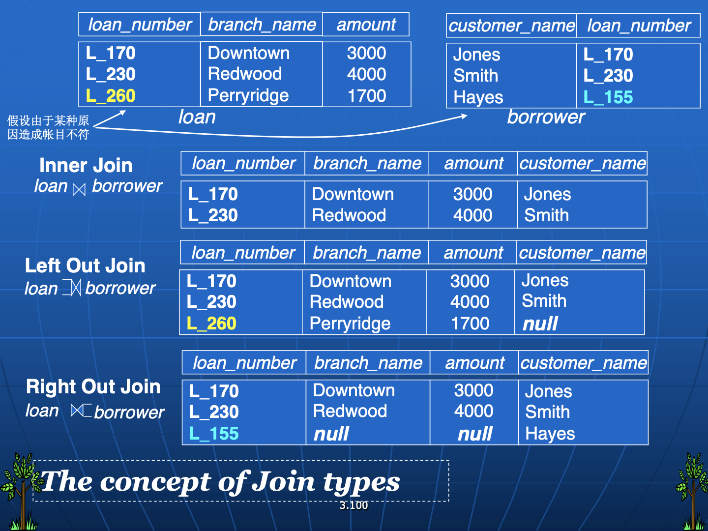

# DDL

## Create

```sql
create table insturctor(
    ID char(5),
    name varchar(20) not full,	-- 指定not full
    primary key(ID)	-- super-key, candidate
	);
```

### Integrity Constraints

* not null
* primary key
    * 可以写成`XXX primary key,`或`XXX, primary key(XXX)`
* check(P), where P is a predicate
    * check(salary >= 0)

### Variable

* char(n)：定长
* varchar(n)：变长
* int
* smallint
* numeric(p,d)：p位定点数，其中小数点右边有d位
* real, double：单双精度浮点数
* float(n)：精度至少为n的浮点数

### Domain

不同的函数：

* SqlServer: Char(65), substring(s, start, length), getdate(), datalength( ‘ abc ’), ……
* Oracle: chr(65), substr(s, start, length), sysdate , length( ‘ abc ’), to_char(sysdate, ’ yyyy/mm/dd ’) 得： 2007/02/28, to_date( ’ 07/02/27 ’, ’ yy/mm/dd ’ ), ……

相同的函数：

Abs()( 绝对值 )，exp()( 指数 )，round()(四舍五入)，sin()，cos()

## Drop & Alter

```mysql
drop table instructor

alter table r add A D;
alter table r add (A1 D1, A2 D2, ..., An Dn);
alter table r drop A D	-- 许多DBMS不支持(安全考虑
alter table r modify (ID char(10), salary not full)	-- 加属性或添加限制
```


# DML

SQL不会自动去重，得加`distinct`，并且是基于整个元组判断

字符串操作：

%表子串，_表字符

使用：`Like 'Hello, % \_' ESCAPE '!'`


## 集合运算

操作对象是两个表

并：`union`

交：`intersect`

减：`except`


## 聚合函数

* ==`where`和`group by`混用，`where`必须写在`group by`的前面==
* `having`是对分组再进行选择，里面的**属性要么是聚合函数，要么是`group by`里的**
* where不能放聚合函数


### NULL

null算术运算为null

unknown逻辑运算为unknown

`unknown or true = true`, `unknown and false = false` 其他的逻辑运算结果全为unknown

所有不能用`where salary = null`


聚合函数涉及到null则不计入，除非所有全是null则输出也是null(count是0？一会试试看)


## 嵌套

Ex. 找09年秋开课，10年春没开课的学科

```sql
-- select dintinct course_id
-- from section
-- where (course_id)
```


找每个支行下存款最多的账户？

```sql
Select account_number AN, balance from account A
where balance >= (	-- 但是很慢
    select max(balance) from account B
    where A.branch_name = B.branch_name
    )
order by balance;
```

一个错误写法：👇

```sql
-- 值和集合不能比较
select account_ID, balance
from account
group by brach_name
having balance >= max(balance)	-- 一个group有多个balance，不能这样比
order by balance
```

<u>用**some** 和 **all**进行集合和值的对比</u>


**except差运算**(这里not exists+except相当于equal)

```sql
-- 找到所有上了生物学院的每门课的学生
select
    distinct S.ID,
    S.name
from student as S
where
    not exists (
        (	-- 在 Biology 系开设的所有课程集合 
            select
                course_id
            from course
            where
                dept_name = 'Biology'
        )
        except
        (	-- 找出 S.ID 选修的所有课程
            select
                T.course_id
            from takes as T
            where
                S.ID = T.ID
        )
    );
```


## View

视图总是显示最近的数据。每当用户查询视图时，数据库引擎通过使用 SQL 语句来重建数据。

输出XXX最大的

```sql
CREATE VIEW <v_name> AS
select c1,c2,… from… ;
CREATE VIEW <v_name> (c1,c2,…) AS
select e1,e2,… from… ;

DROP VIEW <V_NAME>;
```


## Delete

`delete from`后面只能跟一个table/view`

例.删掉比平均工资低的老师

```sql
-- 正解
delete from instructor
where salary < (select avg(salary)
               from instructor);
-- 注意，这里里面会先执行，所以外层的删除不会影响平均数的计算
```


## Insert

```sql
insert into book value('10', '心理学', '新的世界', '浙江大学', 2002, '高云鹏', 48.00, 20, 4);
```

## Update of view

view和table的区别

```sql
insert into vName values ();
```

Complex View

```sql
create view all_customer as
select ... from...
union
select ... from... ;
-- 系统不允许对复杂视图的更新(无法反应到底层表)
```

## Transactions

事务

commit work: makes all updates of the transaction permanent in the database

rollback work: undoes all updates performed rollback work: undoes all updates performed by the transaction.

非显式

```sql

```


声明事务显式头尾

```sql
begin atomic

end
```

## Join

**Join Type**

Inner, left outer, right outer, full outer

PPT 3.100



**Join Condition**

```sql
natural
on <predicate>
using (A1, A2, ...., An)
```


使用

```sql
自然连接: R natural { inner join, left join, right join, full join } S
非自然连接: R { inner join, left join, right join, full join } S (on < 连接条件判别式 >) (using < 同名的等值属性名 >)
```


E.g. 

```mysql
-- Find all customers who have either an account or a loan (but not both) at the bank. account or a loan (but not both) at the bank.
select customer_name
from (depositor natural full outer join borrower)
where account_number is null or loan_number is null
```


主流DBMS的外连接表示：

```sql
-- SQL Server
(1) SELECT loan.loan_number, branch_name, amount,customer_name
FROM loan left outer join borrower on loan.loan_number = borrower.loan_number;
(2) SELECT loan.loan_number, branch_name, amount, customer_name
FROM loan , borrower
WHERE loan.loan_number *= borrower.loan_number;
( 注: Left join: *=, Right join: =* )
-- MySQL
SELECT loan.loan_number, branch_name, amount, customer_name
FROM loan, borrower
WHERE loan.loan_number=borrower.loan_number(+);
/*
【注: Right join: loan.loan_number(+) = borrower.loan_number
[ 相当于在（入门级（入门级 + )侧附加一特殊空行与另一表中的连接属性匹配 ]
【Left join: loan.loan_number = borrower.loan_number (+)
*/
```


With??

龟龟MySQL好像又没有with

```sql
-- 找出平均分最高的班级的no
with course_avg(course_no, score_avg) as
select
    course_no,
    avg(score)
from study
group by
    course_no
select
    course_name
from course
where
    course_no in (
        select
            course_no
        from course_avg
        where
            score_avg = (
                select
                    max(score_avg)
                from course_avg
            )
    );
```

