# Entity Sets

The real world  can be modeled as:

* a collection of entities (实体), 
* ==relationships (联系)== among entities.

Entities have attributes (属性)

* Example: student has id, name, age, sex and address

An entity set is a set of entities of the same type that share the same properties.

* Example: set of all students, companies, trees, holidays, customers, accounts, loans
* 一个实体集包含多个同类实体

## Attributes

**Domain** (域, value set)– the set of permitted values for each attribute 

Attribute types:

* Simple and composite attributes (简单和复合属性，如sex, name).
* Single-valued and multi-valued attributes(单值和多值属性)
    * E.g. multivalued attribute: phone-numbers (多个电话号码)
* Derived attributes (派生属性) 
    * Can be computed from other attributes(可以由其他计算得到的
    * E.g.  age, given date of birth
    * versus base attributes or stored attributes (基属性，存储属性)

# Relationship Sets

<u>A relationship is an association among several entities (是二个或多个不同类实体之间的关联)</u>

A relationship set is a set of relationship of the same type. example:`advisor( s_ID,  i_ID)`

Formally, a relationship set is a mathematical relation among n >= 2 entities, each taken from entity sets `{(e1, e2, … en) | e1 \in E1, e2 \in E2, …, en \in En}` where (e1, e2, …, en) is a relationship，Ei  is entity set. Example: 	(98988, 76766) \in advisor, where  98988 \in student,  76766 \in instructor

## Degree

 of a relationship set是参与联系的实体集的个数，显示生活中一般都是binary的，即使是Ternary的也能转换成binary

## Mapping Cardinalities

**映射基数**：一个联系集中，一个实体可以与另一类实体相联系的实体数目。其中数目是指最多一个还是多个

对于**二元关系**

* One to one (1 : 1)  ， 如：就任总统（总统，国家）
* One to many (1 : n)， 如：分班情况（班级，学生）
* Many to one (n : 1)， 如：就医（病人，医生）
* Many to many (n : m)， 如：选课（学生，课程）

Note: Some elements in entity set A and B may not be mapped to any elements in the other set(有些不会被映射)

具体的映射方式PPT7.15

# Keys

* super key超码：一个或多个属性，可以唯一地区分不同的元组
* candidate key候选码：**最小超码**，任意真子集都不是超码，如`{ID}, {name, dept_name}`是(可以有多个)，而`{ID, name}`不是候选码(不是最小的)
* primary key主码：人为选出用来区分元组的候选码

强关系：primary key > candidate key > super key

联系集的候选码依赖于联系集的映射基数(1:1, 1:n, m:n)????????????????????什么意思

**注意**：作为primary key的属性不能为`null`

# E-R Diagram

* 分成两部分的矩形：代表实体集。有阴影的第一部分包含实体集的名字， 第二部分包含实体集中所有属性的名字
* 菱形：代表联系集
* 未分割的矩形：代表联系集的属性。构成主码的属性以下划线标明
* 线段：将实体集连接到联系集
* 虚线：将联系集属性连接到联系集
* 双线：显示实体在联系集中的参与度
* 双菱形：代表连接到弱实体集的标志性联系集

•Rectangles divided into two parts represent entity sets. The first part, which in this textbook is shaded blue, contains the name of the entity set. The second part contains the names of all the attributes of the entity set.

•Diamonds represent relationship sets.

•Undivided rectangles represent the attributes of a relationship set. Attributes that are part of the primary key are underlined.

•Lines link entity sets to relationship sets.

•Dashed lines link attributes of a relationship set to the relationship set.

•Double lines indicate total participation of an entity in a relationship set.

•Double diamonds represent identifying relationship sets linked to weak entity sets

## 属性的表示

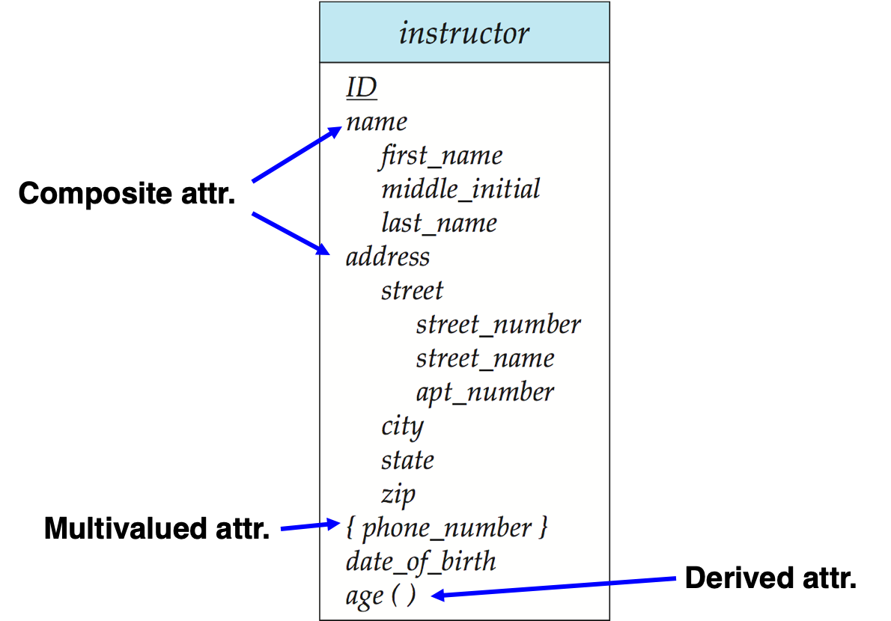

## 带属性的联系集

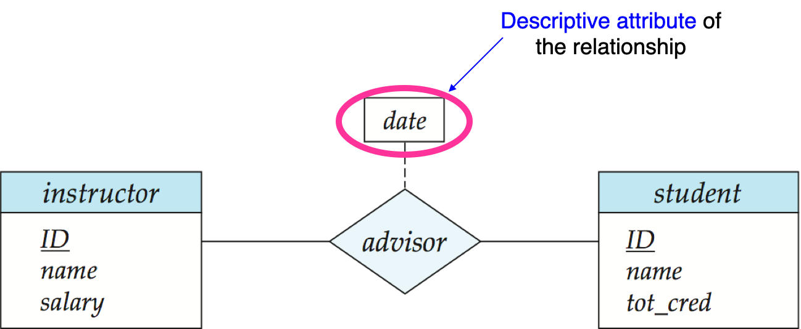

## Roles

参加联系的实体集不必是互不相同的，如Recursive relationship set自环联系集：一个ES通过一个RsS连到自己

角色:实体在联系集中的作用

例，下图给出了course实体集和prereq联系集之间的角色标识course_id和prereq_id

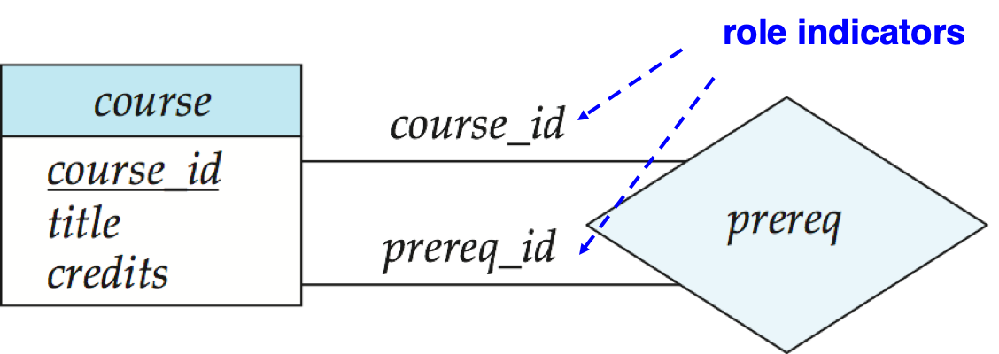

## 基数约束

Cardinality Constraints

$\rightarrow$表示“一”，$-$表示“多”

一对多：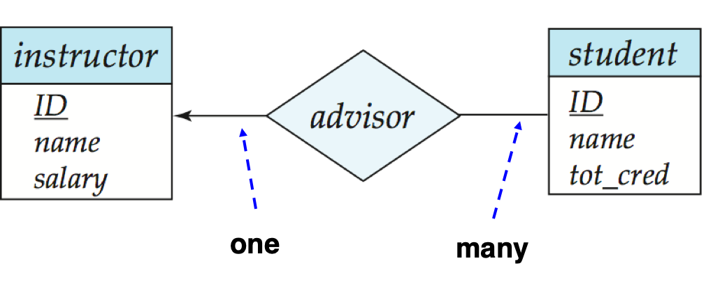

多对一：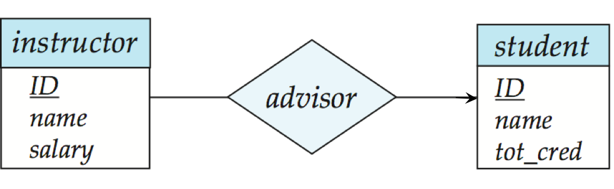

多对多：

## 参与约束

==Participation of an Entity Set in a Relationship Set==

* Total participation (全参与) (indicated by double line双线)：实体集中的每个实体都至少参加联系集中的一个联系
* Partial participation (部分参与)：某些实体可能未参加联系集中的任何联系

作用

* 映射基数约束(Mapping cardinality constraints)，限定了一个实体与 发生关联的另一端实体可能关联的数目上限
* 全参与和部分参与约束，则反映了一个实体参与关联的数目下限:0次， 还是至少1次

如下图，一个course有多个section，所以是多对一；section存在则course必须存在，所以section是total participation


或者量化表示：

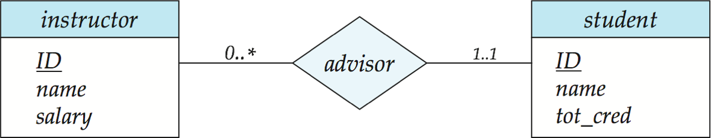

1..1：至少一个至多一个

## 二元与非二元

一般使用二元更好，比如这个可以这样转：parents( he, she, child) => father (he, child) + mother( she, child)

但是有些用三元更自然：proj_guide(instructor, project, student) 

非二元转二元：可以人为创造一个entity set

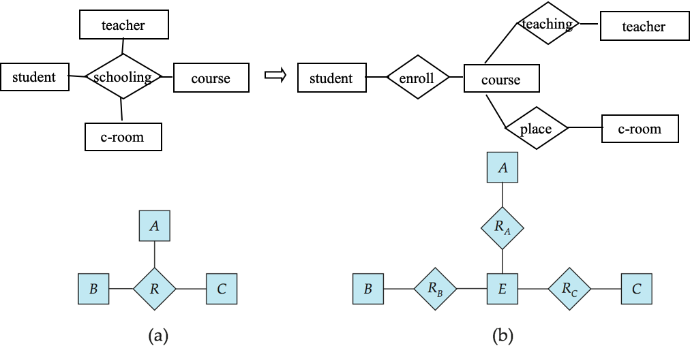

## 弱实体集与标识性联系

不具有主键的实体集称为弱实体集

弱实体集的存在依赖于它的标识实体集(或属主实体集)的存在

标识性联系:将弱实体集与其标识实体集相联的联系

分辨符：弱实体集的分辨符(或称部分码)是指在一个弱实体集内区分所有实体的属性集合

主码：弱实体集的主码由它所依赖的强实体集的主码加上它的分辨符组成(注意：强实体集的主码并不显式地存于弱实体集中，而是隐含地通过标识性联系起作用)

为什么需要弱实体集？<u>如果course\_id显式存在，section就成了强实体，则section与course之间的联系变得冗余。因为section与course共有的属性course\_id 已定义 了一个隐含的联系</u>

例如，对于弱实体集section(sec_id,semester,year)；分辨符(**discriminator**)由属性sec_id，year以及semester组成；依赖于标识实体集course(course_id,title,credits)；标示性联系为sec_course；主码为{course_id, sec_id,semester,year}；

# Extended E-R Features

## 层

### 特化概化

**特化** Specialization

低层实体集：**自顶向下**设计过程中，确定实体集中的一个具有特殊性质的子集，它们具有特殊的属性或者参加特殊的联系

属性继承：低层实体集继承它连接的高层实体集的所有属性及参加的联系

特化用从特化实体指向另一方实体的空心箭头来表示。这种关系为ISA关系，代表“is a”(“是一个”)。例如，一个教师“是一个”雇员

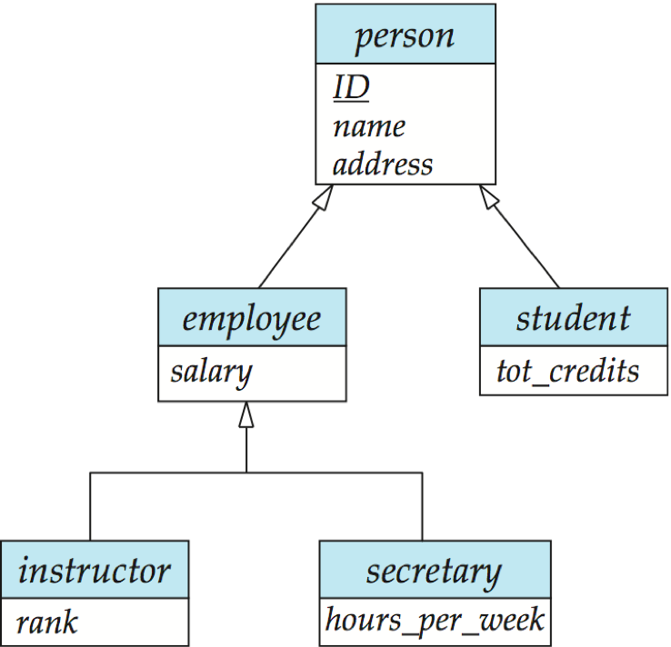

**概化** Generalization

**自底向上**设计过程中，将若干共享相同特性的实体集组合成一个高层实体集

特化与概化简单互逆：<u>它们在E-R图中以相同方式表示</u>

特化与概化的设计约束

* 不相交
    *  一个实体只能属于一个低层实体集
    * 在E-R图中ISA三角形旁边加注disjoint
* 重叠
    * 一个实体可以属于多个低层实体集

例如，研究生和本科生必然是不相交的；但是学生和职工可以，比如毛老师


主要就这三种

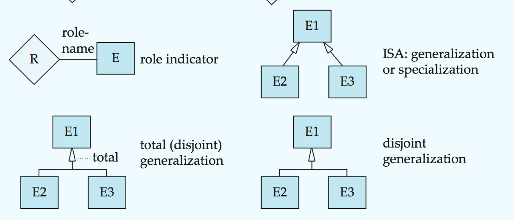

### 聚集

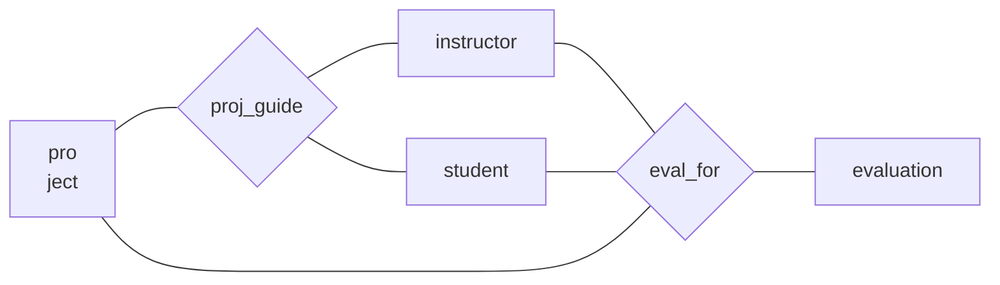

这样会表达重复信息(一个ef对应一个pg，但是pg不一定有ef，因此会有冗余)，因此可使用下图

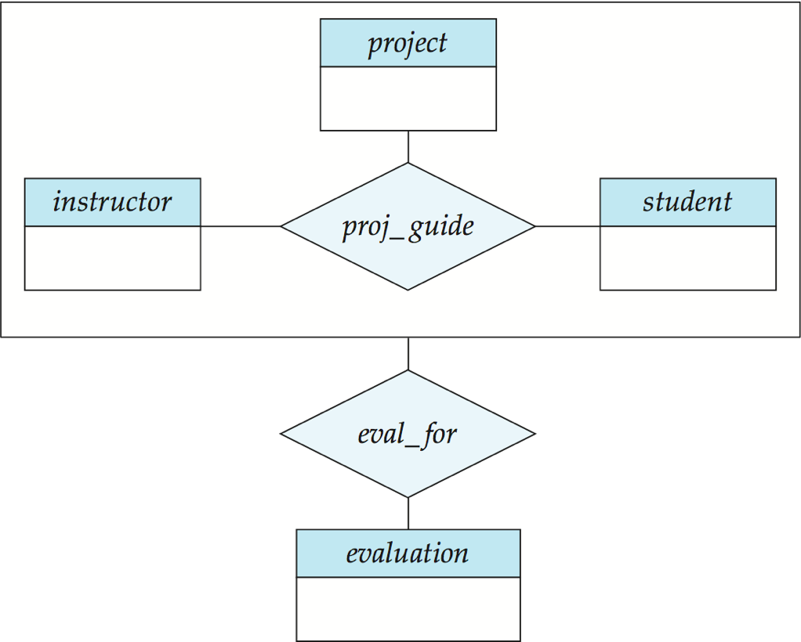

在没有引入冗余的情况下，上图表达了：

* 一个学生在某个项目上由某个导师指导
* 一个学生，导师，项目的组合**可能**有一相关的评估

## Aggregation

符号总结PPT7.45


---


# Design of an E-R Database Schema

## Entity or attribute?

作为属性：

`instructor(ID,name, …, phone)`

优点：简单。但多个电话怎么处理？电话的其他属性？

作为实体：

```sql
instructor(ID, name, ...)
phone(phone-num, location, type, color)
ins-phone(i_ID, phone-num)
```

若一个对象只对其名字及单值感兴趣，则可作为属性，如`性别`;若一 个对象除名字外，本身还有其他属性需描述，则该对象应定义为实体 集。如`电话`，`住址`，`部门`

**考虑映射基数的影响**

例，考虑branch、loan、customer，如果一个客户在一个分支机构有 多个贷款账户，那么将会影响E-R设计

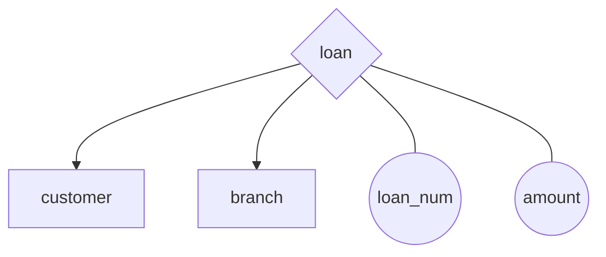

---

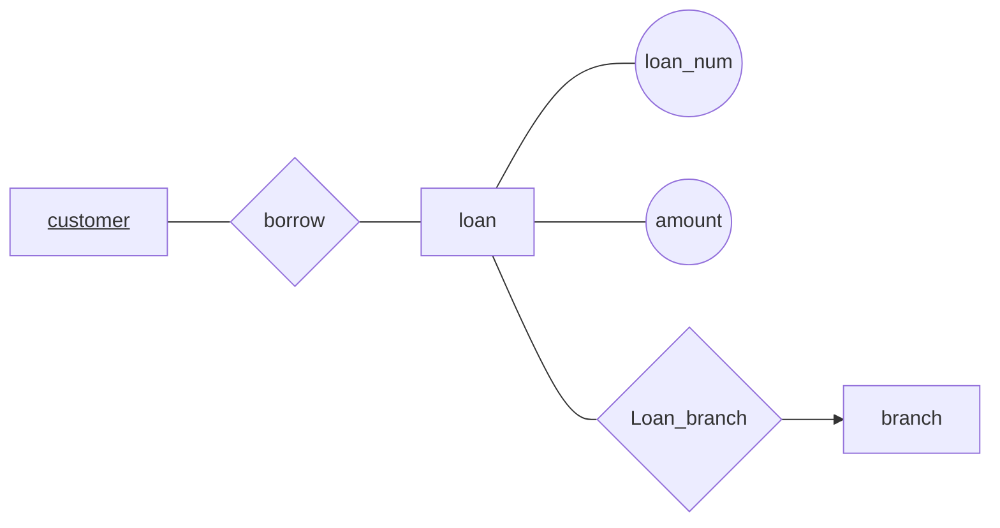

**要从对象的语义独立性和减少数据冗余考虑**

`student(sid,name,sex,age,...,supervisor-id, supervisor-name, supervisor-position,..., class, monitor)`

$\Longrightarrow$

```sql
student(sid,name,sex,age,...);
supervisor(sup-id, name, position, ...);
stu-sup(sid, sup-id, from, to);
class(classno,specialty,monitor,stu-num);
stu-class(sid,classno);
```


# Reduction of an E-R Schema to Tables

## 将E-R图转为表

 E-R图转换成表格式是从E-R图导出关系数据库设计的基础
 符合E-R图的数据库可以表示成若干表的集合
 对每一个实体集及联系集都有一个唯一的表，该表的名字就是对应实 体集或联系集的名字

**强实体集**：直接转换到具有相同属性的表

**复合属性**：为每个组成属性创建一个单独属性，例，给定带有复合属性 `name`( 组成属性为`first-name`和`last-name` ) 的实体集instructor，对应的表具有两个属性`name.first-name`和`name.last-name`，或是，`first-name`和`last-name`

**多值属性**：用一个表instructor_phone(ID, phone_number)来联系instructor和多值属性phone，如果多值属性又为复合属性，则再需一个表phone(phone_number, ...)来专门存储多值属性的信息

**弱实体集**：转换成的表还包含对应于其<u>标识强实体集的主键</u>的列

**联系集**：具有对应于两个参加实体集的主键的列，以及对应于联系集自己的描述性属性(即ER图中的圆圈)的列

## 表的冗余

**1)**如果多对一和一对多联系集在“多”端是完全的，则可不必为联系集 创建表，而是在对应于“多”端的表中加入对应于“一”端表的主键 的额外属性

例如这张图，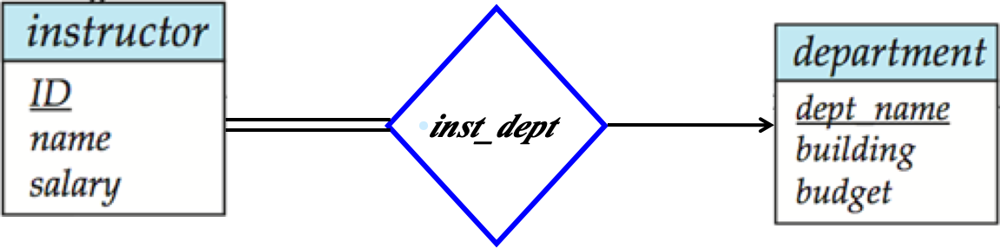，`instructor(ID,name,salary)` + `inst_dept(ID, dept_name)` = `instructor( ID, name,dept_name, salary);`

如果“多”端参加联系是部分的，上述方法可导致空值。例，如果inst_dept是部分参与的，那么没有相关联的系的教师的dept_name中存放空值

特殊的，如果是一对一的，那可以任选一端当做上面的方法中的“多端”

**2)**联系弱实体集及其标识性实体集的<u>联系集</u>对应的表是冗余的，可以直接删掉，其他不变

例如：

## 特化表示成表

**方法1**:

* 为高层实体集构造表
* 为每个低层实体集构造表，包括高层实体集的主键和局部属性
* 缺点:获得 employee之类的实体的信息需要访问两个表

| 表       | 表属性                 |
| -------- | ---------------------- |
| person   | ID, name, street, city |
| student  | ID, tot_cred           |
| employee | ID, salary             |

**方法2**:

* 为每个实体集构造表，其属性包括所有局部属性和继承来的属性
* 如果特化是全部特化(Total Specialization)，则没有必要为一般实体person创建表，因为两个加起来就够了
    * 可以被定义为包含特化联系的“视图”
    * 由于外键约束的需要，可能仍然需要定义关系模式person
* 缺点:对于既是学生又是雇员的人，其name、street和city被冗余存储

| 表       | 表属性                           |
| -------- | -------------------------------- |
| person   | ID, name, street, city           |
| student  | ID, name, street, city, tot_cred |
| employee | ID, name, street, city, salary   |


# 总结

* 数据库设计主要涉及数据库模式的设计

*  E-R模型主要用于数据库设计过程，E-R图用于表示数据库模式的逻

    辑结构，以及E-R图的其他表示方法

* 实体、实体集

* 联系、联系集

* 超码、候选码以及主码同样适用于实体和联系集

* 映射基数

* 弱实体集、强实体集

* 特化和概化定义了一个高层实体集和一个或多个低层实体集之间的 包含关系