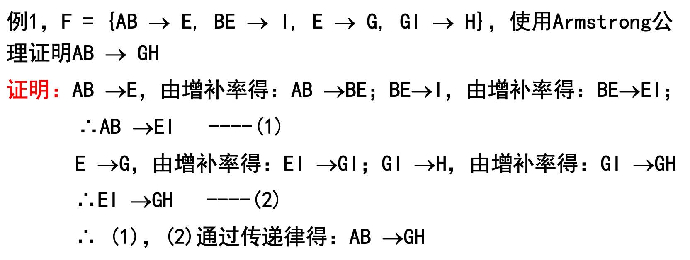
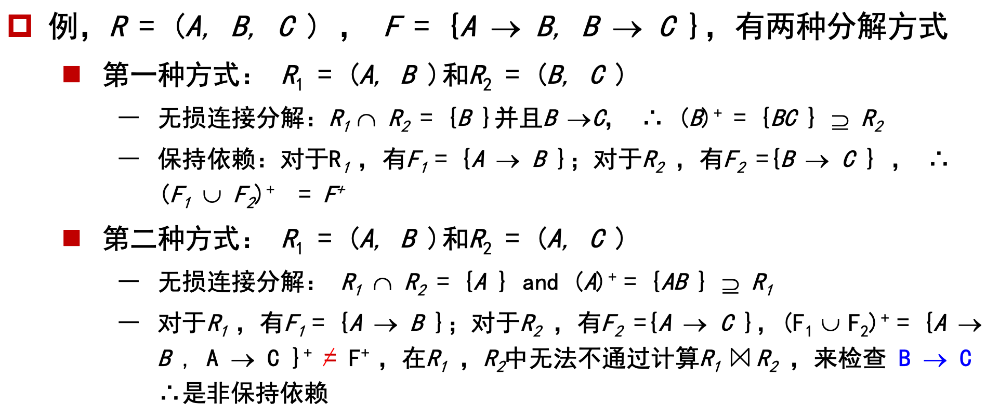

# Write Before

> **Prime Attribute(主属性)**: Attributes that form a candidate key of a relation, i.e. attributes of candidate key, are called **prime** attributes.
>
> **Partial Dependency**: A FD that holds in a relation is partial when removing one of the determining attributes gives a FD that holds in the relation(被依赖属性集中有些属性去掉FD也成立). A FD that isn't partial is full. (Eg: If {A,B} → {C} but also {A} → {C} then {C} is partially functionally dependent on {A,B})，感觉实际上就是
>
> **Transitive dependency**: `(A → B) && !(B → A) && (B → C), A → C` (which follows from 1 and 3 by the [axiom of transitivity](https://en.wikipedia.org/wiki/Armstrong's_axioms#Axioms)) is a transitive dependency / Video里的说法：A->B(B不是prime atr)，且A-/->主码
>
> **MultiValued Dependency**：[此处](# MVD)
>
> What to remove
>
> |      |                                     |
> | ---- | ----------------------------------- |
> | 2NF  | Partial Dependency                  |
> | 3NF  | Transtive Dependency(NonPrime->Key) |
> | BCNF | 左边是超码                          |
> | 4NF  | MultiValued Dependency              |
>
> 

[Database Normalization - 1NF, 2NF, 3NF, BCNF, 4NF and 5NF - YouTube](https://www.youtube.com/playlist?list=PLLGlmW7jT-nTr1ory9o2MgsOmmx2w8FB3)

# 1NF

原子：如果某个域中元素被认为是不可分的，则这个域称为是原子的

* 非原子域的例子:
    ― 复合(composite)属性:名字集合
    ― 多值(multi-value)属性:电话号码
    ― 复杂数据类型:面向对象的
* <u>如果关系模式R的所有属性的域都是原子的，则R称为属于**第一范式 (1NF)**</u>
* 非原子值存储复杂并易<u>导致数据冗余</u>(redundant)
    * 我们假定所有关系都属于第一范式

* 原子性实际上是由域元素在数据库中**如何被使用**决定的
    * 例，字符串通常会被认为是不可分割的
    * **但是**假设学生被分配这样的标识号:CS0012或EE1127，如果前两个字母表示系，后四位数字表示学生在该系内的唯一号码，则这样的标识号不是原 子的
    * 当采用这种标识号时，是不可取的。因为这需要额外的编程，而且信息是在应用程序中而不是在数据库中编码

妈的课件上的条件是不完整的，实际上有四个条件

* **单值**
* 同属性同类
* 元组顺序无关
* 属性不同名
* [不涉及函数依赖]

## 非原子值处理

**复合属性**

1. 让每个子属性本身成为成为一个属性

**多值属性的处理方式**

1. Use multi fields, as person(pname, … , phon1, phon2, phon3, …);
2. Use a separate table, as phone(pname, phone);
3. Use single field, as person(pname, …, phones,…) 类型看是原子的，处理方式看不是

## 2NF(补充)

**条件**

* 1NF
* 不包含Key->NonPrime的Partial Dependency

# Pitfalls

关系数据库设计要求我们找到一个“好的”关系模式集合。一个坏的设计可能导致

* redundant storage
* insert / delete / update anomalies
* inability to represent certain information

**数据冗余**

如将instructor和department合并，则所有同个系的老师的系的信息都会被存储多次

**增删改异常**

更新：如一个计算机从玉泉搬到紫金港了，那instructor里所有妓院老师的dept_building都得改

增删：刚入职的任奎没有系，本来一个dept=NULL就行了，现在得有一堆信息是NULL，就很难处理

## Decomposition

**模式分解**

例，可以将关系模式(A,B,C,D)分解为:(A,B)和(B,C,D)，或(A,C,D)和 (A,B,D)，或(A,B,C)和(C,D)，或(A,B)、(B,C)和(C,D)，或 (A,D)和 (B,C,D)。例，将关系模式inst_dept分解为:

* instructor(ID,name,dept_name,salary)
* department(dept_name,building,budget)

**Lossy Decomposition**：分解完再自然连接后元组反而增加了(比如不同系的同名老师，连接完每个人都会跟着跟自己同名的所有老师的系)，这里的有损并不是指数据丢失，而是数据多余

**Lossless-join decomposition**：

## Goal — Devise a Theory for the Following

1) Decide whether a particular relation R is in “good” form. 	-No redundant 
2) In the case that a relation R is not in “good” form, decompose it into a set of relations {R1, R2, ..., Rn } such that 
each relation is in good form the decomposition is a lossless-join decomposition
Our theory is based on:

* functional dependencies (函数依赖)
* multivalued dependencies (多值依赖)

# FD

**Functional Dependencies**

==符号：r表示关系relation(表)、R表示关系模式relation schema(r的属性集)，α、β表示属性集==

## Definition

$$
\alpha \subset R, \beta \subset R(都可以是多个attributes)
\\
\alpha \rightarrow \beta
\\
\Longrightarrow t1[\alpha] = t2 [\alpha] \Rightarrow t1[\beta]  = t2 [\beta] (t1、t2是任意元组)
$$

称 β is functionally dependent on α , α functionally determines β

其实就类似于函数关系$x\rightarrow f(x)$

例如对于下面的实例

| A    | 1    | 1    | 3    |
| ---- | ---- | ---- | ---- |
| B    | 4    | 5    | 7    |

A不能决定B，但是B可以决定A

## 与Key关系

特殊的，对于super key
$$
K \rightarrow R
$$
对于candidate key
$$
K \rightarrow R
\\
\nexists\ \alpha \subset K, \alpha \rightarrow R(不存在K的真子集α，使得α依赖于R)
$$

函数依赖使我们可以表达用超码无法表达的约束(因为超码必须determines整个R)

在之前那个不好的合并`inst_dept(ID,name,salary,dept_name,building,budget)`中；如果用函数依赖表示，则`dept_name -> budget`即可；若用超码，则`{ID, dept_name}`是个超码(单独的`dept_name`不是)，所以`{ID, dept_name} -> budget`，但是这样大可不必，虽然`ID`确实可以决定`budget`，但是两者没什么关联

## Usage

对于例表

| A    | B    | C    | D    |
| ---- | ---- | ---- | ---- |
| a1   | b1   | c1   | d1   |
| a1   | b2   | c1   | d2   |
| a2   | b2   | c2   | d2   |
| a2   | b3   | c2   | d3   |
| a3   | b3   | c2   | d4   |

**检查关系在给定函数依赖之下是否合法**

* 若关系r在函数依赖集F下是合法的，则称：<u>*r* satisfies *F*</u>
* 对上表有：`F = {A->C, AB->D, ABC->D}`(？？漏了一堆？)
* 但是A -\\-> B, A -\\-> D, B -\\-> A, C -\\-> A, C -\\-> D, B -\\-> C, C -\\-> B, B -\\-> D, ...

**对合法关系集合指定约束**

* 如果R上的所有合法关系都满足F，则称：<u>*F* holds on *R*</u>
* 注：容易判别一个r是否满足给定的F 。不易判别F是否在R上成立。不能仅由某个r推断出F。<u>R上的函数依赖F， 通常由定义R的语义决定。</u>

## Trivial

右边是左边的子集的函数依赖称为**平凡的**

像这种：`(ID, name) -> ID`、`ID -> ID`

被所有关系实例(小写字母r)都满足，必然成立(自反律)

**一般情况下**

* 平凡的：$\alpha \rightarrow \beta({\rm if}\ \beta \subseteq \alpha)$(这个必成立)
* 非平凡的：$\alpha \rightarrow \beta({\rm if}\ \beta \nsubseteq \alpha)$(这个感觉不一定，比如两者有非公共属性的时候)

## Armstrong’s Axioms

**原始公理**

* Reflexivity 自反律
    * ${\rm if}\ \beta \subseteq \alpha, {\rm then}\ \alpha \rightarrow \beta$ 
    * (`(ID, name) -> ID`)
* Augmentation 增补律
    * ${\rm if}\ \alpha \rightarrow \beta, {\rm then}\ \gamma\alpha \rightarrow \gamma\beta$
    * (`(name, ID) -> (name, salary)`)
    * ==可以增不能删==
* Transitivity 传递律
    * ${\rm if}\ \alpha \rightarrow \beta\ {\rm and}\ \beta \rightarrow \gamma, {\rm then}\ \alpha \rightarrow \gamma$
    * (`(ID, name) -> ID -> salary`)

**补充定理**

* union 合并律
    * ${\rm if}\ \alpha \rightarrow \beta\ {\rm and}\ \alpha \rightarrow \gamma, {\rm then}\ \alpha \rightarrow \beta\gamma$
    * (这个怎么证的啊？？？)
* decomposition 分解律
    * ${\rm if}\ \alpha \rightarrow \beta\gamma, {\rm then}\ \alpha \rightarrow \beta\ {\rm and}\ \alpha \rightarrow \gamma$
    * (自反+传递)
    * <!--==可以分解不能合并==-->？
* pseudotransitivity 伪传递律
    * ${\rm if}\ \alpha \rightarrow \beta\ {\rm and}\ \gamma\beta \rightarrow \delta, {\rm then}\ \alpha\gamma \rightarrow \delta$
    * (增补+传递)



<center>这是3NF后面的例题</center>


该公理是sound(保真) and complete(完备，产生所有成立的函数依赖即F^+^)的

**Example**：PPT8.21

## Closure 

### F^+^

**函数依赖集的闭包**

被F逻辑蕴含的全体**函数依赖的集合**称为F的闭包，可以有A公理求得

例：`F = { A -> B, B -> C }`，则`F^+ = { A -> B, B -> C, A -> C, A -> A, AB -> A, AB -> B, AC -> C, A -> BC, ... }`

找闭包

```pseudocode
F+ = F
repeat
    for each F+ 中的函数依赖 f
        对f应用自反律和增补律
        将结果函数依赖加入 F+
    for each F+ 中的一对函数依赖 f1 和 f2
        if f1 和 f2 可以使用传递律结合起来
            将结果函数依赖加入 F+
until F+ 不再变化
```

由于包含n个元素的集合含有个2^n^子集，因此共有2^2n^(包括了空集？)个可能的函数依赖

### α^+^

**属性集的闭包**

出现的原因：为了判断集合α是否为超码，一种方法是计算F^+^，然后在看所有依赖于α的属性集的并集是否为R。但是这样开销太大了，因此可以计算属性集的闭包

**定义**：给定一个属性集α，在函数依赖集F下由函数确定的所有属性的集合为F下α的闭包(记做α^+^)

* $\alpha \rightarrow \beta \in F^+ \Longleftrightarrow \beta \sube \alpha^+$
* $\alpha为超码 \Longleftrightarrow \alpha \rightarrow R \in F^+ \Longleftrightarrow R \sube \alpha^+$

找闭包

```python
result := a;
while (result有变化)
    for each β->γ in F	# 实际上还是看β->γ有没有在F+中
        if β ⊆ result
            result := result ∪ γ
a+ := result
```

**属性集闭包的用途**

* 超码
    * 原理：$\alpha为超码 \Longleftrightarrow \alpha \rightarrow R \in F^+ \Longleftrightarrow R \sube \alpha^+$
* 检测函数依赖是否成立
    * 原理：$\alpha \rightarrow \beta \in F^+ \Longleftrightarrow \beta \sube \alpha^+$
* 求依函数赖集闭包
    * 原理同上
    * 对于R中所有属性X，计算X^+^，对X^+^中每一个Y，$\displaystyle \bigcup_{\forall X}\{X \rightarrow Y | Y \in X^+\}$即为所求

**Ex1**

> `R = (A, B, C, G, H, I); F = {A->B, A->C, CG->H, CG->I, B->H};`问AG是啥

(AG)^+^ -> R，所以AG是超码；又因为A^+^=ABCH和G^+^=G，$R \nsubseteq A^+/G^+$，所以A、G不是超码，所以AG是候选码

**Ex2**

> `R =(A, B, C)，F ={A->B, BC->A}`求超码

BC、AC<font color='red'>、ABC（前两个是候选码）</font>

## Canonical Cover

**正则覆盖**

F的正则覆盖(记做Fc)是指与F等价的“极小的”函数依赖集合

* Fc中任何函数依赖都不包含无关属性(即没有Partial Dependency)
* Fc中函数依赖的左半部都是唯一的
    * 如：${\rm if}\ \alpha \rightarrow \beta\ {\rm and}\ \alpha \rightarrow \gamma, {\rm then}\ \alpha \rightarrow \beta\gamma$

**计算Fc**：删除多余属性，存在以下三种情况

* 存在可由其他推导出的函数依赖
    * `{A->C, A->B, B->C}`中`A->C`是冗余的
* 函数依赖左边部分存在属性冗余
    * `{AC->D, A->B, B->C}`中`AC->D`的`C`是冗余的(A->D则必有AC->CD->D)
* 函数依赖右边部分存在属性冗余
    * `{A->CD, A->B, B->C}`中`A->CD`的`C`是冗余的

### Extraneous Attributes

**无关属性**：去掉函数依赖集中一个函数依赖中的一个属性，不改变这个函数依赖集的闭包

有两种：在左边和右边

* 上面计算方法的后两者

例如{AB->C, A->C}中，B在AB->C中是无关的；在{AB->CD, A->C}中，C在AB->CD中是无关的

*--

计算**正则覆盖**的伪代码

```pascal
Fc = F
repeat
    对Fc中的**所有**FD利用合并规则，将α->β和α->γ替换成α->βγ	// 删除某些无关的属性之后，可能导致合并规则可以使用，所以必须重新应用，所以才要repeat
    for (α->β : Fc)
        if 在α或β中有无关的属性:
            从 α->β 中删去
until Fc不再变化
```

正则覆盖例子

`R = (A, B, C); F = {A->BC, B->C, A->B, AB->C};`的正则覆盖：`Fc = {A->B, B->C}`

# Decomposition

**模式分解**

## 目标和特性

* 原模式(R)的所有属性都必须出现在分解后的(R1, R2)中：R = R1 ∪ R2
* The decomposition is a **lossless-join decomposition**. (无损连接分解)
* 拆开再自然连接后不会有多余元组
    * 条件：分解后的二个子模式的共同属性必须是R1 或R2的(超？)码，即`R1∩R2->R1`和`R1∩R2->R2`至少有一个要属于F^+^
* The decomposition is **dependency preservation**. (依赖保持)

    * F在Ri上的限定是：Fi ⊆ F^+^， 即F^+^中<u>所有**只包含**Ri中属性的函数依赖Fi的集合</u>
    * 在上面的限定下，满足：$\displaystyle F'^+ = (\bigcup_{i=1}^n F_i)^+  = F^+$
* **No redundancy**: each relation Ri is in good form
  * BCNF or 3NF

例：



检查依赖α->β是否被保持的伪代码(课本P195)：

```python
result = α
while(result 有变化)
    for each 分解后的 Ri	# 对于F中的某个α->β，投影到各个Ri中，判别是否有某个Ri能保持函数依赖α->β
        t = (result ∩ Ri)_plus ∩ Ri	# 这是干啥？找出
        result = result ∪ t
# 若最后result包含β中的所有属性，则α->β得到保持
# 若对F中的每个函数依赖都能有一个Ri满足该函数依赖，则该分解保持依赖
```

# BCNF与3NF

BCNF比3NF更严格

## BCNF

> 条件
>
> * 是3NF
> * <u>对于所有α->β，若不平凡则α必须是超码</u>

<u>在3NF基础上消除**主属性**对于**非码**的**部分**与**传递**函数依赖(Key->Prime)</u>，之前消的是非主属性，不过这不重要，总之就是不能有依赖于非码的FD

对F^+^中所有的函数依赖α->β，以下**至少有一项成立**

* α->β是平凡的(β⊆α)[若α不是超码，不平凡的α->β就是Partial Dependency]
* α是R的超码(α->R, R⊆α^+^)

Ex.`R = (A, B, C); F = {A->B, B->C}`

​	R不是BCNF，因为`B->C`不平凡，`B`也不是超码

​	因此进行分解，`R1 = (A, B); R2 = (B, C)`

​	分解后R1与R2都是BCNF，并且也是无损的(B为R2超码)，并且也是依赖保持的(显然)


**Testing for BCNF**

* 为检查具有函数依赖集合F的关系模式R是否属于BCNF，只需检查F中的函数依赖是否违反BCNF即可，而不需检查F^+^中的所有函数依赖 (证明：F^+^是由Armstrong的3个公理从F推出的，而任何公理都不会使FD左边变小(拆分)，故如果F中没有违反BCNF的FD(即左边是superkey)，则F^+^中也不会)
* **但是**，检查拆分后的关系不能仅用原来F中的FD了 (例如`R (A, B, C, D); F = {A->B, B->C}`拆分成`R1(A，B) + R2(A，C，D)`如果直接按原F判断，则会发现没有“只包含R2中属性的函数依赖”，但实际上F^+^是有`A->C`的)
* 总结：==可在F下判别R是否违反BCNF，但须在F^+^下判别R 的分解式是否违反BCNF==


**保证无损连接的分解算法**(不一定保持依赖)

> 把non-prime_attr -> prime_attr拆分出去

见作业8.21

```cpp
result = {R}
done = false
compute Fp;

while not done:
    if result 中有Ri不为BCNF:
        找到Ri上的一个非平凡函数依赖α->β/*α->Ri2*/，使得α->R不属于Fp/*α不为超码*/，且α∩β=∅/*不平凡*/;	// 一定能找到吗？？ 可以，不然就是BCNF了； **另外，β可以尽量取大**
        result = (result - Ri)/*第一次循环时此处为R-R=空集*/ ∪ (Ri - β)/*Ri1*/ ∪ (α, β)/*Ri2*/;	// α为Ri1与Ri2的共同属性
    else
        done = true
```


## 3NF

> 不含Key->NonPrime(非主属性对码)的Transitive Dependency <==> 不存在NonKey->NonPrime的Dependency(若存在，Key->NonKey, NonKey->NonPrime ==> Key->NonPrime)

BCNF不一定依赖保持，但是在去冗余上比3NF好(更严格)

关系模式R 属于(3NF)当且仅当对**所有**F^+^中的函数依赖α->β满足三条中至少一条(1、2条与BCNF相同)==不是所有FD都要满足同一条，而是所有的都满足三者之一即可==

* α->β是平凡的(β⊆α)[若α不是超码，不平凡的α->β就是Partial Dependency]
* α是R的超码(α->R, R⊆α^+^)
* β-α(若不相交则为β)的每个属性都是Prime Attribute（即Candidate Key中的属性）
* 若二三均不成立，即`!(α->R) && !(β is prime)`等价于原始定义

另一种定义：<u>β不是PrimeAttr时α必须是码，但是β是主属性时α无限制</u>

~~这三个怎么就他妈等价了？？这第三个和第一个完全相反好吗，而且23完全没有体现出什么传递依赖啊~~

~~草那个知乎的回答完全是反的~~

推论：BCNF一定是3NF，反之不一定

推论2：若R中属性不超过2个(不可能有传递)，则一定符合3NF


Ex. 学号->系名->系办公楼，将系名和系办公楼拎出来建新表


Ex. `R = (J, K, L); F = {JK->L, L->K}`

* 两个候选码:JK 和JL
* R 属于3NF
    * JK->L，JK 是超码
    * L->K，K 包含在一候选码中
* 但BCNF分解将得到(J, L)和(L, K)，JK->L不保持依赖


> Video中的例子，学生表主码是{学生ID，科目ID}，但是总分这个属性还可以**仅**取决于exam_name(比如说有期中考、期末考、上机考等等总分不一样的)，且exam_name不是prime attr，此时exam_name->total_mark构成一个transtive dependency，得拎出来建一个新表


**Testing for 3NF**

是NP-hard的


**无损且保持依赖的3NF分解算法**

> Video中将Transtive Dependency的属性放到新的表里面

将Fc中每队αβ加入结果集，如果没有loseless则再把任意一组候选码加进去

见作业8.20

```python
令Fc 是F 的正则覆盖;
i = 0;
将R中在F中未出现的模式单独拎出来记为R0
for each Fc 中的函数依赖α->β:
    if 没有模式Rj (1 <= j <= i)包含αβ:
        i = i + 1;
        Ri =(α, β)	# αβ可能都是多个属性

if 没有模式Rj (1 <= j <= i)包含R的候选码:	# 保证至少有一个Ri中有候选吗，从而保证是无损分解
    i = i + 1;
    Ri = R 的任意候选码;
return (R0, R1, R2, ..., Ri)
```

## 与BCNF比较

* 总是可以将一个关系分解到3NF并且满足
    * 分解是无损的
    * 保持依赖
* 总是可以将一个关系分解到BCNF并且满足
    * 分解是无损的
    * 但可能不保持依赖

## 设计目标


# MVD与4NF

**Multivalued Dependencies**

> 条件
>
> * 一个A的值对应多个B(一个学生多门课) [也可以对应多个B和多个C(一个学生多门课多个爱好)]
> * At least 3 coloums (ABC) 
> * B and C are independent
>
> 也可以FD和MVD共存：(student_ID, course, hobby, address) 后三者之间没有任何依赖，其中s->->c, s->->h, s->a，最好拆成三个表

考虑`classes(course, teacher, book)`，定义(c,t,b) ∈ classes，意思是教师t可以教课程c，而b是需用于课程c的教材，course: teacher =1:n，course: book = 1:n，teacher和book是多值属性(一门课多个老师、多本课本) ，并且teacher和book相互独立。由于没有非平凡依赖，(course, teacher, book)是唯一的键，因此该关系模式属于BCNF

冗余：数据库这门课有两本参考书目，新来一个教数据库的教师，得插入两个元祖：`(database, Sara, DB Concepts)`和`(database, Sara, Ullman)`

因此最好分解成`teaches(course, teacher)`和`text(course, book)`

**4NF**

> 条件
>
> * BCNF
> * 不含MultiValue Dependency

* α->->β是平凡的(β⊆α或α∪β=R)[不存在不平凡的α->->β]
* α是R的超码(α->R, R⊆α^+^)


**分解算法**

分解方式和BCNF的比较相似

见作业8.21

```cpp
result = {R};
done = false;
compute D+;
令Di 表示 D+ 在 Ri 上的限制
while (not done):
    if (在result 中有不属于4NF的模式Ri):
        令α->->β是在Ri上成立的一个非平凡多值依赖，它使得α->Ri不属于Di，并且α∩β=∅;
        result := (result - Ri)/*原结果去掉Ri*/ ∪ (Ri - β)/*去掉多值依赖于别人的*/ ∪ (α, β)
    else:
        done = true
// 注:每个Ri 属于4NF，且分解是无损连接的
```

